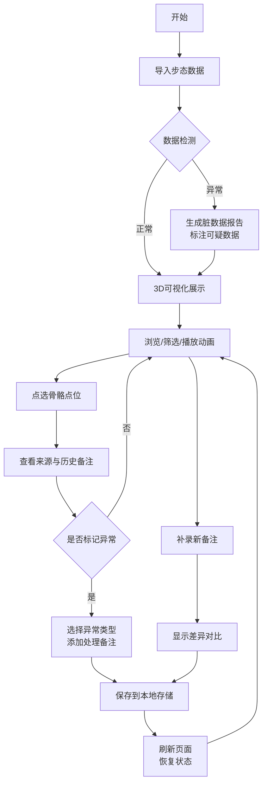

## 1. 产品概述

人体步态康复骨架可视化工具，解决数据分析同事在处理CAD导出的人体步态点位数据时，人工核对坐标、追溯来源的痛点。通过3D可视化实现点选、筛选、时间轴同步、来源追溯，让数据交接时无需重复手工核对。

- 目标用户：数据分析同事（阿乔）及后续接手人员
- 核心价值：消除人工核对误差，保留完整数据处理链路，提高交接效率

## 2. 核心 Features

### 2.1 用户角色

| 角色 | 注册方式 | 核心权限 |
|------|----------|----------|
| 数据分析员 | 无需注册，本地使用 | 导入数据、标记异常、添加备注、导出结果 |

### 2.2 Feature Module

1. **主可视化页面**：3D骨架展示、点选交互、视角控制
2. **侧边信息面板**：点位详情、来源追溯、处理备注
3. **筛选与工具栏**：数据筛选、异常标记、视图切换
4. **时间轴面板**：步态帧切换、动画播放、帧对比
5. **数据导入面板**：点位表导入、照片关联、方案备注管理

### 2.3 Page Details

| 页面名称 | 模块名称 | Feature 描述 |
|----------|----------|--------------|
| 主可视化页面 | 3D骨架视图 | Three.js渲染人体骨架模型，支持旋转、缩放、平移，点击骨骼点高亮显示 |
| 主可视化页面 | 视角记忆 | 自动保存当前视角，刷新页面后恢复 |
| 侧边信息面板 | 点位详情 | 显示选中点的坐标、名称、编号、所属骨骼 |
| 侧边信息面板 | 来源追溯 | 显示数据来源（CAD导出/手改坐标）、原始行号、导入时间、处理人 |
| 侧边信息面板 | 处理备注 | 显示历史备注，支持添加新备注，记录修改时间差异 |
| 筛选工具栏 | 数据筛选 | 按骨骼部位、数据来源、异常状态、时间范围筛选 |
| 筛选工具栏 | 异常标记 | 一键标记异常点，选择异常类型，添加异常说明 |
| 时间轴面板 | 帧控制 | 滑块切换步态帧，播放/暂停动画，调节播放速度 |
| 时间轴面板 | 帧同步 | 切换帧时同步更新3D视图、侧边信息、筛选状态 |
| 数据导入面板 | 批量导入 | 支持导入点位表（CSV/JSON）、关联现场照片、导入方案备注 |
| 数据导入面板 | 脏数据处理 | 导入时检测数据异常，生成清洗报告，标注可疑数据 |
| 数据导入面板 | 差异对比 | 补录数据时显示与原始数据的坐标差异、备注差异 |

## 3. 核心流程

## 4. 界面设计

### 4.1 设计风格

- **主色调**：专业医疗蓝 (#165DFF)，传达精确、可信的专业感
- **辅助色**：警示橙 (#FF7D00) 标记异常，成功绿 (#00B42A) 标记正常，中性灰 (#4E5969) 用于文本
- **按钮样式**：圆角8px，轻微悬浮效果，点击有反馈动画
- **字体**：标题使用 Noto Sans SC Bold，正文使用 Noto Sans SC Regular，保证中文可读性
- **布局风格**：三栏布局（左筛选+中3D视图+右详情），卡片式信息面板
- **图标风格**：线性图标，保持简洁专业

### 4.2 页面设计概览

| 页面名称 | 模块名称 | UI 元素 |
|----------|----------|----------|
| 主可视化页面 | 3D视图区域 | 深蓝色渐变背景，骨骼线用白色，选中点用蓝色发光效果，网格地面辅助定位 |
| 主可视化页面 | 左侧筛选栏 | 白色背景卡片，折叠式筛选组，复选框+标签组合 |
| 主可视化页面 | 右侧详情面板 | 白色背景卡片，分区块展示（点位信息、来源追溯、处理备注） |
| 主可视化页面 | 底部时间轴 | 深色背景条，滑块带帧号标记，播放控制按钮居中 |
| 数据导入面板 | 导入模态框 | 居中弹出，拖拽上传区域，文件列表展示，进度条动画 |

### 4.3 响应式

- 桌面端优先设计（1920×1080起）
- 平板端：侧边栏可折叠，详情面板改为底部弹出
- 移动端：简化为单视图模式，核心功能保留

### 4.4 3D 场景指引

- **环境**：深色渐变背景 (#0a1628 → #1a2d4a)，营造专业数据可视化氛围
- **光照**：主方向光 + 环境光，骨骼模型使用半透明材质，关节点使用发光材质
- **相机**：PerspectiveCamera，初始视角为45度斜视图，支持轨道控制器
- **交互**：点击骨骼点触发缩放动画，异常点持续脉冲发光
- **后处理**：轻微泛光效果增强选中点视觉效果，抗锯齿处理
- **资源**：纯代码生成骨架模型，无需外部模型文件，性能预算60fps
