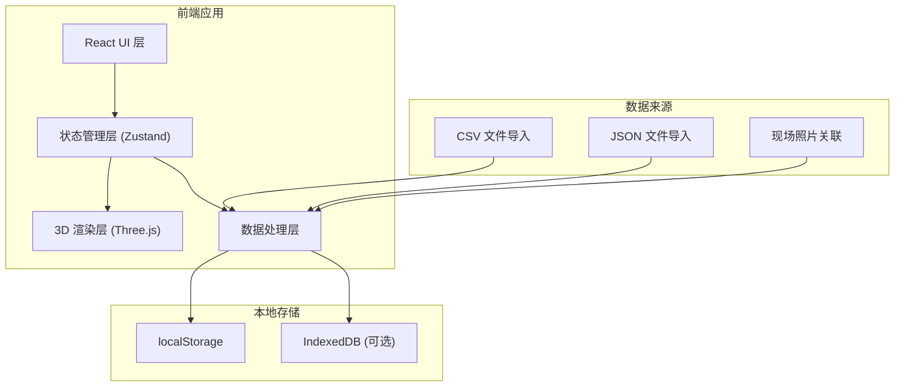
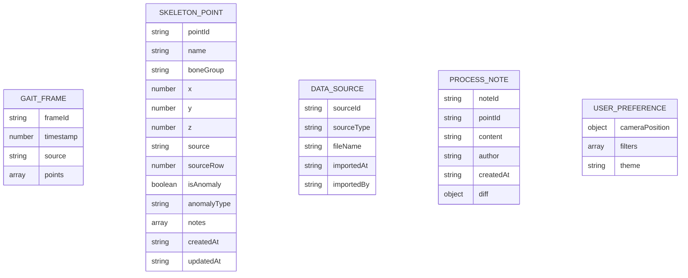

## 1. 架构设计



## 2. 技术选型说明

- **前端框架**: React@18 + TypeScript
- **构建工具**: Vite@5
- **样式方案**: TailwindCSS@3
- **3D 渲染**: Three.js + @react-three/fiber + @react-three/drei
- **状态管理**: Zustand（轻量、简洁，适合本地应用
- **图标库**: Lucide React
- **数据可视化**: Recharts（差异对比图表）

## 3. 目录结构

```
src/
├── components/
│   ├── viewer/          # 3D视图相关组件
│   ├── sidebar/         # 侧边栏组件
│   ├── timeline/      # 时间轴组件
│   ├── filters/       # 筛选组件
│   └── import/        # 数据导入组件
├── store/           # 状态管理
├── types/           # TypeScript 类型定义
├── utils/           # 工具函数
├── data/            # Mock数据和示例
└── App.tsx
└── main.tsx
```

## 4. 路由定义

| 路由 | 用途 |
|------|------|
| / | 主可视化页面（单页应用 |

## 5. 数据模型

### 5.1 数据模型定义



### 5.2 核心类型定义

```typescript
// 骨骼点位
interface SkeletonPoint {
  id: string;
  name: string;
  boneGroup: 'head' | 'spine' | 'leftArm' | 'rightArm' | 'leftLeg' | 'rightLeg';
  x: number;
  y: number;
  z: number;
  source: 'cad_export' | 'manual_edit' | 'photo_estimate';
  sourceRow?: number;
  isAnomaly: boolean;
  anomalyType?: 'coordinate_error' | 'missing_data' | 'outlier';
  notes: ProcessNote[];
  createdAt: string;
  updatedAt: string;
}

// 步态帧
interface GaitFrame {
  frameId: string;
  timestamp: number;
  points: SkeletonPoint[];
  source: string;
}

// 处理备注
interface ProcessNote {
  id: string;
  pointId: string;
  content: string;
  author: string;
  createdAt: string;
  diff?: {
    previous?: Partial<SkeletonPoint>;
    current?: Partial<SkeletonPoint>;
  };
}

// 用户视角状态
interface ViewState {
  cameraPosition: [number, number, number];
  cameraTarget: [number, number, number];
  selectedPointId?: string;
  currentFrame: number;
  isPlaying: boolean;
  playSpeed: number;
}
```

## 6. 核心功能实现方案

### 6.1 3D 可视化
- 使用 @react-three/fiber 管理 Three.js 场景
- 使用 OrbitControls 实现视角控制
- 使用 Raycaster 实现点选交互
- 骨骼连接使用 LineSegments 渲染

### 6.2 状态持久化
- Zustand + persist middleware 实现 localStorage 持久化
- 保存内容：标记的异常、视角状态、筛选条件、处理备注

### 6.3 数据导入
- PapaParse 解析 CSV 文件
- 文件读取后进行数据校验和清洗
- 生成脏数据检测报告

### 6.4 时间轴动画
- requestAnimationFrame 实现流畅动画
- 帧间插值实现平滑过渡
- 播放速度可调节（0.5x - 2x

## 7. 性能优化

- 骨骼模型复用几何体
- 帧数据懒加载
- Web Worker 处理数据计算
- requestAnimationFrame 动画优化
