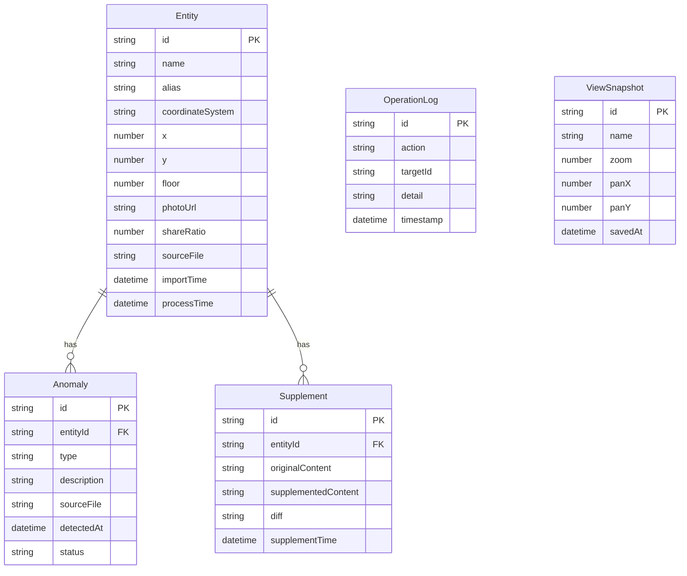

## 1. 架构设计

```mermaid
graph TB
    subgraph "前端层"
        "React App" --> "Zustand Store"
        "Zustand Store" --> "localStorage 持久化"
        "React App" --> "星图画布组件"
        "React App" --> "明细表格组件"
        "React App" --> "审计报告组件"
        "React App" --> "参数面板组件"
    end
    subgraph "数据层"
        "Mock 数据引擎" --> "实体数据"
        "Mock 数据引擎" --> "异常数据"
        "Mock 数据引擎" --> "操作时间线"
    end
    "前端层" --> "数据层"
```

纯前端架构，无后端服务。所有数据通过 Zustand store 管理，使用 localStorage 进行持久化存储，保证刷新后状态完整恢复。

## 2. 技术说明

- **前端**：React@18 + TypeScript + Tailwind CSS@3 + Vite
- **初始化工具**：vite-init (react-ts 模板)
- **状态管理**：Zustand（含 persist middleware 实现自动持久化）
- **后端**：无
- **数据库**：localStorage + JSON 导出/导入
- **可视化**：D3.js 力导向图（股权星图）
- **图标**：lucide-react

## 3. 路由定义

| 路由 | 用途 |
|------|------|
| `/` | 重定向到星图总览页 |
| `/starmap` | 星图总览页，股权关系可视化 |
| `/details` | 数据明细页，实体列表和参数编辑 |
| `/report` | 审计报告页，汇总统计和异常清单 |

## 4. 数据模型

### 4.1 数据模型定义



### 4.2 数据定义

```typescript
interface Entity {
  id: string
  name: string
  alias: string[]
  coordinateSystem: string
  x: number
  y: number
  floor: number
  photoUrl: string | null
  shareRatio: number
  sourceFile: string
  importTime: string
  processTime: string
}

type AnomalyType = 'coordinate_offset' | 'duplicate_name' | 'missing_photo' | 'cross_floor'
type AnomalyStatus = 'pending' | 'confirmed' | 'ignored'

interface Anomaly {
  id: string
  entityId: string
  type: AnomalyType
  description: string
  sourceFile: string
  detectedAt: string
  status: AnomalyStatus
}

interface Supplement {
  id: string
  entityId: string
  originalContent: string
  supplementedContent: string
  diff: string
  supplementTime: string
}

interface OperationLog {
  id: string
  action: 'import' | 'edit' | 'supplement' | 'mark_anomaly' | 'save_view' | 'merge_entity'
  targetId: string
  detail: string
  timestamp: string
}

interface ViewSnapshot {
  id: string
  name: string
  zoom: number
  panX: number
  panY: number
  savedAt: string
}
```

## 5. 核心模块说明

### 5.1 异常检测引擎

导入材料时自动运行四类检测：
- **坐标偏移检测**：同一坐标系内的实体坐标偏差超过阈值时标记
- **重名检测**：基于编辑距离和关键词匹配识别疑似同一实体的不同写法
- **缺照片检测**：photoUrl 为空的实体标记
- **跨楼层检测**：同一实体（或重名实体）出现在不同楼层时标记

### 5.2 参数联动机制

参数面板修改任意字段 → Zustand store 更新 → 订阅了该数据的组件（星图画布、明细表格、审计报告）自动重渲染。所有变更同时写入操作时间线。

### 5.3 增补差异记录

增补备注时，系统记录：
- 原始内容快照
- 增补后完整内容
- 差异文本（标记新增部分）
- 增补时间戳

### 5.4 持久化策略

使用 Zustand 的 persist middleware，将完整 store 状态序列化为 JSON 存入 localStorage。包括：
- 所有实体数据
- 所有异常及其状态
- 所有增补记录
- 操作时间线
- 视角快照
- 当前视角状态
- 最后操作时间
