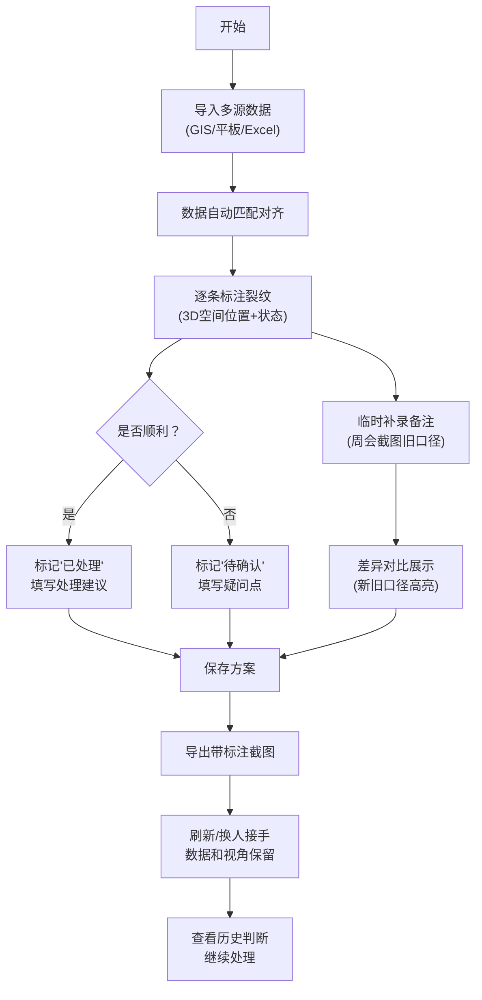

## 1. 产品概述
面向运维工程师何工的风电叶片裂纹标注协作工具，解决多来源数据（GIS、巡检平板、Excel、周会截图）命名不统一、人工对账效率低的问题。通过3D空间标注、异常高亮、方案留存和截图导出，让标注结果一次说清，不用二次核对。

## 2. 核心 Features

### 2.1 User Roles
| Role | Registration Method | Core Permissions |
|------|---------------------|------------------|
| 运维工程师 | 直接使用（本地存储） | 标注裂纹、保存方案、导出截图、补录备注、查看历史 |

### 2.2 Feature Module
1. **主工作台**：3D叶片模型 + 异常列表 + 详情面板
2. **数据导入**：支持多来源数据导入（GIS坐标、巡检记录、Excel台账、周会截图补录）
3. **裂纹标注**：空间位置标记、异常高亮、处理状态标记
4. **方案管理**：保存标注方案、加载历史方案、版本对比
5. **截图导出**：当前视角+标注信息一键导出
6. **数据溯源**：点击异常定位来源行、显示处理备注、新旧口径对比

### 2.3 Page Details
| Page Name | Module Name | Feature description |
|-----------|-------------|---------------------|
| 主工作台 | 3D视图区 | 简化风电叶片模型，支持旋转/缩放/平移，裂纹位置高亮，点击选中 |
| 主工作台 | 异常列表 | 三列展示：待处理/处理中/已完成，含来源标识、风险等级、状态标签 |
| 主工作台 | 详情面板 | 选中异常后展示：基本信息、来源追溯、处理建议、补录备注、操作历史 |
| 主工作台 | 顶部工具栏 | 导入数据、保存方案、导出截图、切换视角、显示/隐藏已完成 |
| 主工作台 | 数据对比区 | 补录备注后展示差异对比，明确改动内容 |

## 3. Core Process

**主要工作流程**：何工先导入一批材料（GIS+巡检+Excel），系统自动匹配对齐，然后逐条标注裂纹位置和处理建议，遇到存疑的标记"待确认"，中途可临时补录周会截图里的旧口径记录，补录后系统高亮显示差异，全部标注完成后保存方案并导出带标注的截图。刷新页面后，上次的标注、视角、状态都保留，换人接手也能看懂之前的判断依据。

## 4. User Interface Design

### 4.1 Design Style
- **主色调**：工业蓝 (#1E40AF) 作为主色，配警示橙 (#F97316) 标记异常，成功绿 (#10B981) 标记已处理，中性灰 (#64748B) 作为背景和文字
- **按钮风格**：圆角8px，轻微阴影，hover时有上浮效果，状态色区分明确
- **字体**：标题用"思源黑体 Bold"，正文用"思源黑体 Regular"，数字等宽用"JetBrains Mono"，保证专业感同时易读
- **布局风格**：三栏式布局，左列异常列表，中间3D视图，右列详情面板，顶部工具栏
- **图标风格**：使用Lucide图标库，线性图标，保持简洁专业

### 4.2 Page Design Overview
| Page Name | Module Name | UI Elements |
|-----------|-------------|-------------|
| 主工作台 | 3D视图区 | 深色背景衬托叶片模型，裂纹用发光球体标记，不同状态不同颜色，选中后有脉冲动画 |
| 主工作台 | 异常列表 | 卡片式设计，来源用小图标区分（GIS/平板/Excel/截图），风险等级用颜色条 |
| 主工作台 | 详情面板 | 分区清晰，来源追溯用引用块样式，处理建议用黄色便签风格，操作历史用时间线 |
| 主工作台 | 顶部工具栏 | 半透明毛玻璃效果，按钮带图标和文字，操作反馈明确 |
| 主工作台 | 差异对比区 | 左右分栏或上下对比，改动部分用底色高亮，标注"新增/修改/旧口径"标签 |

### 4.3 Responsiveness
- Desktop-first设计，主工作区最小宽度1280px
- 3D视图自适应中间区域，保证操作空间
- 异常列表和详情面板可折叠，扩大3D视图区
- 触摸设备支持手势旋转缩放

### 4.4 3D Scene Guidance
- **环境**：深色渐变背景，配微弱网格地面，突出叶片模型
- **光照**：主光源+两盏补光，柔和阴影，突出叶片曲面和裂纹位置
- **相机**：默认透视视角，可切换正交，支持保存自定义视角
- **交互**：鼠标左键旋转，右键平移，滚轮缩放，双击异常自动对焦
- **动画**：模型加载时淡入，选中异常时有视角平滑过渡动画，裂纹标记有呼吸灯效果
- **后处理**：轻微Bloom效果让高亮更明显，选中物体有描边效果

## 5. 样例数据要求

预置3条典型记录，覆盖核心场景：

1. **顺利处理记录**：来源"巡检平板"，叶中部位横向裂纹，已处理，有明确处理建议
2. **待人工确认记录**：来源"GIS"，叶尖部位疑似裂纹，标记"待确认"，有疑问备注
3. **周会截图补录**：来源"周会截图（旧口径）"，叶根部位旧记录，标注"旧口径待复核"，补录后系统展示与当前标准的差异

支持操作：先导入前两条处理，再临时补录第三条，补录后自动展示新旧口径对比差异。
