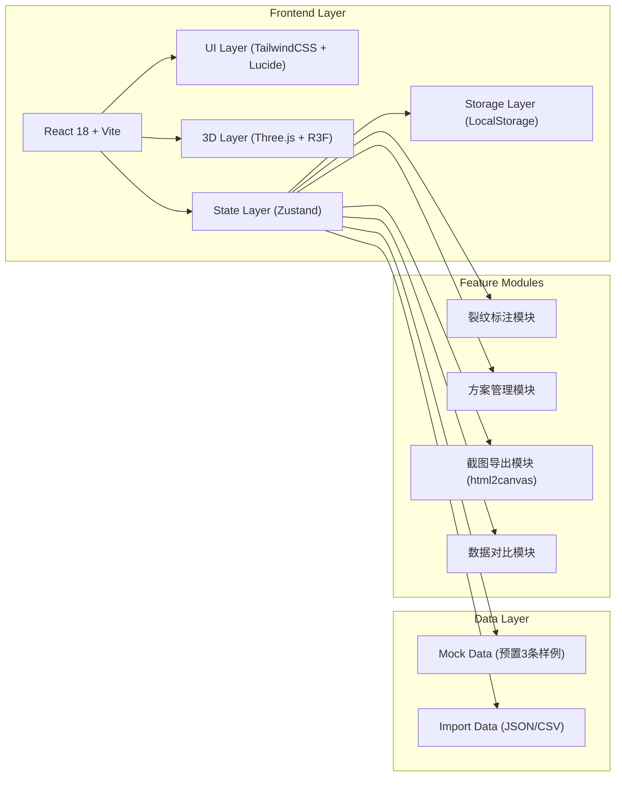
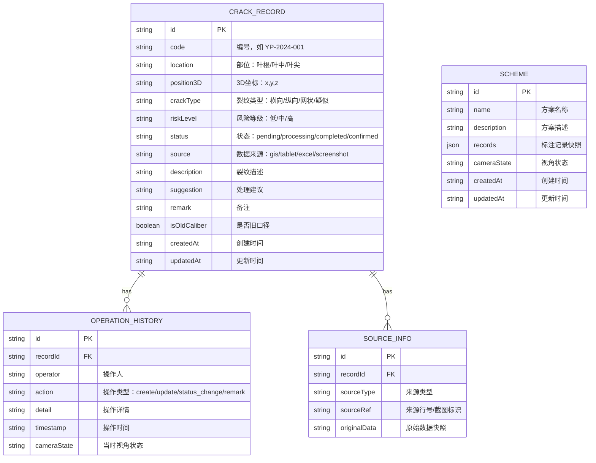

## 1. Architecture Design



## 2. Technology Description

- **Frontend**: React@18 + TypeScript + tailwindcss@3 + vite@5
- **3D Engine**: three@0.160 + @react-three/fiber@8 + @react-three/drei@9
- **State Management**: zustand@4
- **UI Icons**: lucide-react@0.294
- **Export Utility**: html2canvas@1.4.1
- **Data Persistence**: localStorage (无需后端)
- **Mock Data**: 预置3条典型样例数据，覆盖顺利处理/待确认/旧口径补录场景

## 3. Route Definitions

| Route | Purpose |
|-------|---------|
| / | 主工作台（唯一页面，单页应用） |

## 4. Data Model

### 4.1 Data Model Definition



### 4.2 Type Definitions

```typescript
interface Position3D {
  x: number;
  y: number;
  z: number;
}

interface CameraState {
  position: Position3D;
  target: Position3D;
  fov: number;
}

interface SourceInfo {
  id: string;
  sourceType: 'gis' | 'tablet' | 'excel' | 'screenshot';
  sourceRef: string;
  originalData: string;
}

interface OperationHistory {
  id: string;
  operator: string;
  action: 'create' | 'update' | 'status_change' | 'remark' | 'import';
  detail: string;
  timestamp: string;
  cameraState?: CameraState;
  diff?: {
    field: string;
    oldValue: string;
    newValue: string;
  }[];
}

interface CrackRecord {
  id: string;
  code: string;
  location: 'root' | 'middle' | 'tip';
  position3D: Position3D;
  crackType: 'transverse' | 'longitudinal' | 'mesh' | 'suspected';
  riskLevel: 'low' | 'medium' | 'high';
  status: 'pending' | 'processing' | 'completed' | 'confirmed';
  source: 'gis' | 'tablet' | 'excel' | 'screenshot';
  description: string;
  suggestion: string;
  remark: string;
  isOldCaliber: boolean;
  sourceInfo: SourceInfo;
  history: OperationHistory[];
  createdAt: string;
  updatedAt: string;
}

interface Scheme {
  id: string;
  name: string;
  description: string;
  records: CrackRecord[];
  cameraState: CameraState;
  createdAt: string;
  updatedAt: string;
}

interface AppState {
  records: CrackRecord[];
  selectedRecordId: string | null;
  cameraState: CameraState;
  schemes: Scheme[];
  activeSchemeId: string | null;
  showCompleted: boolean;
  showDiffPanel: boolean;
  diffRecords: { old: CrackRecord; new: CrackRecord }[];
}
```

### 4.3 Mock Data

```typescript
// 预置3条样例数据
const mockRecords: CrackRecord[] = [
  {
    id: '1',
    code: 'YP-2024-001',
    location: 'middle',
    position3D: { x: 0, y: 2.5, z: 0 },
    crackType: 'transverse',
    riskLevel: 'medium',
    status: 'completed',
    source: 'tablet',
    description: '叶中部位发现横向裂纹，长约15cm，宽度0.3mm',
    suggestion: '建议下次定检时打磨修补，表面涂覆保护涂层，记录在册持续跟踪6个月',
    remark: '巡检平板拍摄，编号TAB-2024-156，现场已做临时标记',
    isOldCaliber: false,
    sourceInfo: {
      id: 's1',
      sourceType: 'tablet',
      sourceRef: '平板记录第3行，照片IMG_20240615_1423',
      originalData: '{"position":"叶中","length":"15cm","width":"0.3mm","photo":"IMG_20240615_1423"}'
    },
    history: [
      {
        id: 'h1',
        operator: '何工',
        action: 'create',
        detail: '导入巡检平板数据，创建标注记录',
        timestamp: '2024-06-15 14:30:00'
      },
      {
        id: 'h2',
        operator: '何工',
        action: 'status_change',
        detail: '状态从pending改为completed',
        timestamp: '2024-06-15 15:10:00',
        diff: [{ field: 'status', oldValue: 'pending', newValue: 'completed' }]
      }
    ],
    createdAt: '2024-06-15 14:30:00',
    updatedAt: '2024-06-15 15:10:00'
  },
  {
    id: '2',
    code: 'YP-2024-002',
    location: 'tip',
    position3D: { x: 0, y: 4.8, z: 0.2 },
    crackType: 'suspected',
    riskLevel: 'high',
    status: 'pending',
    source: 'gis',
    description: '叶尖部位GIS扫描发现异常反射信号，疑似表面裂纹或涂层剥落',
    suggestion: '建议安排无人机近距航拍确认，必要时搭架人工检查，确认前降低该风机运行负荷15%',
    remark: 'GIS数据编号GIS-2024-W03-078，信号强度超出阈值2.3倍，位置与上月巡检记录有偏差',
    isOldCaliber: false,
    sourceInfo: {
      id: 's2',
      sourceType: 'gis',
      sourceRef: 'GIS扫描报告第7页，异常点编号A-078',
      originalData: '{"grid":"W03","point":"A-078","signalStrength":"2.3x","deviation":"15cm"}'
    },
    history: [
      {
        id: 'h3',
        operator: '何工',
        action: 'create',
        detail: '导入GIS扫描数据，创建疑似记录',
        timestamp: '2024-06-16 09:15:00'
      },
      {
        id: 'h4',
        operator: '何工',
        action: 'remark',
        detail: '补充备注：与上月记录位置偏差15cm，需确认是否为同一处',
        timestamp: '2024-06-16 09:45:00',
        diff: [{ field: 'remark', oldValue: '', newValue: '与上月记录位置偏差15cm...' }]
      }
    ],
    createdAt: '2024-06-16 09:15:00',
    updatedAt: '2024-06-16 09:45:00'
  },
  {
    id: '3',
    code: 'YP-2023-156',
    location: 'root',
    position3D: { x: 0, y: 0.5, z: -0.1 },
    crackType: 'longitudinal',
    riskLevel: 'low',
    status: 'confirmed',
    source: 'screenshot',
    description: '叶根部位纵向微裂纹，旧口径记录，长约8cm，已跟踪12个月无明显扩展',
    suggestion: '按旧口径标准属"观察类"，按新标准需重新评估是否需要修补，建议下次定检时重点复核，确认无扩展可维持观察',
    remark: '从周会截图补录，原记录日期2023-06-01，旧口径分类为"一般缺陷"，新口径可能升级为"需处理"',
    isOldCaliber: true,
    sourceInfo: {
      id: 's3',
      sourceType: 'screenshot',
      sourceRef: '周会截图2024-06-10，第5页第3行旧记录',
      originalData: '{"oldCode":"DEF-2023-156","oldCategory":"一般缺陷","oldStatus":"观察中","date":"2023-06-01"}'
    },
    history: [
      {
        id: 'h5',
        operator: '何工',
        action: 'import',
        detail: '从周会截图补录旧口径记录',
        timestamp: '2024-06-16 11:20:00'
      },
      {
        id: 'h6',
        operator: '系统',
        action: 'remark',
        detail: '新旧口径对比：旧口径"观察类" vs 新口径"需重新评估"',
        timestamp: '2024-06-16 11:20:01'
      }
    ],
    createdAt: '2023-06-01 00:00:00',
    updatedAt: '2024-06-16 11:20:01'
  }
];
```

## 5. Module Structure

```
src/
├── components/
│   ├── layout/
│   │   ├── Toolbar.tsx        # 顶部工具栏
│   │   ├── LeftPanel.tsx      # 异常列表
│   │   ├── RightPanel.tsx     # 详情面板
│   │   └── DiffPanel.tsx      # 差异对比面板
│   ├── three/
│   │   ├── Blade3D.tsx        # 3D叶片模型
│   │   ├── CrackMarker.tsx    # 裂纹标记
│   │   └── Scene.tsx          # 3D场景
│   ├── common/
│   │   ├── StatusBadge.tsx    # 状态标签
│   │   ├── SourceIcon.tsx     # 来源图标
│   │   └── RiskIndicator.tsx  # 风险指示器
│   └── dialogs/
│       ├── ImportDialog.tsx   # 数据导入
│       ├── SaveSchemeDialog.tsx # 保存方案
│       └── AddRemarkDialog.tsx # 补录备注
├── store/
│   └── useAppStore.ts         # Zustand状态管理
├── utils/
│   ├── storage.ts             # localStorage操作
│   ├── export.ts              # 截图导出
│   └── diff.ts                # 差异对比
├── types/
│   └── index.ts               # TypeScript类型定义
├── data/
│   └── mockData.ts            # 预置样例数据
├── App.tsx
├── main.tsx
└── index.css
```
