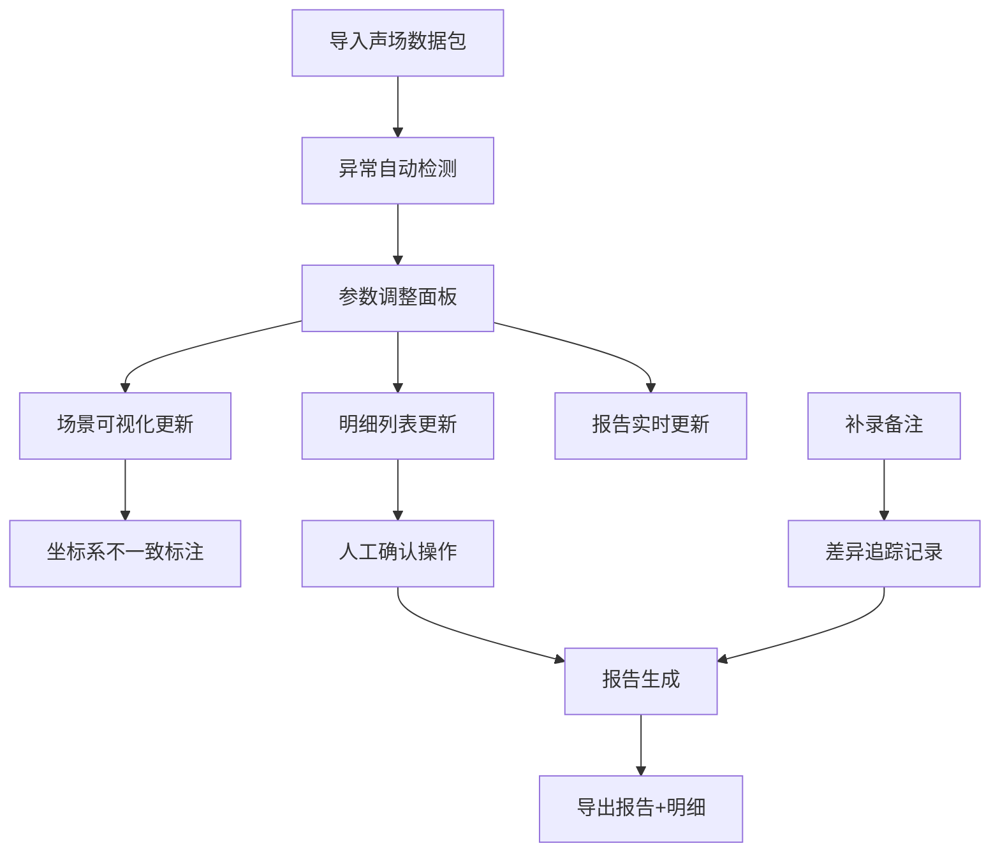

## 1. 产品概述

交响乐团站位声场管理系统，用于管理和校验交响乐团各乐器组的站位声场数据，解决当前依赖GIS底图临时拼凑时异常难追溯、数据脱节、参数修改不同步等问题。核心目标是确保声场分析数据的一致性、可追溯性和异常可识别性，服务于声场分析人员和数据校验人员。

## 2. 核心功能

### 2.1 用户角色

| 角色 | 注册方式 | 核心权限 |
|------|----------|----------|
| 数据分析员（阿乔） | 系统内置 | 导入数据、调整参数、补录备注、导出报告 |
| 数据校验员 | 系统内置 | 查看异常、人工确认、校验结果 |

### 2.2 功能模块

1. **参数配置面板**：声场参数调整，实时联动场景、明细和报告
2. **场景可视化区**：GIS风格站位图，坐标系不一致标注，异常点位高亮
3. **明细数据列表**：全量点位数据，异常类型标注，人工确认操作
4. **报告生成模块**：自动生成分析报告，包含判断过程，导出带原因
5. **备注补录模块**：临时补录备注，差异追踪记录
6. **异常检测引擎**：自动检测坐标偏移、设备重名、缺照片、跨楼层等异常

### 2.3 页面详情

| 页面名称 | 模块名称 | 功能描述 |
|----------|----------|----------|
| 主工作台 | 参数配置面板 | 频率范围、采样精度、声场阈值等参数调整，修改后实时联动所有模块 |
| 主工作台 | 场景可视化区 | 2D平面站位图，不同坐标系分区显示，异常点位图标高亮，点击查看详情 |
| 主工作台 | 明细数据列表 | 表格展示所有点位，状态标签（正常/待确认/异常），支持人工确认操作 |
| 主工作台 | 报告预览区 | 实时生成的报告摘要，包含判断过程和异常原因，导出按钮 |
| 主工作台 | 备注补录区 | 选中点位后补录备注，记录补录前后差异，保留操作人时间戳 |
| 主工作台 | 异常概览卡片 | 统计各类异常数量，点击筛选对应点位 |

## 3. 核心流程

### 3.1 主工作流程

1. 数据分析员阿乔导入"交响乐团站位声场"基础数据包
2. 系统自动检测异常（坐标偏移、设备重名、缺照片、跨楼层）
3. 阿乔调整参数面板，场景、明细、报告实时同步更新
4. 对需要人工确认的记录，阿乔或校验员进行确认操作
5. 阿乔临时补录备注，系统记录补录差异
6. 生成完整报告，包含所有判断过程和异常原因
7. 导出报告和明细数据，确保两者一致

## 4. 用户界面设计

### 4.1 设计风格

- **主色调**：深蓝 (#1a365d) 作为主色，代表专业和精准；橙色 (#dd6b20) 作为异常强调色；墨绿 (#276749) 代表正常状态
- **按钮风格**：轻微圆角 (4px)，悬浮时有微妙阴影，点击有按压反馈
- **字体**：标题使用 "Noto Serif SC" 衬线字体体现专业性，正文使用 "Noto Sans SC" 无衬线字体保证可读性
- **布局风格**：三栏式布局，左侧参数面板，中间场景+明细，右侧报告+备注
- **图标风格**：线性图标，异常点使用实心圆点，不同状态不同颜色

### 4.2 页面设计概述

| 页面名称 | 模块名称 | UI元素 |
|----------|----------|--------|
| 主工作台 | 参数配置面板 | 滑块控件、数值输入框、下拉选择器、实时应用按钮 |
| 主工作台 | 场景可视化区 | 2D网格背景、乐器图标站位、异常高亮闪烁、坐标系分区虚线框 |
| 主工作台 | 明细数据列表 | 斑马纹表格、状态标签、操作按钮列、异常原因悬浮提示 |
| 主工作台 | 报告预览区 | 结构化文本、判断过程时间线、异常原因加粗标注、导出按钮组 |
| 主工作台 | 备注补录区 | 文本输入框、保存按钮、历史记录折叠面板 |
| 主工作台 | 异常概览卡片 | 彩色数字统计、图标+文字、点击交互筛选 |

### 4.3 响应式设计

- 桌面端优先设计，三栏布局
- 平板端折叠为两栏，参数面板可收起
- 移动端单栏滚动，保留核心功能

### 4.4 视觉动效

- 异常点位呼吸灯动画，吸引注意
- 参数修改后，场景元素有平滑过渡动画
- 人工确认操作有打钩动画反馈
- 报告生成有进度条动画
