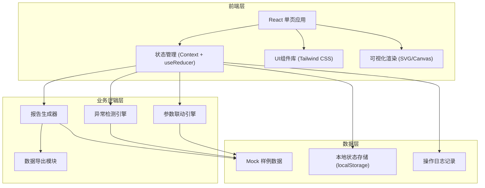
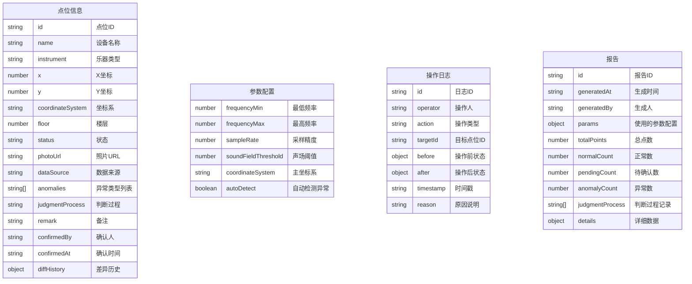

## 1. 架构设计



## 2. 技术描述

- **前端框架**：React@18 + TypeScript@5
- **构建工具**：Vite@5
- **样式方案**：Tailwind CSS@3 + PostCSS
- **状态管理**：React Context + useReducer（轻量级全局状态）
- **可视化**：原生 SVG + Canvas 2D（无需额外图表库）
- **图标**：Lucide React（轻量级图标库）
- **数据持久化**：localStorage（保存参数配置和操作记录）
- **后端**：无（纯前端应用，使用Mock数据）
- **数据库**：无（使用内存数据结构 + localStorage持久化）

## 3. 路由定义

| 路由 | 用途 |
|------|------|
| / | 主工作台（唯一页面，包含所有功能模块） |

## 4. 数据模型

### 4.1 数据模型定义



### 4.2 TypeScript 类型定义

```typescript
// 点位状态
type PointStatus = 'normal' | 'pending' | 'anomaly';

// 异常类型
type AnomalyType = 
  | 'coordinate_offset'      // 坐标偏移
  | 'duplicate_name'         // 设备重名
  | 'missing_photo'          // 缺照片
  | 'cross_floor'            // 跨楼层
  | 'coordinate_mismatch';   // 坐标系不一致

// 数据来源
type DataSource = 'primary' | 'gis_legacy' | 'manual';

// 点位信息
interface SoundFieldPoint {
  id: string;
  name: string;
  instrument: string;
  x: number;
  y: number;
  coordinateSystem: string;
  floor: number;
  status: PointStatus;
  photoUrl?: string;
  dataSource: DataSource;
  anomalies: AnomalyType[];
  judgmentProcess: string;
  remark?: string;
  confirmedBy?: string;
  confirmedAt?: string;
  diffHistory: DiffRecord[];
}

// 差异记录
interface DiffRecord {
  timestamp: string;
  operator: string;
  field: string;
  oldValue: any;
  newValue: any;
  reason: string;
}

// 参数配置
interface AnalysisParams {
  frequencyMin: number;
  frequencyMax: number;
  sampleRate: number;
  soundFieldThreshold: number;
  coordinateSystem: string;
  autoDetect: boolean;
}

// 操作日志
interface OperationLog {
  id: string;
  operator: string;
  action: 'import' | 'param_change' | 'confirm' | 'remark' | 'export';
  targetId?: string;
  before?: any;
  after?: any;
  timestamp: string;
  reason?: string;
}

// 报告
interface AnalysisReport {
  id: string;
  generatedAt: string;
  generatedBy: string;
  params: AnalysisParams;
  summary: {
    totalPoints: number;
    normalCount: number;
    pendingCount: number;
    anomalyCount: number;
    anomalies: Record<AnomalyType, number>;
  };
  judgmentProcess: string[];
  points: SoundFieldPoint[];
}
```

## 5. 核心模块设计

### 5.1 参数联动引擎
- 单一数据源原则：所有模块从同一状态树读取参数
- 参数变更时，通过 useReducer 派发 ACTION，触发所有关联模块更新
- 场景、明细、报告使用同一计算函数确保数据一致性

### 5.2 异常检测引擎
- 坐标偏移：检查点位是否超出合理范围或与同类乐器组距离异常
- 设备重名：比对所有点位名称，检测重复项
- 缺照片：检查 photoUrl 字段是否为空
- 跨楼层：检查同一设备是否分布在不同楼层
- 坐标系不一致：标注非主坐标系的点位，不硬画到同一空间

### 5.3 报告生成器
- 实时生成：参数或点位变更时自动重新计算
- 判断过程可追溯：每条结论附带判断依据和过程记录
- 导出一致性：报告和明细使用同一数据源，导出时校验两者一致性

### 5.4 数据导出模块
- 支持导出格式：JSON、CSV
- 导出内容包含：参数配置、点位数据、异常原因、判断过程
- 导出时自动添加导出人、导出时间、原因说明
