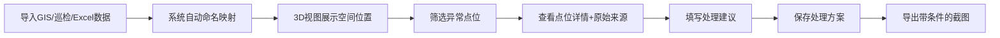
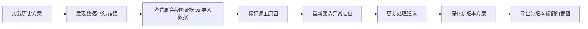
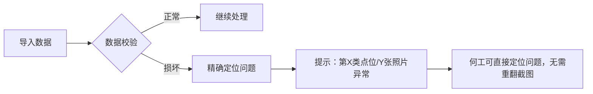

# 矿山边坡滑移预警系统 - 产品需求文档

## 1. 产品概述

矿山边坡滑移预警系统是一款面向矿山运维团队的3D可视化决策工具，解决周会评审中坐标系混乱、数据来源多样、判断过程难以追溯等痛点。

- 核心目标：让"矿山边坡滑移预警"从样例数据一路走到可导出的评审结果，确保每一步都有据可查
- 目标用户：运维工程师（如何工）、安全管理人员、评审会议参与人员
- 产品价值：减少周会截图翻找时间，提高预警判断可信度，便于工作交接

## 2. 核心功能

### 2.1 用户角色

| 角色 | 注册方式 | 核心权限 |
|------|----------|----------|
| 运维工程师 | 本地登录 | 导入数据、标记异常、保存方案、导出截图 |
| 评审人员 | 只读访问 | 查看数据、对比方案、导出结果 |

### 2.2 功能模块

1. **数据导入面板**：支持GIS、巡检平板、Excel多源数据导入，命名自动映射
2. **3D边坡视图**：空间位置展示、异常点位高亮、坐标系切换
3. **预警处理工作台**：点位详情、处理建议、来源追溯
4. **方案管理**：保存处理方案、版本对比、返工记录
5. **导出中心**：带筛选条件的截图导出、处理报告生成

### 2.3 页面详情

| 页面名称 | 模块名称 | 功能描述 |
|----------|----------|----------|
| 主工作台 | 3D视图区 | 边坡模型渲染、异常点位高亮、鼠标交互（旋转/缩放/点击） |
| 主工作台 | 数据导入 | 文件拖拽上传、格式自动识别、命名映射规则配置 |
| 主工作台 | 点位列表 | 筛选/搜索、状态标记、批量操作 |
| 主工作台 | 详情面板 | 点位详情、原始来源、处理时间、处理建议编辑 |
| 方案管理 | 方案列表 | 方案保存/加载、版本对比、返工标记 |
| 方案管理 | 冲突检测 | 周会截图与导入数据冲突时，双栏证据展示 |
| 导出中心 | 截图导出 | 自动附带当前筛选条件、坐标系信息、处理状态水印 |
| 导出中心 | 报告生成 | 业务友好的处理建议清单、交接说明文档 |

## 3. 核心流程

### 3.1 正常处理流程

### 3.2 返工处理流程

### 3.3 数据损坏提示流程

## 4. 用户界面设计

### 4.1 设计风格

- **主色调**：工业深蓝（#165DFF）+ 警示橙（#FF7D00）+ 安全绿（#00B42A）
- **辅助色**：深灰背景（#1D2129），突出3D场景
- **按钮风格**：直角硬朗工业风，2px边框，悬停时有明显状态变化
- **字体**：使用 Roboto Mono（数字显示）+ Noto Sans SC（中文内容），保证专业感
- **布局风格**：三栏布局（左侧列表+中间3D视图+右侧详情），信息密度高
- **图标风格**：线性图标，工程感强，避免卡通化

### 4.2 页面设计概述

| 页面名称 | 模块名称 | UI元素 |
|----------|----------|--------|
| 主工作台 | 3D视图区 | 深灰背景、蓝色网格地面、边坡模型、橙色异常点发光效果、鼠标悬停提示 |
| 主工作台 | 数据导入 | 拖拽区域虚线框、文件列表、进度条、错误提示红色高亮 |
| 主工作台 | 点位列表 | 表格斑马纹、状态标签色（绿/橙/红）、选中行高亮 |
| 主工作台 | 详情面板 | 卡片式分组、来源标签带时间戳、处理建议文本框带字数统计 |
| 方案管理 | 冲突检测 | 双栏对比布局、左右证据分开展示、中间VS标识、下方建议动作列表 |
| 导出中心 | 截图预览 | 缩略图带水印、筛选条件文字叠加、一键下载按钮 |

### 4.3 响应式

- **桌面优先**：针对1920×1080及以上分辨率优化，三栏布局最大化利用空间
- **平板适配**：1024px以下改为两栏（列表折叠为抽屉，详情在底部）
- **触摸优化**：关键按钮最小48px，3D视图支持双指缩放

### 4.4 3D场景指导

- **环境/氛围**：工业风，深色背景配柔和环境光，模拟矿场作业环境
- **光照设置**：主方向光 + 环境光，确保边坡轮廓清晰，异常点有自发光效果
- **相机设置**：初始为透视视角，可切换正交；支持轨道控制，默认角度为45°俯角
- **构图与焦点**：边坡模型居中，异常点位有明显的发光脉冲动画吸引注意
- **交互与动画**：点击点位有上浮动画，选中点有环绕光环，切换方案时有平滑过渡
- **后处理效果**：轻微泛光效果（Bloom）突出异常点，FXAA抗锯齿
- **资源与性能**：模型面数控制在5万以内，使用实例化渲染处理大量点位

