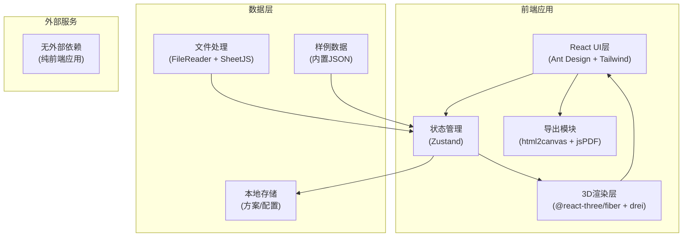
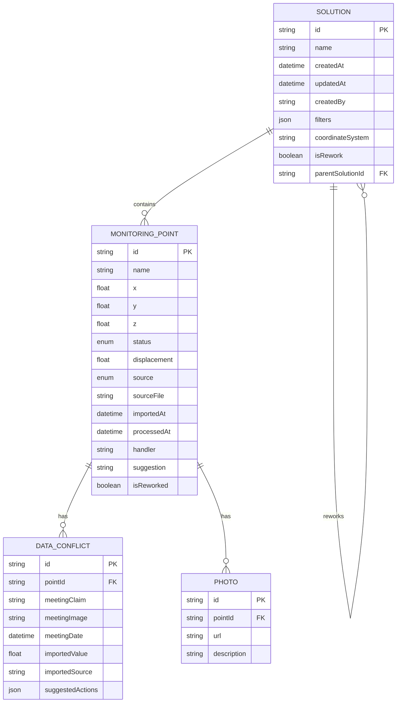

# 矿山边坡滑移预警系统 - 技术架构文档

## 1. 架构设计



## 2. 技术描述

- **前端框架**: React@18 + TypeScript
- **构建工具**: Vite@5
- **样式方案**: TailwindCSS@3 + CSS变量
- **UI组件库**: Ant Design@5
- **3D渲染**: @react-three/fiber@8 + @react-three/drei@9 + three@0.160
- **后处理**: @react-three/postprocessing@2
- **状态管理**: Zustand@4
- **文件处理**: xlsx(SheetJS)用于Excel解析
- **导出功能**: html2canvas + jsPDF
- **后端**: 无（纯前端应用，数据本地存储）
- **数据库**: LocalStorage + IndexedDB（可选）

## 3. 路由定义

| 路由 | 页面名称 | 用途 |
|------|----------|------|
| / | 主工作台 | 3D视图、数据导入、点位列表、详情面板 |
| /solutions | 方案管理 | 方案列表、版本对比、返工记录 |
| /export | 导出中心 | 截图预览、报告生成 |

## 4. 核心模块划分

### 4.1 目录结构

```
src/
├── components/
│   ├── layout/           # 布局组件
│   ├── import/           # 数据导入组件
│   ├── viewer3d/         # 3D视图组件
│   ├── point-list/       # 点位列表组件
│   ├── detail-panel/     # 详情面板组件
│   └── export/           # 导出组件
├── store/                # Zustand状态管理
├── hooks/                # 自定义Hooks
├── types/                # TypeScript类型定义
├── data/                 # 样例数据
├── utils/                # 工具函数
└── App.tsx
```

### 4.2 关键数据类型

```typescript
// 监测点位
interface MonitoringPoint {
  id: string;
  name: string;
  coordinates: { x: number; y: number; z: number };
  status: 'normal' | 'warning' | 'danger';
  displacement: number;
  source: 'gis' | 'tablet' | 'excel';
  sourceFile: string;
  importedAt: string;
  processedAt?: string;
  handler?: string;
  suggestion?: string;
  photos?: string[];
  isReworked?: boolean;
  reworkReason?: string;
}

// 处理方案
interface Solution {
  id: string;
  name: string;
  createdAt: string;
  updatedAt: string;
  createdBy: string;
  points: string[];
  filters: {
    status: string[];
    source: string[];
    dateRange: [string, string];
  };
  coordinateSystem: 'utm' | 'local' | 'wgs84';
  isRework: boolean;
  parentSolutionId?: string;
  notes: string;
}

// 数据冲突
interface DataConflict {
  pointId: string;
  meetingScreenshot: {
    claim: string;
    imageUrl: string;
    date: string;
  };
  importedData: {
    value: number;
    source: string;
    date: string;
  };
  suggestedActions: string[];
}
```

## 5. 数据模型

### 5.1 数据关系图



### 5.2 样例数据说明

系统内置两套样例数据：

1. **顺利处理样例**（15个点位）：
   - 8个GIS点位（坐标系UTM）
   - 5个巡检平板点位（含照片）
   - 2个Excel导入点位
   - 包含3个异常点位需处理

2. **返工处理样例**（10个点位）：
   - 包含2个数据冲突点
   - 1个数据损坏点位（模拟坐标缺失）
   - 1个历史方案用于对比

## 6. 3D渲染实现方案

### 6.1 边坡模型生成

- 使用程序化生成简化边坡地形（无需精细模型）
- 基于噪声函数生成自然的坡面起伏
- 材质使用深灰色加高度色阶映射

### 6.2 点位渲染

- 使用实例化渲染(InstancedMesh)优化大量点位性能
- 不同状态使用不同颜色和大小：
  - 正常：绿色小球，半径0.5
  - 预警：橙色发光球，半径0.8，脉冲动画
  - 危险：红色发光球，半径1.0，快速脉冲

### 6.3 交互实现

- 射线拾取(Raycaster)实现点位点击
- 选中点位显示详细信息标签
- 相机轨道控制支持旋转、缩放、平移

## 7. 导出功能实现

### 7.1 截图导出流程

1. 捕获3D Canvas内容（使用three.js的renderer.domElement.toDataURL）
2. 捕获UI层筛选条件信息
3. 在Canvas上叠加文字水印：
   - 方案名称
   - 当前筛选条件
   - 坐标系信息
   - 导出时间
4. 转换为PNG下载

### 7.2 报告导出流程

1. 使用jsPDF创建PDF文档
2. 插入3D截图
3. 生成点位清单表格
4. 附加处理建议清单（业务友好格式）
5. 添加交接说明区域

## 8. 性能优化策略

- 3D场景使用实例化渲染减少Draw Call
- 点位列表采用虚拟滚动
- 大文件导入使用Web Worker后台解析
- 图片资源懒加载
- LocalStorage数据分片存储

