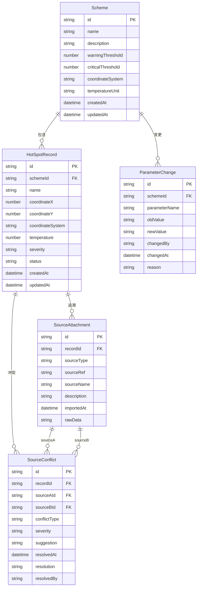

## 1. 架构设计

```mermaid
graph TB
    subgraph "前端层"
        "React SPA" --> "Zustand状态管理"
        "React SPA" --> "路由层"
    end
    subgraph "后端层"
        "Express API" --> "热斑服务"
        "Express API" --> "来源追踪服务"
        "Express API" --> "冲突检测服务"
        "Express API" --> "报告导出服务"
    end
    subgraph "数据层"
        "SQLite数据库" --> "热斑记录表"
        "SQLite数据库" --> "来源关联表"
        "SQLite数据库" --> "参数变更日志表"
        "SQLite数据库" --> "冲突处理记录表"
    end
    "React SPA" -->|"REST API"| "Express API"
    "热斑服务" --> "SQLite数据库"
    "来源追踪服务" --> "SQLite数据库"
    "冲突检测服务" --> "SQLite数据库"
    "报告导出服务" --> "SQLite数据库"
```

## 2. 技术说明

- **前端**：React@18 + TypeScript + Tailwind CSS@3 + Vite
- **初始化工具**：vite-init
- **后端**：Express@4 + TypeScript（ESM）
- **数据库**：SQLite（via better-sqlite3），本地文件存储，适合单机/小团队使用
- **状态管理**：Zustand（前端全局状态，含参数联动事件总线）
- **图标**：lucide-react

## 3. 路由定义

| 路由 | 用途 |
|------|------|
| `/` | 总览面板，方案状态概览与快捷入口 |
| `/workbench` | 热斑工作台，核心编辑与查看界面 |
| `/workbench/:recordId` | 热斑工作台聚焦到指定记录 |
| `/trace` | 追溯与报告页面 |
| `/trace/:recordId` | 追溯到指定记录的完整证据链 |

## 4. API定义

### 4.1 热斑记录相关

```typescript
interface HotSpotRecord {
  id: string;
  schemeId: string;
  name: string;
  coordinateX: number;
  coordinateY: number;
  coordinateSystem: string;
  temperature: number;
  severity: "normal" | "warning" | "critical";
  status: "active" | "resolved" | "conflict";
  createdAt: string;
  updatedAt: string;
}

interface CreateHotSpotRequest {
  schemeId: string;
  name: string;
  coordinateX: number;
  coordinateY: number;
  coordinateSystem: string;
  temperature: number;
  sources: SourceAttachment[];
}

interface UpdateHotSpotRequest {
  name?: string;
  coordinateX?: number;
  coordinateY?: number;
  temperature?: number;
  severity?: string;
}
```

### 4.2 来源追踪相关

```typescript
type SourceType = "point_table" | "photo" | "meeting_screenshot" | "plan_note" | "manual_coordinate";

interface SourceAttachment {
  id: string;
  recordId: string;
  sourceType: SourceType;
  sourceRef: string;
  sourceName: string;
  description: string;
  importedAt: string;
  rawData?: string;
}

interface SourceConflict {
  id: string;
  recordId: string;
  sourceA: SourceAttachment;
  sourceB: SourceAttachment;
  conflictType: "coordinate_mismatch" | "value_mismatch" | "coordinate_system_mismatch";
  severity: "low" | "medium" | "high";
  suggestion: string;
  resolvedAt?: string;
  resolution?: string;
  resolvedBy?: string;
}
```

### 4.3 参数变更相关

```typescript
interface ParameterChange {
  id: string;
  schemeId: string;
  parameterName: string;
  oldValue: number | string;
  newValue: number | string;
  changedBy: string;
  changedAt: string;
  reason?: string;
}

interface SchemeParameter {
  schemeId: string;
  warningThreshold: number;
  criticalThreshold: number;
  coordinateSystem: string;
  temperatureUnit: "celsius" | "fahrenheit";
}
```

### 4.4 报告导出相关

```typescript
interface ExportRequest {
  schemeId: string;
  format: "pdf" | "json";
  includeChangelog: boolean;
  includeConflicts: boolean;
  includeSourceChain: boolean;
}

interface ExportResponse {
  downloadUrl: string;
  generatedAt: string;
  recordCount: number;
}
```

### 4.5 API端点

| 方法 | 路径 | 说明 |
|------|------|------|
| GET | `/api/schemes` | 获取方案列表 |
| POST | `/api/schemes` | 创建方案 |
| GET | `/api/schemes/:id` | 获取方案详情（含参数） |
| PUT | `/api/schemes/:id/params` | 更新方案参数（触发联动） |
| GET | `/api/schemes/:id/records` | 获取方案下所有热斑记录 |
| POST | `/api/schemes/:id/records` | 创建热斑记录 |
| PUT | `/api/records/:id` | 更新热斑记录 |
| GET | `/api/records/:id/sources` | 获取记录的来源链 |
| POST | `/api/records/:id/sources` | 添加来源附件 |
| GET | `/api/schemes/:id/conflicts` | 获取方案下的冲突列表 |
| PUT | `/api/conflicts/:id` | 处理冲突（记录决策） |
| GET | `/api/schemes/:id/changes` | 获取参数变更历史 |
| POST | `/api/schemes/:id/export` | 导出报告 |
| POST | `/api/import/points` | 导入点位表 |
| POST | `/api/import/photos` | 导入现场照片元数据 |
| POST | `/api/import/meeting` | 导入周会截图OCR结果 |
| GET | `/api/schemes/:id/dashboard` | 获取总览面板数据 |

## 5. 服务端架构图

```mermaid
graph LR
    subgraph "Controller层"
        "SchemeController" --> "RecordController"
        "RecordController" --> "SourceController"
        "SourceController" --> "ConflictController"
        "ConflictController" --> "ExportController"
        "ExportController" --> "ImportController"
    end
    subgraph "Service层"
        "SchemeService" --> "RecordService"
        "RecordService" --> "SourceService"
        "SourceService" --> "ConflictService"
        "ConflictService" --> "ExportService"
        "ExportService" --> "ImportService"
    end
    subgraph "Repository层"
        "SchemeRepo" --> "RecordRepo"
        "RecordRepo" --> "SourceRepo"
        "SourceRepo" --> "ConflictRepo"
        "ConflictRepo" --> "ChangeLogRepo"
    end
    "SchemeController" --> "SchemeService"
    "RecordController" --> "RecordService"
    "SourceController" --> "SourceService"
    "ConflictController" --> "ConflictService"
    "ExportController" --> "ExportService"
    "ImportController" --> "ImportService"
    "SchemeService" --> "SchemeRepo"
    "RecordService" --> "RecordRepo"
    "SourceService" --> "SourceRepo"
    "ConflictService" --> "ConflictRepo"
    "ExportService" --> "ChangeLogRepo"
```

## 6. 数据模型

### 6.1 数据模型定义



### 6.2 数据定义语言

```sql
CREATE TABLE schemes (
  id TEXT PRIMARY KEY,
  name TEXT NOT NULL,
  description TEXT,
  warning_threshold REAL NOT NULL DEFAULT 85.0,
  critical_threshold REAL NOT NULL DEFAULT 100.0,
  coordinate_system TEXT NOT NULL DEFAULT 'chip_local',
  temperature_unit TEXT NOT NULL DEFAULT 'celsius',
  created_at TEXT NOT NULL DEFAULT (datetime('now')),
  updated_at TEXT NOT NULL DEFAULT (datetime('now'))
);

CREATE TABLE hot_spot_records (
  id TEXT PRIMARY KEY,
  scheme_id TEXT NOT NULL REFERENCES schemes(id),
  name TEXT NOT NULL,
  coordinate_x REAL NOT NULL,
  coordinate_y REAL NOT NULL,
  coordinate_system TEXT NOT NULL,
  temperature REAL NOT NULL,
  severity TEXT NOT NULL CHECK(severity IN ('normal', 'warning', 'critical')),
  status TEXT NOT NULL DEFAULT 'active' CHECK(status IN ('active', 'resolved', 'conflict')),
  created_at TEXT NOT NULL DEFAULT (datetime('now')),
  updated_at TEXT NOT NULL DEFAULT (datetime('now'))
);
CREATE INDEX idx_records_scheme ON hot_spot_records(scheme_id);
CREATE INDEX idx_records_severity ON hot_spot_records(severity);
CREATE INDEX idx_records_status ON hot_spot_records(status);

CREATE TABLE source_attachments (
  id TEXT PRIMARY KEY,
  record_id TEXT NOT NULL REFERENCES hot_spot_records(id),
  source_type TEXT NOT NULL CHECK(source_type IN ('point_table', 'photo', 'meeting_screenshot', 'plan_note', 'manual_coordinate')),
  source_ref TEXT NOT NULL,
  source_name TEXT NOT NULL,
  description TEXT,
  imported_at TEXT NOT NULL DEFAULT (datetime('now')),
  raw_data TEXT
);
CREATE INDEX idx_sources_record ON source_attachments(record_id);
CREATE INDEX idx_sources_type ON source_attachments(source_type);

CREATE TABLE parameter_changes (
  id TEXT PRIMARY KEY,
  scheme_id TEXT NOT NULL REFERENCES schemes(id),
  parameter_name TEXT NOT NULL,
  old_value TEXT NOT NULL,
  new_value TEXT NOT NULL,
  changed_by TEXT NOT NULL,
  changed_at TEXT NOT NULL DEFAULT (datetime('now')),
  reason TEXT
);
CREATE INDEX idx_changes_scheme ON parameter_changes(scheme_id);

CREATE TABLE source_conflicts (
  id TEXT PRIMARY KEY,
  record_id TEXT NOT NULL REFERENCES hot_spot_records(id),
  source_a_id TEXT NOT NULL REFERENCES source_attachments(id),
  source_b_id TEXT NOT NULL REFERENCES source_attachments(id),
  conflict_type TEXT NOT NULL CHECK(conflict_type IN ('coordinate_mismatch', 'value_mismatch', 'coordinate_system_mismatch')),
  severity TEXT NOT NULL CHECK(severity IN ('low', 'medium', 'high')),
  suggestion TEXT NOT NULL,
  resolved_at TEXT,
  resolution TEXT,
  resolved_by TEXT
);
CREATE INDEX idx_conflicts_record ON source_conflicts(record_id);
CREATE INDEX idx_conflicts_severity ON source_conflicts(severity);
```

### 6.3 初始样例数据

针对"芯片封装热斑立方"样例，插入一组示例数据，确保演示时可以看出完整追溯链和参数联动效果：

```sql
INSERT INTO schemes (id, name, description, warning_threshold, critical_threshold, coordinate_system, temperature_unit) VALUES
('demo-001', '芯片封装热斑立方-样例', '许姐负责的芯片封装热斑分析样例方案，包含点位表、现场照片和周会截图多源数据', 85.0, 100.0, 'chip_local', 'celsius');

INSERT INTO hot_spot_records (id, scheme_id, name, coordinate_x, coordinate_y, coordinate_system, temperature, severity, status) VALUES
('hs-001', 'demo-001', 'Die中心热点-A1', 12.5, 8.3, 'chip_local', 102.4, 'critical', 'active'),
('hs-002', 'demo-001', '焊球区域-B3', 25.1, 15.7, 'chip_local', 89.6, 'warning', 'active'),
('hs-003', 'demo-001', '基板边缘-C7', 3.2, 22.8, 'substrate_global', 76.3, 'normal', 'conflict'),
('hs-004', 'demo-001', '焊球区域-B5', 28.9, 14.2, 'chip_local', 91.1, 'warning', 'active'),
('hs-005', 'demo-001', 'Die角落-D2', 2.1, 3.5, 'chip_local', 105.8, 'critical', 'active');

INSERT INTO source_attachments (id, record_id, source_type, source_ref, source_name, description, imported_at, raw_data) VALUES
('src-001', 'hs-001', 'point_table', '点位表v2.3-行15', '点位表v2.3', '点位表第15行记录Die中心A1区域温度102.4°C', '2025-11-15T09:30:00Z', NULL),
('src-002', 'hs-001', 'photo', 'PHOTO_20251114_032', '现场照片032号', '红外热像仪拍摄Die中心热点，可见明显温度集中', '2025-11-15T09:35:00Z', NULL),
('src-003', 'hs-001', 'meeting_screenshot', '周会20251112-截图3', '第47周周会截图3', '周会中讨论Die中心温度偏高，标注需要关注', '2025-11-15T09:40:00Z', NULL),
('src-004', 'hs-002', 'point_table', '点位表v2.3-行28', '点位表v2.3', '点位表第28行记录焊球B3区域温度89.6°C', '2025-11-15T09:30:00Z', NULL),
('src-005', 'hs-002', 'plan_note', '方案备注v1.0-第4节', '方案备注第一版', '方案备注提到B3焊球区域需持续监控', '2025-11-14T14:00:00Z', NULL),
('src-006', 'hs-003', 'point_table', '点位表v2.3-行42', '点位表v2.3', '点位表第42行记录基板边缘C7温度76.3°C（substrate_global坐标系）', '2025-11-15T09:30:00Z', NULL),
('src-007', 'hs-003', 'manual_coordinate', '手改坐标-李工-20251113', '李工手改坐标', '李工在现场手改标注C7位置，坐标系为substrate_global与chip_local不一致', '2025-11-13T16:00:00Z', NULL),
('src-008', 'hs-003', 'meeting_screenshot', '周会20251112-截图5', '第47周周会截图5', '周会中提到C7位置需要标注坐标系差异', '2025-11-15T09:40:00Z', NULL),
('src-009', 'hs-004', 'point_table', '点位表v2.3-行30', '点位表v2.3', '点位表第30行记录焊球B5区域温度91.1°C', '2025-11-15T09:30:00Z', NULL),
('src-010', 'hs-005', 'photo', 'PHOTO_20251114_048', '现场照片048号', '红外热像仪拍摄Die角落D2，温度集中明显', '2025-11-15T09:35:00Z', NULL),
('src-011', 'hs-005', 'meeting_screenshot', '周会20251112-截图7', '第47周周会截图7', '周会讨论D2角落温度异常，判断为critical', '2025-11-15T09:40:00Z', NULL),
('src-012', 'hs-005', 'plan_note', '方案备注v2.0-第6节', '方案备注第二版', '方案备注v2更新D2区域需重点跟踪', '2025-11-15T10:00:00Z', NULL);

INSERT INTO source_conflicts (id, record_id, source_a_id, source_b_id, conflict_type, severity, suggestion, resolved_at, resolution, resolved_by) VALUES
('conflict-001', 'hs-003', 'src-006', 'src-007', 'coordinate_system_mismatch', 'high', '点位表使用chip_local坐标系，李工手改坐标使用substrate_global坐标系。建议：标注两个坐标系边界，不强制合并到同一空间。可由方案经理决定采用哪个坐标系作为基准。', NULL, NULL, NULL),
('conflict-002', 'hs-005', 'src-011', 'src-012', 'value_mismatch', 'medium', '周会截图标注D2为warning，但方案备注v2标记为critical。建议：以最新方案备注为准，但保留周会截图作为历史参考。', NULL, NULL, NULL);

INSERT INTO parameter_changes (id, scheme_id, parameter_name, old_value, new_value, changed_by, changed_at, reason) VALUES
('change-001', 'demo-001', 'warning_threshold', '80.0', '85.0', '许姐', '2025-11-14T10:00:00Z', '根据周会讨论提高warning阈值至85°C'),
('change-002', 'demo-001', 'critical_threshold', '95.0', '100.0', '许姐', '2025-11-15T11:00:00Z', '结合现场照片数据调整critical阈值');
```
