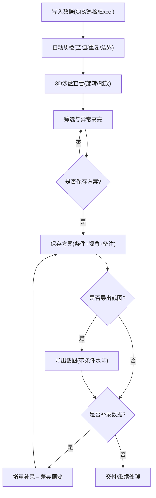

## 1. 产品概述

航道船舶会遇沙盘——面向方案经理的 3D 空间分析工具，用于可视化航道内船舶会遇场景、标注异常记录、管理方案版本并导出带筛选条件的截图报告。解决评审会上截图与筛选条件对不上、材料来源不可追溯、增量补录后差异不明等痛点。

- 目标用户：方案经理（如许姐），需在方案评审会上展示和交付"航道船舶会遇沙盘"成果
- 核心价值：每条记录可追源、截图自动嵌入筛选条件、方案可保存/续处理、补录差异一目了然

## 2. 核心功能

### 2.1 用户角色

| 角色 | 使用方式 | 核心权限 |
|------|----------|----------|
| 方案经理 | 直接使用 | 导入数据、3D 查看、筛选高亮、保存方案、截图导出、补录对比 |

### 2.2 功能模块

1. **沙盘主页**：3D 航道场景、船舶位置展示、异常高亮、筛选面板、截图导出
2. **数据管理页**：多来源数据导入、溯源标签、去重/空值处理、增量补录与差异
3. **方案管理页**：方案列表、保存/加载、版本备注、条件快照

### 2.3 页面详情

| 页面名称 | 模块名称 | 功能说明 |
|----------|----------|----------|
| 沙盘主页 | 3D 航道场景 | Three.js 渲染航道水面、航道边界线、船舶模型，支持旋转/缩放/平移 |
| 沙盘主页 | 船舶标记 | 每条记录以船型标记显示在 3D 空间中，悬停显示详情（名称、来源、时间、状态） |
| 沙盘主页 | 异常高亮 | 空值/重复/边界记录以红色脉冲光晕标记，正常记录为默认颜色 |
| 沙盘主页 | 筛选面板 | 按来源（GIS/巡检/Excel）、时间范围、状态（正常/空值/重复/边界）筛选，实时更新 3D 场景 |
| 沙盘主页 | 截图导出 | 导出当前 3D 视角截图，自动嵌入当前筛选条件水印（左下角）、时间戳、方案名称 |
| 沙盘主页 | 方案保存 | 保存当前筛选条件 + 相机视角 + 标注为方案，可命名和备注 |
| 数据管理页 | 数据导入 | 支持 CSV/JSON 导入，自动识别来源字段，无来源字段则手动标注 |
| 数据管理页 | 溯源标签 | 每条记录显示来源标识（GIS/巡检/Excel + 原始ID），点击可查看原始字段映射 |
| 数据管理页 | 数据质检 | 自动检测空值字段、重复记录、边界记录（坐标在航道边缘），标注异常类型 |
| 数据管理页 | 增量补录 | 追加新数据后自动生成差异摘要：新增 N 条、变更 M 条、异常类型分布变化 |
| 方案管理页 | 方案列表 | 显示已保存方案列表，含名称、创建时间、筛选条件摘要、记录数 |
| 方案管理页 | 方案加载 | 加载方案后恢复筛选条件、相机视角、标注状态，可继续处理 |
| 方案管理页 | 版本备注 | 每次保存可添加备注，方案详情页显示完整操作历史 |

## 3. 核心流程

方案经理许姐的典型工作流：
1. 导入一小包材料（GIS/巡检/Excel 混合数据）
2. 系统自动质检，标记空值、重复项和边界记录
3. 在 3D 沙盘中旋转查看，异常记录以红色高亮
4. 使用筛选面板聚焦特定来源或异常类型
5. 保存当前视图为方案，命名并备注
6. 导出截图（自动带筛选条件水印）用于评审
7. 临时补录一条备注数据，系统显示差异
8. 更新方案版本，继续处理或交付

## 4. 用户界面设计

### 4.1 设计风格

- 主色调：深海蓝(#0A1628)为底，航道青(#00E5CC)为强调色，异常红(#FF4757)用于警示
- 按钮风格：圆角矩形，带微光边框，hover 时强调色亮起
- 字体：Noto Sans SC（正文）+ JetBrains Mono（数据/代码）
- 布局：左侧筛选面板（可折叠）、中央 3D 场景、右侧详情面板（可折叠）
- 图标：lucide-react 线性图标

### 4.2 页面设计概览

| 页面名称 | 模块名称 | UI 元素 |
|----------|----------|----------|
| 沙盘主页 | 3D 航道场景 | 深色背景、水面纹理、航道边界发光线、船舶为简化几何体(锥体+长方体) |
| 沙盘主页 | 筛选面板 | 左侧抽屉，来源多选checkbox、时间范围双滑块、状态标签选择器、记录计数 |
| 沙盘主页 | 详情面板 | 右侧抽屉，选中记录详情卡片、溯源链、异常标签、备注输入 |
| 沙盘主页 | 工具栏 | 顶部，方案保存按钮、截图导出按钮、视角重置、全屏切换 |
| 数据管理页 | 导入区 | 拖拽上传区，来源选择下拉，字段映射预览表 |
| 数据管理页 | 数据表 | 分页表格，行高亮异常，溯源标签列，空值灰色标记 |
| 数据管理页 | 差异卡片 | 补录后弹出，显示新增/变更/异常分布对比 |
| 方案管理页 | 方案卡片网格 | 卡片含方案名、时间、条件摘要、记录数、操作按钮(加载/删除/导出) |

### 4.3 响应式

桌面优先设计，3D 场景最小宽度 800px，筛选和详情面板可折叠以适应 1280px+ 屏幕。

### 4.4 3D 场景指引

- 环境：深色背景模拟夜间航道，微弱环境光 + 航道两侧引导灯
- 灯光：方向光模拟月光，航道边界线自发光(青色)
- 相机：透视相机，初始俯视 45°，自由旋转/缩放，限制最大/最小距离
- 交互：鼠标悬停船舶显示 tooltip，点击选中高亮并展开详情面板
- 异常效果：异常船舶附加红色脉冲光环动画
- 后处理：轻微泛光(bloom)效果增强发光元素
