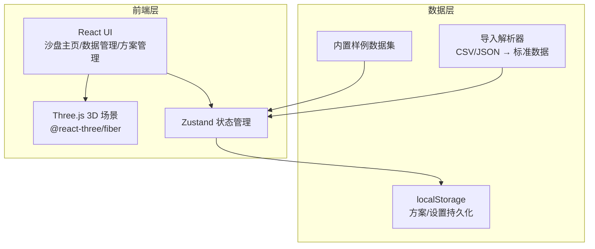
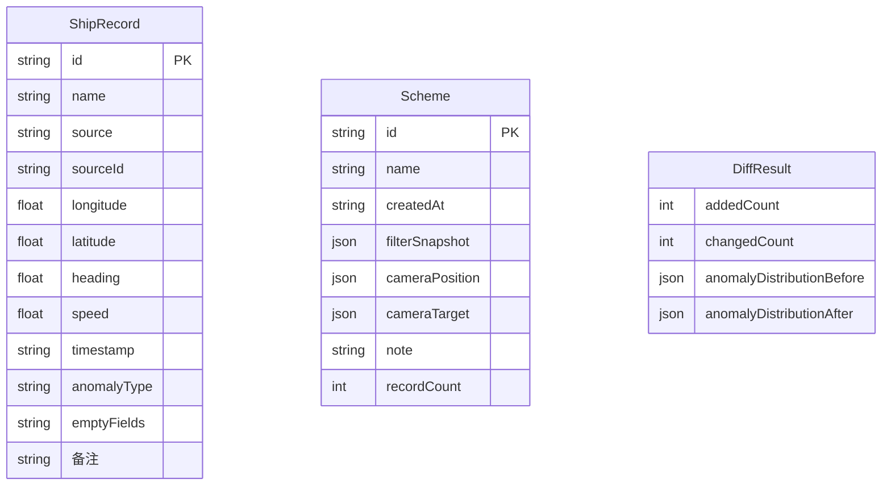

## 1. 架构设计



纯前端架构，无后端服务。数据通过浏览器 localStorage 持久化方案和设置，原始数据内置于前端。3D 渲染使用 Three.js + React Three Fiber。

## 2. 技术说明

- 前端：React@18 + TypeScript + Tailwind CSS@3 + Vite
- 初始化工具：vite-init（react-ts 模板）
- 3D 渲染：three + @react-three/fiber + @react-three/drei + @react-three/postprocessing
- 状态管理：zustand
- 路由：react-router-dom
- 数据持久化：localStorage（方案、设置）
- 数据导入：PapaParse（CSV 解析）
- 截图导出：Canvas toDataURL + 自定义水印绘制
- 后端：无
- 数据库：无（前端内置样例数据 + localStorage）

## 3. 路由定义

| 路由 | 用途 |
|------|------|
| `/` | 沙盘主页：3D 场景 + 筛选 + 截图导出 |
| `/data` | 数据管理页：导入、质检、补录差异 |
| `/schemes` | 方案管理页：方案列表、保存/加载 |

## 4. API 定义

无后端 API。所有数据操作通过 Zustand store 在前端完成。

核心 Store 接口：

```typescript
interface ShipRecord {
  id: string;
  name: string;
  source: 'GIS' | '巡检' | 'Excel';
  sourceId: string;
  longitude: number;
  latitude: number;
  heading: number;
  speed: number;
  timestamp: string;
  anomalyType: '正常' | '空值' | '重复' | '边界' | null;
  emptyFields: string[];
 备注: string;
}

interface FilterState {
  sources: ('GIS' | '巡检' | 'Excel')[];
  timeRange: [string, string];
  anomalyTypes: string[];
}

interface Scheme {
  id: string;
  name: string;
  createdAt: string;
  filterSnapshot: FilterState;
  cameraPosition: [number, number, number];
  cameraTarget: [number, number, number];
  note: string;
  recordCount: number;
}

interface DiffResult {
  addedCount: number;
  changedCount: number;
  anomalyDistributionBefore: Record<string, number>;
  anomalyDistributionAfter: Record<string, number>;
}
```

## 5. 服务器架构图

无后端服务。

## 6. 数据模型

### 6.1 数据模型定义



### 6.2 数据定义

无需 DDL。数据以 JSON 格式存储在 localStorage 和前端常量中。

内置样例数据集包含：
- 8 条 GIS 来源记录（2 条正常、1 条空值、1 条重复、1 条边界、3 条正常）
- 5 条巡检来源记录（3 条正常、1 条空值、1 条边界）
- 4 条 Excel 来源记录（3 条正常、1 条重复）
- 共 17 条记录，覆盖所有异常类型
