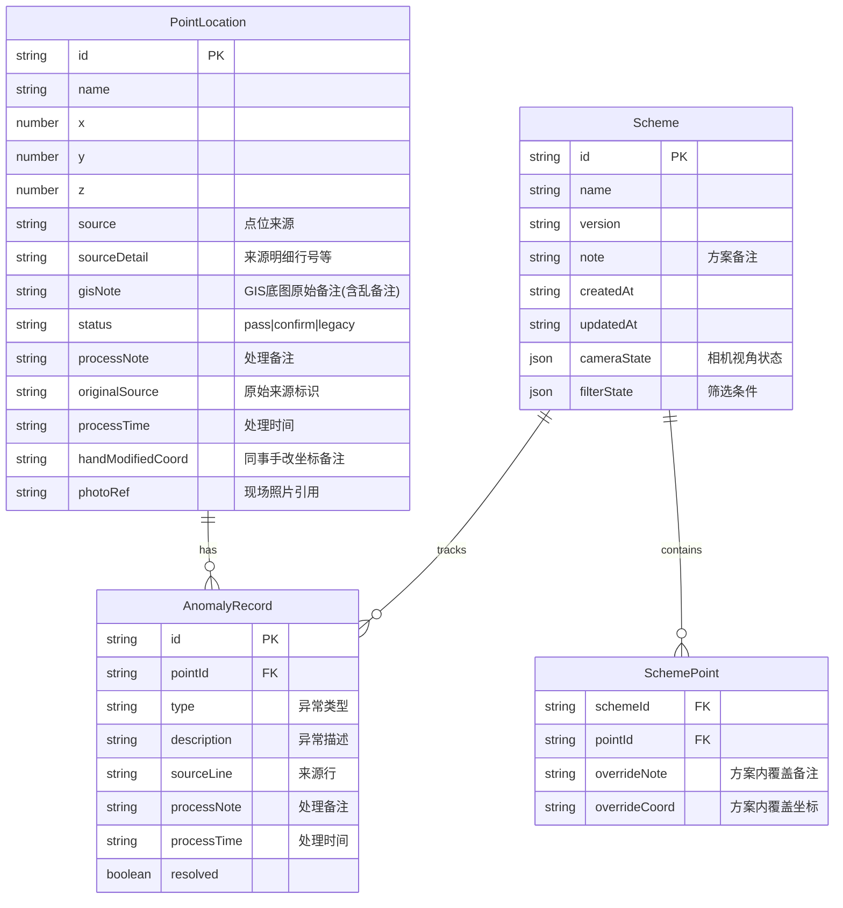

## 1. 架构设计

```mermaid
graph TB
    subgraph "前端层"
        "3D场景模块" --- "表格模块"
        "表格模块" --- "方案面板"
        "方案面板" --- "截图/报告模块"
    end
    subgraph "数据层"
        "Zustand Store" --- "localStorage持久化"
        "Zustand Store" --- "样例数据"
    end
    subgraph "3D引擎层"
        "Three.js" --- "@react-three/fiber"
        "@react-three/fiber" --- "@react-three/drei"
        "@react-three/drei" --- "@react-three/postprocessing"
    end
    "前端层" --> "数据层"
    "前端层" --> "3D引擎层"
```

## 2. 技术说明

- 前端：React@18 + TypeScript + TailwindCSS@3 + Vite
- 3D引擎：three + @react-three/fiber + @react-three/drei + @react-three/postprocessing
- 状态管理：Zustand（含localStorage中间件，刷新持久化）
- 初始化工具：vite-init（react-ts模板）
- 后端：无（纯前端，数据localStorage持久化）
- 数据库：无（使用mock数据和localStorage）

## 3. 路由定义

| 路由 | 用途 |
|------|------|
| / | 空间台主页：3D场景 + 点位表格 + 方案面板 |
| /report | 报告导出页：基于当前方案生成一致报告 |

## 4. 数据模型

### 4.1 数据模型定义



### 4.2 数据定义

```typescript
type PointStatus = 'pass' | 'confirm' | 'legacy';

interface PointLocation {
  id: string;
  name: string;
  x: number;
  y: number;
  z: number;
  source: '点位表' | '现场照片' | 'GIS底图' | '手改坐标';
  sourceDetail: string;
  gisNote: string;
  status: PointStatus;
  processNote: string;
  originalSource: string;
  processTime: string;
  handModifiedCoord: string;
  photoRef: string;
}

interface Scheme {
  id: string;
  name: string;
  version: string;
  note: string;
  createdAt: string;
  updatedAt: string;
  cameraState: { position: [number, number, number]; target: [number, number, number] };
  filterState: { status: PointStatus[]; source: string[] };
}

interface SchemePoint {
  schemeId: string;
  pointId: string;
  overrideNote: string;
  overrideCoord: string;
}

interface AnomalyRecord {
  id: string;
  pointId: string;
  type: string;
  description: string;
  sourceLine: string;
  processNote: string;
  processTime: string;
  resolved: boolean;
}

interface AppState {
  points: PointLocation[];
  schemes: Scheme[];
  currentSchemeId: string;
  schemePoints: SchemePoint[];
  anomalies: AnomalyRecord[];
  selectedPointId: string | null;
  cameraPosition: [number, number, number];
  cameraTarget: [number, number, number];
  filterStatus: PointStatus[];
  filterSource: string[];
}
```

## 5. 样例数据规划

### 5.1 顺利记录
- 名称：EFL-P001（110kV甲线#12塔）
- 来源：点位表
- 状态：pass（顺利通过）
- 处理备注：坐标与现场照片一致，GIS底图匹配
- 原始来源：点位表第3行
- 处理时间：2025-05-28 14:30

### 5.2 人工确认记录
- 名称：EFL-P007（220kV乙线#5塔）
- 来源：现场照片
- 状态：confirm（需人工确认）
- 处理备注：现场照片与GIS底图坐标偏差>2m，需小赵现场复测
- GIS备注：此处标注有误??老版底图 (保留原始乱备注)
- 原始来源：现场照片IMG_20250515_003.jpg
- 处理时间：2025-05-29 09:15

### 5.3 GIS旧口径记录
- 名称：EFL-P015（35kV丙线#3塔）
- 来源：GIS底图
- 状态：legacy（旧口径）
- 处理备注：此点位来自2019年GIS底图旧口径，坐标系为CGCS2000，与现行WGS84有偏移
- GIS备注：旧版坐标!!注意偏移~~不要删这条 (保留原始乱备注)
- 同事手改坐标：经小王手改为 x=125.3367 y=31.2245
- 原始来源：GIS底图2019_v2.dwg
- 处理时间：2025-05-30 16:45

## 6. 关键技术决策

1. **持久化**：Zustand + localStorage中间件，自动保存状态，刷新不丢失异常标注和视角
2. **3D交互**：@react-three/fiber的Raycaster实现点击拾取，drei的OrbitControls实现相机控制
3. **异常高亮**：@react-three/postprocessing的Bloom效果 + 自定义shader脉冲动画
4. **截图导出**：Three.js renderer.domElement.toDataURL() + Canvas合成筛选条件水印
5. **报告一致性**：报告直接从同一Store数据源生成，不引入二次计算
6. **GIS乱备注保留**：gisNote字段原样存储和显示，不做清洗
