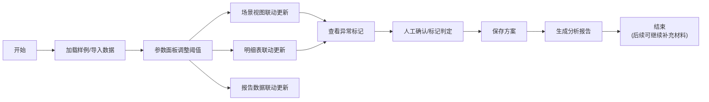

# 地下停车诱导模型 - 产品需求文档

## 1. 产品概述

地下停车诱导模型是一款面向数据分析人员的轻量工具，解决CAD导出点位与现场采集数据对齐难的问题。通过可视化场景、参数联动和智能判断，帮助同事快速识别数据异常、统一设备口径、生成可追溯的分析报告。

- 目标用户：数据分析同事阿乔及团队后续接手人员
- 核心价值：让乱材料能对得上，让判断过程有迹可循

---

## 2. 核心功能

### 2.1 用户角色

| 角色 | 使用方式 | 核心能力 |
|------|----------|----------|
| 数据分析人员 | 本地浏览器使用 | 数据导入、参数调整、场景查看、异常判定、方案保存、报告导出 |

### 2.2 功能模块

1. **数据导入页**：CAD点位导入、现场数据导入、样例数据加载
2. **主工作台**：参数面板、2D场景视图、数据明细表、冲突检测区
3. **方案报告**：判定记录回顾、分析报告生成、导出分享

### 2.3 页面详情

| 页面名称 | 模块名称 | 功能描述 |
|---------|---------|---------|
| 数据导入页 | 样例加载区 | 一键加载预置样例数据，包含典型异常场景 |
| 数据导入页 | 文件上传区 | 支持JSON/CSV格式数据导入，预览数据概览 |
| 主工作台 | 参数面板 | 诱导阈值、坐标容差、楼层映射等参数，实时联动 |
| 主工作台 | 场景视图 | 2D平面图展示设备点位，支持旋转、缩放、楼层切换 |
| 主工作台 | 数据明细 | 设备列表，标记异常状态，支持人工确认操作 |
| 主工作台 | 冲突检测 | 坐标系不一致、命名冲突、数据缺失等问题展示 |
| 方案报告 | 判定历史 | 每条记录的判定结果、依据、操作人、时间 |
| 方案报告 | 报告导出 | 同事间可读的分析报告，含统计数据和建议 |

---

## 3. 核心流程

用户操作流程：
1. 选择"地下停车诱导模型"样例，一键加载包含预置异常的测试数据
2. 在参数面板调整诱导距离阈值、坐标容差等参数，观察场景和明细实时变化
3. 查看系统自动标记的异常：坐标偏移、设备重名、缺照片、跨楼层
4. 对需要人工确认的记录给出判定，系统记录判定依据和时间
5. 保存当前方案，生成可供同事查阅的分析报告

---

## 4. 用户界面设计

### 4.1 设计风格

**设计方向：专业务实的工业风**

- **主色调**：深蓝灰（#1E293B）作为主背景，营造专业数据分析氛围
- **强调色**：警示黄（#F59E0B）标记待确认，成功绿（#10B981）标记已通过，错误红（#EF4444）标记异常，信息蓝（#3B82F6）标记正常
- **按钮风格**：直角或微圆角（4px），边框清晰，hover时有微妙的明暗变化
- **字体**：使用 JetBrains Mono 作为等宽数据字体，配合 Inter 作为界面字体
- **布局风格**：三栏式工作台（左侧参数、中间场景、右侧明细），信息密度适中
- **视觉细节**： subtle的网格背景、精确的边框分隔、数据表格使用斑马纹增强可读性

### 4.2 页面设计概览

| 页面名称 | 模块名称 | UI 元素 |
|---------|---------|---------|
| 主工作台 | 参数面板 | 卡片式分组，滑块+数字输入联动，实时生效 |
| 主工作台 | 场景视图 | 工具栏（缩放/旋转/重置/楼层切换），设备点位用不同颜色和图标区分状态 |
| 主工作台 | 数据明细 | 可折叠分组（按状态/按楼层），操作按钮在行内 |
| 主工作台 | 冲突检测 | 时间线式展示，每条冲突包含"两边证据"+"建议动作" |
| 方案报告 | 判定历史 | 卡片式时间线，清晰展示谁在什么时候做了什么判定 |
| 方案报告 | 报告区域 | 类Markdown排版，可复制可导出，语言口语化 |

### 4.3 响应式设计

- **桌面优先**：核心体验针对 1440px 及以上宽度优化
- **平板适配**：三栏可折叠为两栏，参数面板可收起为侧边抽屉
- **触控优化**：按钮最小点击区域 44x44px，支持触屏缩放场景图

### 4.4 2D场景视图设计

- **环境**：深色网格背景，模拟CAD绘图环境
- **图层**：楼层平面图为底层，设备点位为上层，连线（如有）为中间层
- **交互**：鼠标滚轮缩放、拖拽平移、工具栏按钮旋转90度
- **坐标系提示**：不同坐标系的设备用不同边框样式标记，悬停显示来源
- **动画**：参数变化时，点位颜色渐变过渡，避免突兀

---

## 5. 样例数据规范

预置"地下停车诱导模型"样例需包含：

| 类型 | 数量 | 说明 |
|-----|-----|-----|
| 顺利通过记录 | 1条 | 数据完整、坐标一致、命名统一 |
| 需人工确认记录 | 1条 | 坐标接近阈值边界，需人工判断 |
| CAD旧口径记录 | 1条 | 从CAD导出，字段命名与新标准不同 |
| 坐标偏移异常 | 1条 | 同一设备CAD与现场坐标偏差过大 |
| 设备重名异常 | 1条 | 同一物理设备被录入为两个名称 |
| 缺照片异常 | 1条 | 现场采集缺少照片佐证 |
| 跨楼层异常 | 1条 | 数据标记楼层与实际坐标楼层不符 |
| 坐标系不一致 | 1组 | 两套坐标系数据，不强行合并，分别标记 |
