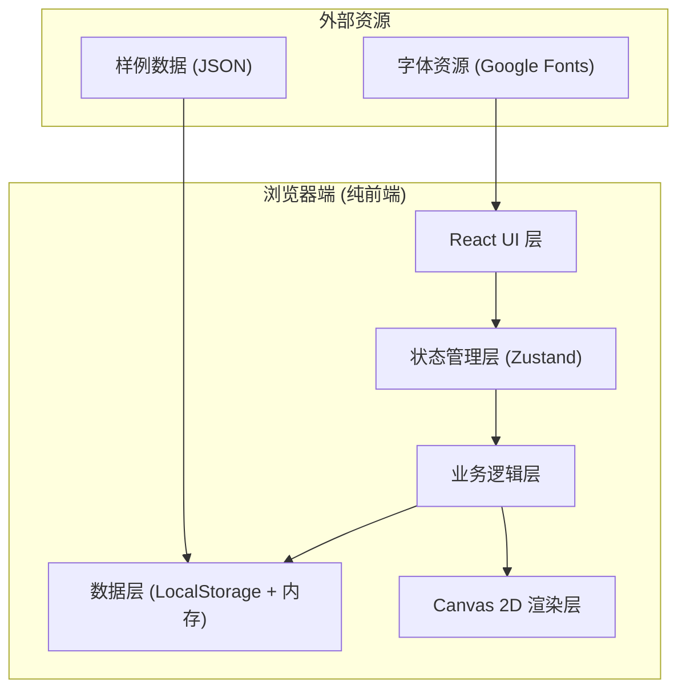
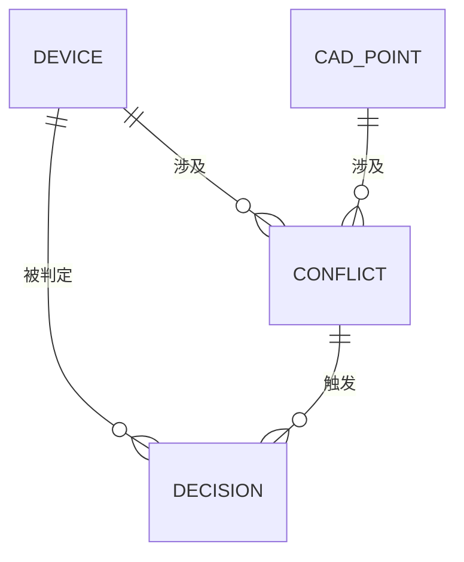

# 地下停车诱导模型 - 技术架构文档

## 1. 架构设计



本项目为纯前端应用，无需后端服务，所有数据存储在浏览器 LocalStorage 中。

---

## 2. 技术选型说明

| 技术 | 版本 | 用途 | 选型理由 |
|-----|-----|-----|---------|
| React | 18.x | UI 框架 | 组件化开发，状态管理生态成熟 |
| Vite | 5.x | 构建工具 | 启动快、热更新流畅、生产构建优化 |
| TypeScript | 5.x | 类型系统 | 数据模型复杂，类型安全减少bug |
| Tailwind CSS | 3.x | 样式方案 | 快速实现工业风设计，原子化CSS |
| Zustand | 4.x | 状态管理 | 轻量、简单，适合中小型应用，参数联动容易实现 |
| Canvas API | - | 2D场景渲染 | 设备点位绘制性能好，支持旋转缩放变换 |

---

## 3. 路由定义

| 路由 | 页面 | 核心功能 |
|-----|-----|---------|
| `/` | 数据导入页 | 样例选择、文件上传、数据预览 |
| `/workspace` | 主工作台 | 参数调整、场景查看、数据明细、冲突处理 |
| `/report` | 方案报告 | 判定历史、报告生成、导出 |

---

## 4. 状态管理设计

### 4.1 Store 结构

```typescript
// 全局状态 Store
interface AppState {
  // 数据部分
  devices: Device[];              // 设备列表
  cadPoints: CadPoint[];          // CAD导出点位
  conflicts: Conflict[];          // 检测到的冲突
  decisions: Decision[];          // 人工判定记录
  
  // 参数部分（联动核心）
  params: {
    distanceThreshold: number;    // 诱导距离阈值 (米)
    coordTolerance: number;       // 坐标容差 (米)
    floorMapping: FloorMap;       // 楼层映射关系
    coordSystem: 'A' | 'B' | 'separate';  // 坐标系处理方式
  };
  
  // 视图部分
  view: {
    currentFloor: string;
    zoom: number;
    rotation: number;
    panX: number;
    panY: number;
    selectedDeviceId: string | null;
  };
  
  // 方案元数据
  project: {
    name: string;
    createdAt: string;
    updatedAt: string;
    operator: string;
  };
}
```

### 4.2 参数联动机制

```typescript
// 当 params 变化时，触发以下联动：
// 1. 重新计算每个设备的状态（正常/异常/待确认）
// 2. 更新冲突列表
// 3. 触发场景视图重绘
// 4. 更新明细表的筛选和排序
// 5. 重新计算报告统计数据

// 使用 Zustand 的 subscribe 实现：
useEffect(() => {
  const unsubscribe = useStore.subscribe(
    (state) => state.params,
    () => {
      recalculateDeviceStatus();
      detectConflicts();
      updateReportStats();
    },
    { equalityFn: shallow }
  );
  return unsubscribe;
}, []);
```

---

## 5. 数据模型

### 5.1 ER 图



### 5.2 核心数据类型定义

```typescript
// 设备（现场采集数据）
interface Device {
  id: string;
  name: string;
  alias?: string;           // 别名（用于重名检测）
  type: 'camera' | 'sensor' | 'indicator';
  floor: string;
  x: number;
  y: number;
  coordSystem: 'A' | 'B';
  hasPhoto: boolean;
  photoUrl?: string;
  source: 'field' | 'cad';  // 数据来源
  importTime: string;
  status: 'normal' | 'warning' | 'error' | 'pending';
  matchedCadId?: string;
}

// CAD导出点位
interface CadPoint {
  id: string;
  oldName?: string;         // 旧口径字段名
  newName?: string;         // 新口径字段名
  layer: string;            // CAD图层
  floor: string;
  x: number;
  y: number;
  coordSystem: 'A' | 'B';
  exportTime: string;
}

// 冲突记录
interface Conflict {
  id: string;
  type: ConflictType;
  severity: 'low' | 'medium' | 'high';
  deviceIds: string[];
  cadPointIds: string[];
  evidence: {
    source: 'device' | 'cad';
    field: string;
    value: any;
  }[];
  suggestion: string;        // 建议动作（口语化描述）
  resolved: boolean;
  resolvedBy?: string;
  resolvedAt?: string;
}

type ConflictType = 
  | 'coord_offset'           // 坐标偏移
  | 'name_duplicate'         // 设备重名
  | 'missing_photo'          // 缺少照片
  | 'cross_floor'            // 跨楼层
  | 'coord_system_mismatch'  // 坐标系不一致
  | 'cad_field_mismatch';    // CAD字段口径不一致

// 人工判定记录
interface Decision {
  id: string;
  deviceId?: string;
  conflictId?: string;
  type: 'accept' | 'reject' | 'manual_check' | 'merge';
  reason: string;
  operator: string;
  timestamp: string;
  paramsSnapshot: Params;    // 判定时的参数快照
}
```

---

## 6. 核心算法

### 6.1 坐标偏移检测

```typescript
function detectCoordOffset(
  device: Device, 
  cadPoint: CadPoint, 
  tolerance: number
): boolean {
  const dx = device.x - cadPoint.x;
  const dy = device.y - cadPoint.y;
  const distance = Math.sqrt(dx * dx + dy * dy);
  return distance > tolerance;
}
```

### 6.2 诱导模型判断

```typescript
function evaluateGuidanceModel(
  device: Device,
  params: Params
): {
  status: DeviceStatus;
  score: number;
  reasons: string[];
} {
  const reasons: string[] = [];
  let score = 100;
  
  // 1. 坐标一致性检查
  if (device.matchedCadId) {
    const offset = calculateOffset(device, device.matchedCadId);
    if (offset > params.coordTolerance) {
      score -= 40;
      reasons.push(`坐标偏移 ${offset.toFixed(2)}m，超过容差 ${params.coordTolerance}m`);
    }
  }
  
  // 2. 照片完整性
  if (!device.hasPhoto) {
    score -= 20;
    reasons.push('缺少现场照片佐证');
  }
  
  // 3. 楼层一致性
  if (isCrossFloor(device)) {
    score -= 30;
    reasons.push('坐标所在楼层与标记楼层不符');
  }
  
  // 4. 坐标系兼容性
  if (device.coordSystem !== 'A') {
    reasons.push('使用非标准坐标系，已单独标记');
  }
  
  // 判断状态
  let status: DeviceStatus;
  if (score >= 80) status = 'normal';
  else if (score >= 50) status = 'warning';
  else status = 'error';
  
  return { status, score, reasons };
}
```

---

## 7. Canvas 2D 渲染方案

### 7.1 渲染管线

```
参数变化 → 状态更新 → 计算设备状态 → 触发重绘 → 
  1. 清空画布
  2. 绘制网格背景
  3. 绘制楼层平面图（如果有）
  4. 按坐标系分组绘制
  5. 绘制设备点位（颜色/大小/边框根据状态）
  6. 绘制选中设备的详情浮层
  7. 绘制冲突连线
```

### 7.2 变换矩阵

```typescript
// 支持缩放、平移、旋转的变换矩阵
const transform = (ctx: CanvasRenderingContext2D, view: ViewState) => {
  ctx.translate(view.panX, view.panY);
  ctx.rotate((view.rotation * Math.PI) / 180);
  ctx.scale(view.zoom, view.zoom);
};
```

---

## 8. 项目目录结构

```
src/
├── assets/              # 静态资源
├── components/          # React 组件
│   ├── layout/         # 布局组件
│   ├── params/         # 参数面板组件
│   ├── canvas/         # 画布渲染组件
│   ├── table/          # 数据明细组件
│   └── report/         # 报告组件
├── store/              # Zustand 状态管理
│   └── useAppStore.ts
├── types/              # TypeScript 类型定义
│   └── index.ts
├── utils/              # 工具函数
│   ├── detection.ts    # 异常检测算法
│   ├── guidance.ts     # 诱导模型判断
│   └── export.ts       # 报告导出
├── data/               # 样例数据
│   └── sample.json
├── pages/              # 页面组件
│   ├── Import.tsx
│   ├── Workspace.tsx
│   └── Report.tsx
└── App.tsx             # 应用入口
```

---

## 9. 数据持久化

- 使用 LocalStorage 存储方案数据，key: `parking-guidance-projects`
- 方案数据包含：设备列表、CAD点位、参数设置、判定记录、视图状态
- 支持多方案切换，每个方案有独立的 ID 和名称
- 自动保存：参数变化或判定操作后 2 秒防抖保存
- 导出功能：JSON 格式导出完整方案，便于备份和分享
