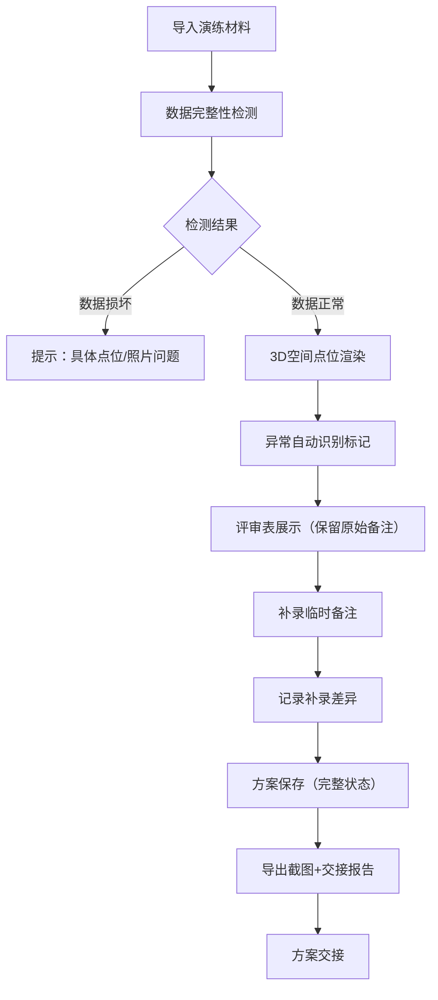

## 1. 产品概述

城市雨洪淹没演练评审系统，解决方案评审过程中数据追溯难、异常判断留痕难、方案复原难的问题。核心目标是让方案经理许姐及后续接手人员能清晰追踪每一条"城市雨洪淹没演练"数据的判断过程、原始来源和处理时间。

- 核心价值：完整保留评审判断链路，避免方案交接时信息丢失
- 目标用户：方案经理许姐、评审人员、后续接手人员
- 解决痛点：评审表备注易丢失、异常判断过程不可追溯、坐标系混乱导致展示失真

## 2. 核心功能

### 2.1 用户角色
| 角色 | 注册方式 | 核心权限 |
|------|----------|----------|
| 方案经理 | 系统内置账号 | 导入演练数据、添加临时备注、导出方案、截图 |
| 评审人员 | 系统内置账号 | 查看评审表、标记异常、确认判断结果 |
| 接手人员 | 系统内置账号 | 查看历史方案、追溯判断过程、导出交接材料 |

### 2.2 功能模块
1. **方案评审主页**：演练方案列表、方案导入入口、快速检索
2. **3D空间展示页**：点位空间分布、异常高亮、坐标系标记、分层展示
3. **评审详情页**：评审表数据、异常详情、判断轨迹、备注历史
4. **导出中心**：方案保存、截图导出、交接报告生成

### 2.3 页面详情
| 页面名称 | 模块名称 | 功能描述 |
|----------|----------|----------|
| 方案评审主页 | 方案列表 | 显示"城市雨洪淹没演练"所有方案，含原始来源、处理时间、状态标签 |
| 方案评审主页 | 导入面板 | 支持导入小包演练材料，自动检测数据问题并提示 |
| 方案评审主页 | 搜索筛选 | 按时间、异常类型、坐标系检索方案 |
| 3D空间展示页 | 场景容器 | 简化3D模型，重点展示空间位置关系，不追求精细度 |
| 3D空间展示页 | 异常高亮 | 坐标偏移点、重名设备、缺照片、跨楼层异常用不同颜色标记 |
| 3D空间展示页 | 坐标系标记 | 坐标系不一致数据分开显示，标注所属坐标系，不强行合并 |
| 3D空间展示页 | 点位详情 | 点击点位显示原始数据、判断过程、备注历史 |
| 评审详情页 | 评审表面板 | 完整展示方案评审表，保留所有"乱备注"不清洗 |
| 评审详情页 | 异常汇总 | 分类统计各类异常数量，不隐藏例外数据 |
| 评审详情页 | 备注补录 | 支持临时补录备注，记录补录时间、操作人、与原始数据的差异 |
| 评审详情页 | 判断轨迹 | 时间线展示：数据接入→自动检测→人工判断→备注补录 |
| 导出中心 | 方案保存 | 完整保存当前评审状态，支持后续复原 |
| 导出中心 | 截图导出 | 3D场景和评审表可截图，附水印（方案名、时间、坐标系） |
| 导出中心 | 交接报告 | 生成含判断链路、异常详情的交接文档 |

## 3. 核心流程

方案经理许姐的典型工作流程：导入小包"城市雨洪淹没演练"材料 → 系统自动检测数据问题 → 查看3D空间分布和异常高亮 → 在评审表中查看原始备注 → 临时补录新备注 → 确认方案并保存 → 导出截图和交接报告。

接手人员的追溯流程：选择历史方案 → 查看评审表完整记录 → 点击异常点查看判断轨迹 → 确认原始来源和处理时间 → 导出交接材料。

## 4. 用户界面设计

### 4.1 设计风格
- **主色调**：深蓝(#1e3a5f) + 警示红(#e63946) + 标记黄(#ffb703) + 正常绿(#52b788)
- **按钮风格**：直角矩形，细微阴影，强调操作的严肃性
- **字体**：标题使用 Noto Sans SC Bold，正文使用 Noto Sans SC Regular，数字使用等宽字体
- **布局风格**：三栏式布局（左侧导航 + 中间3D/评审区 + 右侧详情面板）
- **图标风格**：线性图标，保持专业感，异常点使用实心色块标记

### 4.2 页面设计概述
| 页面名称 | 模块名称 | UI元素 |
|----------|----------|---------|
| 方案评审主页 | 方案卡片 | 深色卡片、时间标签、异常数量徽章、悬停微动效 |
| 3D空间展示页 | 场景容器 | 深色背景、网格参考线、坐标系标签、异常点脉冲动画 |
| 3D空间展示页 | 图层面板 | 可折叠、复选框控制显示、坐标系分组 |
| 评审详情页 | 评审表 | 斑马纹表格、异常行高亮、备注单元格可展开 |
| 评审详情页 | 时间线 | 垂直线条、圆形节点、时间戳、操作人标签 |
| 导出中心 | 导出面板 | 卡片式选项、预览缩略图、进度条反馈 |

### 4.3 响应性
- 桌面端优先设计，最小支持1280px宽度
- 平板端折叠左侧导航为图标模式
- 3D场景自适应容器大小，详情面板可收起
- 表格支持横向滚动，确保数据完整性

### 4.4 3D场景指南
- **环境**：深灰色空间，极简网格地面，不使用HDRI避免干扰
- **光照**：单方向平行光 + 环境光，确保点位清晰可见，阴影柔和
- **相机设置**：透视相机，初始视角为45度俯视，支持轨道控制
- **构图**：建筑轮廓用简化线框表示，点位用球体表示位于前景
- **交互**：点击点位弹出详情面板，hover显示点位名称，异常点持续发光
- **后处理**：轻微Bloom效果突出异常点，不使用其他复杂效果
- **性能**：点位数量控制在200以内，使用实例化渲染，确保60fps

**特殊要求**：
- 坐标系不一致的数据，用不同颜色的地面网格区分，中间有明显分隔
- 跨楼层异常用虚线连接不同楼层的点位
- 缺照片的点位显示空心球体，有照片的显示实心球体
- 重名设备用连线标记并显示警告图标
- 坐标偏移点显示原始位置（半透明）和当前位置的连线
