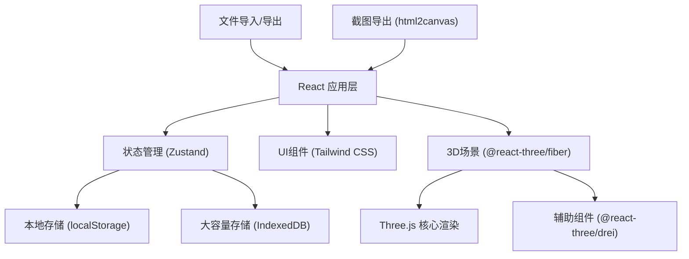
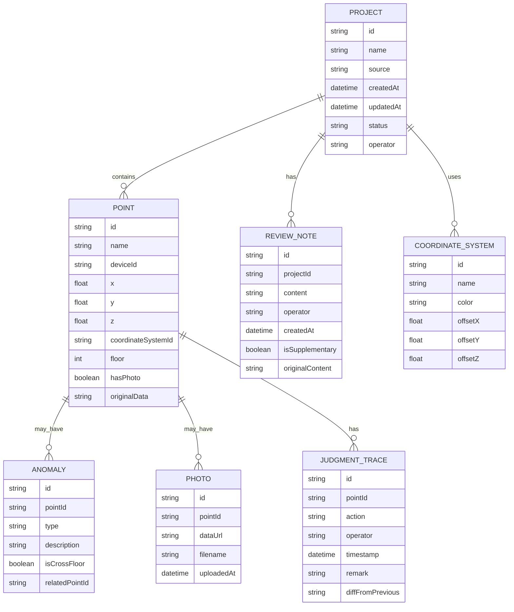

## 1. 架构设计

采用纯前端架构，数据存储在浏览器本地（localStorage + IndexedDB），支持导入导出JSON格式的方案文件。3D渲染使用Three.js生态，UI使用React + Tailwind CSS。



## 2. 技术描述
- **前端框架**: React@18 + TypeScript
- **构建工具**: Vite@5
- **样式方案**: Tailwind CSS@3
- **状态管理**: Zustand@4（轻量级，适合本项目规模）
- **3D渲染**: three@0.160 + @react-three/fiber@8 + @react-three/drei@9
- **后处理**: @react-three/postprocessing@2
- **本地存储**: localStorage（方案元数据） + IndexedDB（点位大数据）
- **截图导出**: html2canvas@1
- **图标**: lucide-react@0.294

## 3. 路由定义
| 路由 | 页面组件 | 用途 |
|------|----------|------|
| / | HomePage | 方案列表主页 |
| /project/:id | ProjectPage | 单个方案评审详情（含3D和评审表） |
| /export | ExportPage | 导出中心 |

## 4. 数据模型

### 4.1 数据模型定义



### 4.2 TypeScript 类型定义

```typescript
// 坐标系类型
interface CoordinateSystem {
  id: string;
  name: string;
  color: string;
  offset: { x: number; y: number; z: number };
}

// 异常类型
type AnomalyType = 'coordinate_offset' | 'duplicate_name' | 'missing_photo' | 'cross_floor';

interface Anomaly {
  id: string;
  pointId: string;
  type: AnomalyType;
  description: string;
  relatedPointId?: string;
  originalPosition?: { x: number; y: number; z: number };
}

// 点位
interface Point {
  id: string;
  name: string;
  deviceId: string;
  position: { x: number; y: number; z: number };
  coordinateSystemId: string;
  floor: number;
  hasPhoto: boolean;
  photoUrl?: string;
  originalData: Record<string, unknown>;
  anomalies: Anomaly[];
}

// 判断轨迹
interface JudgmentTrace {
  id: string;
  pointId: string;
  action: 'import' | 'auto_detect' | 'manual_judge' | 'supplement_note';
  operator: string;
  timestamp: string;
  remark: string;
  diff?: string;
}

// 评审备注
interface ReviewNote {
  id: string;
  projectId: string;
  content: string;
  operator: string;
  createdAt: string;
  isSupplementary: boolean;
  originalContent?: string;
}

// 方案
interface Project {
  id: string;
  name: string;
  source: string;
  createdAt: string;
  updatedAt: string;
  operator: string;
  status: 'draft' | 'completed';
  coordinateSystems: CoordinateSystem[];
  points: Point[];
  judgmentTraces: JudgmentTrace[];
  reviewNotes: ReviewNote[];
}
```

## 5. 核心功能模块设计

### 5.1 数据导入与检测模块
- 支持JSON格式导入
- 自动检测：坐标偏移、设备重名、缺照片、跨楼层连接
- 损坏数据提示：精确到点位ID或照片文件名

### 5.2 3D渲染模块
- 按坐标系分组渲染，不同坐标系物理分离
- 异常点特殊着色 + Bloom发光效果
- 点位交互：hover显示信息，click打开详情面板
- 跨楼层虚线连接

### 5.3 评审表模块
- 原始数据完整展示，不清洗备注
- 异常行高亮
- 备注补录功能，自动记录差异

### 5.4 方案持久化
- localStorage存方案列表和元数据
- IndexedDB存点位和照片大数据
- 导出完整JSON，可再次导入复原

### 5.5 截图与导出
- 3D场景截图（使用Three.js的renderer直接导出）
- 评审表截图（html2canvas）
- 自动添加水印：方案名、时间、坐标系信息
