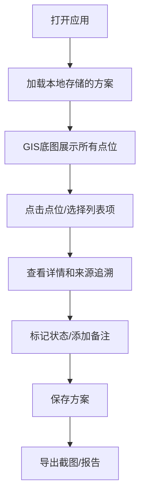

## 1. 产品概述

剧场灯位安全网是为运维工程师何工设计的GIS空间管理工具，解决多源材料（点位表、现场照片、方案备注、手改坐标）的空间对齐与追溯问题。核心价值在于让杂乱的运维材料能在空间维度上对得上、追得到、说得清。

## 2. 核心特性

### 2.1 用户角色
| 角色 | 登录方式 | 核心权限 |
|------|----------|----------|
| 运维工程师 | 本地访问（无登录） | 查看点位、标记异常、保存方案、导出截图、追溯来源 |

### 2.2 功能模块
1. **GIS主界面**：2D底图 + 3D简化模型、点位展示、异常高亮
2. **点位详情面板**：来源追溯、处理备注、操作建议
3. **方案管理**：方案保存/加载、报告导出
4. **数据导入**：多源材料导入与脏数据处理提示

### 2.3 页面详情
| 页面名称 | 模块名称 | 功能描述 |
|----------|----------|----------|
| 主界面 | GIS地图区 | 2D底图展示，3D灯位模型，缩放平移交互 |
| 主界面 | 点位列表区 | 所有点位列表，状态筛选（正常/待确认/异常） |
| 主界面 | 详情面板 | 点位详情、来源追溯、处理建议、备注编辑 |
| 主界面 | 方案工具栏 | 保存方案、加载方案、导出截图、生成报告 |

## 3. 核心流程

## 4. 用户界面设计

### 4.1 设计风格
- **主色调**：深蓝色系 (#1a365d)，体现专业运维感
- **强调色**：安全绿 (#10b981)、警告橙 (#f59e0b)、危险红 (#ef4444)
- **字体**：思源黑体 - 清晰易读的无衬线字体
- **布局**：三栏布局（左列表面板 + 中央GIS区 + 右详情面板）
- **风格**：工业运维风，功能优先，信息密度适中

### 4.2 页面设计概述
| 页面名称 | 模块名称 | UI元素 |
|----------|----------|--------|
| 主界面 | GIS地图区 | 深色底图、3D立方体灯位模型、状态色点标记、视角记忆 |
| 主界面 | 列表区 | 状态标签过滤、搜索框、来源标识、时间戳 |
| 主界面 | 详情面板 | 来源追溯卡片、时间线、建议文案、备注输入框 |
| 主界面 | 工具栏 | 图标按钮、操作提示、保存状态指示器 |

### 4.3 响应性
- 桌面端优先设计，适配1920×1080及以上分辨率
- 支持窗口缩放，GIS区域自适应

### 4.4 3D场景指引
- **环境**：简洁的剧场空间轮廓，不需要精细建模
- **灯光**：平行光 + 环境光，突出灯位立方体
- **相机**：默认俯视45度角，支持鼠标旋转缩放
- **交互**：点击3D模型触发详情面板
- **性能**：每个灯位用简化立方体表示，面数控制在最低
