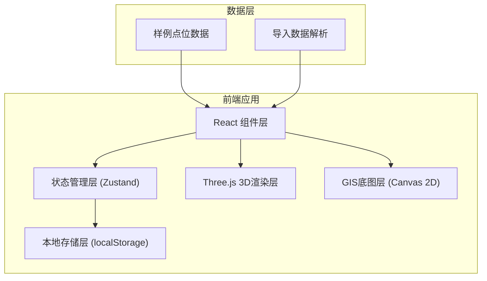
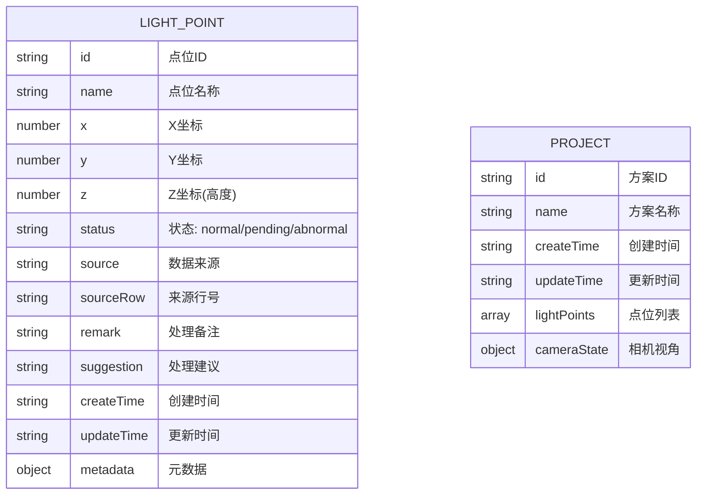

## 1. 架构设计



## 2. 技术说明

- **前端框架**: React@18 + TypeScript
- **构建工具**: Vite
- **样式方案**: TailwindCSS@3
- **3D渲染**: Three.js + @react-three/fiber + @react-three/drei
- **状态管理**: Zustand
- **本地存储**: localStorage (持久化方案和视角)
- **导出功能**: html2canvas (截图) + JSON (方案导出)

## 3. 路由定义

| 路由 | 用途 |
|------|------|
| / | 主界面 - GIS地图 + 列表 + 详情面板 |

## 4. 数据模型

### 4.1 数据模型定义



### 4.2 点位状态说明
- **normal (正常)**: 绿色标记，无异常
- **pending (待确认)**: 橙色标记，需要人工确认
- **abnormal (异常)**: 红色标记，已确认异常

### 4.3 数据来源类型
- **点位表导入**: 从Excel/CSV导入的点位
- **现场照片**: 照片标注的坐标
- **方案备注**: 从方案文档提取
- **手改坐标**: 同事手动修改的坐标
- **GIS底图补录**: 从GIS底图补充的旧口径

## 5. 核心组件结构

```
src/
├── components/
│   ├── GISViewer/          # GIS底图组件
│   ├── Scene3D/            # 3D场景组件
│   ├── PointList/          # 点位列表组件
│   ├── DetailPanel/        # 详情面板组件
│   ├── Toolbar/            # 工具栏组件
│   └── SourceTrace/        # 来源追溯组件
├── store/
│   └── useProjectStore.ts  # 状态管理
├── types/
│   └── index.ts            # 类型定义
├── data/
│   └── sampleData.ts       # 样例数据
├── utils/
│   ├── export.ts           # 导出工具
│   └── storage.ts          # 存储工具
└── App.tsx
```
