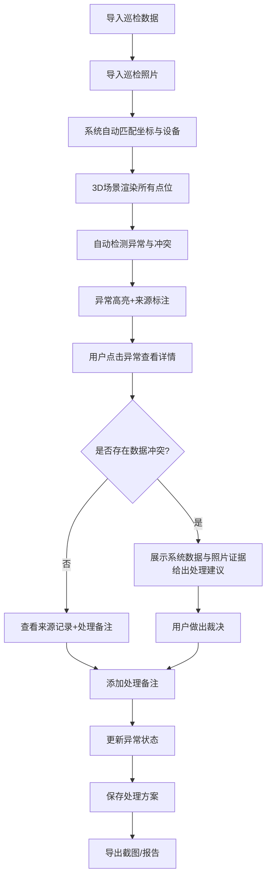

## 1. 产品概述

机器人仓储任务云可视化工具，解决巡检复盘时坐标系混乱、数据脱节、证据追溯困难的问题。以3D空间位置为核心，将仓储巡检数据与来源照片深度绑定，支持异常高亮、方案保存、截图导出和冲突证据对比，让数据分析同事阿乔不用每次从巡检照片重新找证据。

## 2. 核心功能

### 2.1 用户角色

| 角色 | 注册方式 | 核心权限 |
|------|----------|----------|
| 数据分析员（阿乔） | 本地应用 | 导入数据、查看3D场景、处理异常、导出报告、保存方案 |
| 仓储管理员 | 本地应用 | 查看巡检结果、补充巡检照片、确认异常 |

### 2.2 功能模块

1. **3D场景主界面**：仓储空间可视化、点位标注、异常高亮、楼层切换
2. **数据溯源面板**：记录列表、来源追溯、证据链展示、冲突对比
3. **异常处理工作台**：异常详情、处理备注、人工确认、状态流转
4. **方案管理中心**：方案保存、加载、截图导出、报告生成

### 2.3 页面详情

| 页面名称 | 模块名称 | 功能描述 |
|---------|---------|----------|
| 3D场景主界面 | 仓储空间渲染 | 多层仓库3D展示、货架/设备/点位标注、坐标系可视化 |
| 3D场景主界面 | 异常高亮系统 | 不同类型异常用不同颜色/闪烁标识、点击查看详情、跨楼层异常连线 |
| 3D场景主界面 | 视图控制 | 旋转/缩放/平移、楼层切换、视角预设、截图导出 |
| 数据溯源面板 | 记录列表 | 筛选/搜索、状态标签、来源标识（系统导入/照片补录） |
| 数据溯源面板 | 来源追溯 | 点击异常跳转3D位置+来源行+处理备注、数据来源链展示 |
| 数据溯源面板 | 冲突处理 | 系统数据与巡检照片冲突时并列展示、建议动作、人工裁决 |
| 异常处理工作台 | 异常详情 | 位置信息、设备信息、异常类型、照片证据、处理历史 |
| 异常处理工作台 | 处理操作 | 添加备注、标记状态（待处理/确认中/已解决/需复核）、补充材料 |
| 方案管理中心 | 方案管理 | 保存当前视图+筛选条件+处理进度、命名方案、快速加载 |
| 方案管理中心 | 导出功能 | 3D场景截图、异常报告PDF、数据溯源清单 |

## 3. 核心流程

用户导入巡检数据和照片 → 系统自动匹配坐标和设备 → 3D场景展示所有点位并高亮异常 → 用户点击异常查看详情和来源 → 发现冲突时系统展示两边证据并给出建议 → 用户做出裁决并添加备注 → 保存处理方案 → 导出截图和报告用于复盘

## 4. 用户界面设计

### 4.1 设计风格

- **主色调**：深空蓝 #0F172A 作为背景，搭配工业青 #06B6D4 作为主色，警示红 #EF4444 标记异常，确认绿 #10B981 标记正常，待处理橙 #F59E0B 标记人工确认
- **按钮风格**：直角硬边按钮，1px边框，hover时有细微发光效果，体现工业科技感
- **字体**：JetBrains Mono 等宽字体用于数据展示，Inter 用于界面文字，体现专业严谨
- **布局风格**：左侧3D场景主视图（70%），右侧数据面板（30%），顶部工具栏，底部状态栏
- **图标风格**：线型工业风图标，避免圆润可爱风格

### 4.2 页面设计概述

| 页面名称 | 模块名称 | UI Elements |
|---------|---------|-------------|
| 3D场景主界面 | 仓储空间 | 深空背景、网格地面、半透明货架、发光点位、异常脉冲动画 |
| 3D场景主界面 | 异常高亮 | 红色发光球体、脉冲动画、连线显示跨楼层异常、标签显示设备名 |
| 数据溯源面板 | 记录列表 | 卡片式列表、状态色条、来源标签（系统/照片）、冲突预警标识 |
| 数据溯源面板 | 冲突对比 | 左右分栏对比、证据高亮、建议动作按钮、裁决下拉框 |
| 异常处理工作台 | 详情面板 | 时间线布局展示处理历史、照片轮播、备注输入框 |
| 方案管理中心 | 方案列表 | 缩略图卡片、保存时间、状态统计、快速加载按钮 |

### 4.3 响应式

- Desktop-first设计，主场景区域自适应
- 右侧面板可折叠，最小宽度320px
- 支持全屏模式展示3D场景
- 触控设备支持手势旋转/缩放

### 4.4 3D场景指引

- **环境**：纯深空背景 + 网格地面，避免复杂环境分散注意力
- **光照**：顶部主光 + 环境光，异常点自发光，确保点位清晰可见
- **相机**：默认45度俯视角，支持环绕旋转，点击异常时相机自动平滑过渡到目标位置
- **交互**：鼠标悬停显示点位信息，点击选中并高亮，双击定位并展开详情
- **动画**：点位呼吸动画、异常脉冲动画、相机平滑过渡、楼层切换淡入淡出
- **后期处理**：轻微Bloom效果让发光点更突出，异常点有Glow效果
- **性能**：简化模型（用Box/Plane几何体），控制总面数<5000，确保流畅运行

