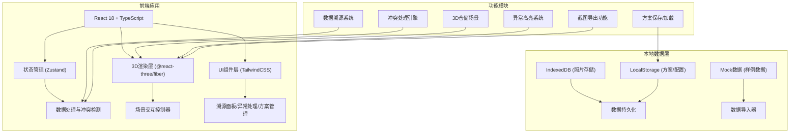
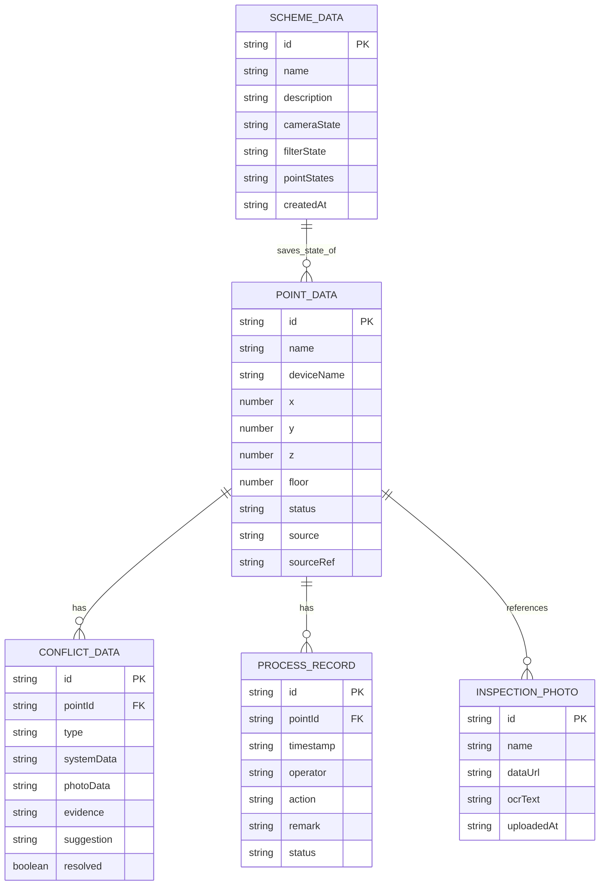

## 1. 架构设计



## 2. 技术描述

- **前端框架**：React 18 + TypeScript + Vite
- **3D引擎**：three.js + @react-three/fiber + @react-three/drei + @react-three/postprocessing
- **样式方案**：TailwindCSS 3
- **状态管理**：Zustand（轻量级，适合本地单页应用）
- **数据存储**：LocalStorage（方案配置）+ IndexedDB（照片二进制数据）
- **初始化工具**：npm create vite@latest
- **后端**：无（纯前端本地应用，数据本地存储）
- **数据库**：无（使用浏览器存储）

## 3. 路由定义

| 路由 | 目的 |
|------|------|
| / | 主界面：3D场景 + 右侧数据面板 |

单页应用，无多路由，所有功能通过面板切换实现。

## 4. API定义（无后端，仅本地数据接口）

```typescript
// 点位数据类型
interface PointData {
  id: string;
  name: string;
  deviceName: string;
  position: { x: number; y: number; z: number; floor: number };
  status: 'normal' | 'warning' | 'error' | 'pending';
  source: 'system' | 'photo' | 'manual';
  sourceRef: string; // 来源行号或照片ID
  photos: string[]; // 关联照片ID列表
  anomalyType?: string;
  conflict?: ConflictData;
  processHistory: ProcessRecord[];
  createdAt: string;
  updatedAt: string;
}

// 冲突数据
interface ConflictData {
  id: string;
  type: 'coordinate' | 'device_name' | 'status' | 'missing_photo';
  systemData: Partial<PointData>;
  photoData: Partial<PointData>;
  evidence: {
    system: string;
    photo: string;
  };
  suggestion: string;
  resolved: boolean;
  resolution?: 'use_system' | 'use_photo' | 'manual';
}

// 处理记录
interface ProcessRecord {
  id: string;
  timestamp: string;
  operator: string;
  action: string;
  remark: string;
  status: string;
}

// 方案数据
interface SchemeData {
  id: string;
  name: string;
  description: string;
  cameraState: { position: number[]; target: number[] };
  filterState: { status: string[]; source: string[]; floor: number };
  pointStates: Record<string, { status: string; remark: string }>;
  screenshot?: string;
  createdAt: string;
  updatedAt: string;
}

// 巡检照片
interface InspectionPhoto {
  id: string;
  name: string;
  dataUrl: string;
  ocrText?: string;
  annotatedPoints?: { x: number; y: number; pointId: string }[];
  exif?: Record<string, string>;
  uploadedAt: string;
}
```

## 5. 数据模型

### 5.1 数据模型ER图



### 5.2 样例数据设计

根据需求预置以下样例数据：

1. **顺利记录（1条）**：
   - 设备：AGV-001 输送机器人
   - 位置：2层 A区 坐标 (10, 2, 15)
   - 状态：正常
   - 来源：系统导入

2. **需要人工确认的记录（1条）**：
   - 设备：货架-S03E（系统名）/ 货架-S03（照片名）
   - 问题：同一设备两个名字冲突
   - 状态：待确认
   - 来源：系统+照片

3. **从巡检照片补来的旧口径（1条）**：
   - 设备：温湿度传感器-TH12
   - 问题：系统无记录，从历史照片补录
   - 状态：已补录
   - 来源：照片补录

4. **坐标偏移问题（1条）**：
   - 设备：充电桩-C02
   - 问题：系统坐标 (5, 1, 8) vs 照片识别坐标 (5.8, 1, 8.2) 偏移0.8米
   - 状态：异常

5. **缺照片问题（1条）**：
   - 设备：消防喷淋-F07
   - 问题：系统有记录但无对应巡检照片
   - 状态：待补拍

6. **跨楼层异常（1条）**：
   - 设备：提升机-LIFT-01
   - 问题：1层入口和2层出口均检测到异常，疑似联动故障
   - 状态：严重异常
   - 位置：跨1-2层

## 6. 关键实现要点

### 6.1 3D场景实现
- 使用简单Box几何体表示货架和设备，不追求精细模型
- 每层一个Group，支持楼层显隐切换
- 点位用Sphere几何体，根据状态设置不同颜色和自发光
- 跨楼层异常用Tube几何体绘制连线
- 后期处理使用EffectComposer + BloomPass实现发光效果

### 6.2 数据溯源实现
- 每个点位维护sourceRef字段指向原始数据行或照片
- 点击异常时，同时高亮3D点位 + 定位到来源记录 + 显示处理历史
- 维护完整的处理时间线，支持补充材料后继续处理

### 6.3 冲突处理实现
- 自动检测：坐标偏差>0.5米、设备名不完全匹配、状态不一致
- 冲突展示：左右分栏对比系统数据和照片证据
- 建议动作：根据冲突类型给出建议（如"建议以照片坐标为准，偏差0.8米可能影响导航"）
- 不自动裁决，仅提供证据和建议，由用户决定

### 6.4 方案保存实现
- 保存相机位置、目标点、当前筛选条件
- 保存所有点位的处理状态和备注
- 可选保存当前场景截图作为缩略图
- 支持方案重命名、删除、快速加载

### 6.5 截图导出实现
- 使用three.js的renderer.domElement.toDataURL()获取3D场景截图
- 支持添加水印和时间戳
- 支持导出当前溯源面板内容为文本报告
- 所有导出文件包含数据来源标识，避免脱节

