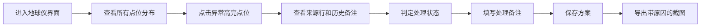
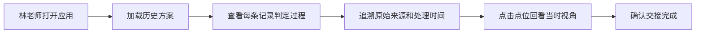

## 1. 产品概述
"遥感地块变化地球仪"是一款面向现场巡检人员和教学老师林老师的3D可视化工具，解决传统二维表格难以直观展示空间位置关系的问题。通过3D地球仪直观展示遥感地块变化点位，支持异常高亮、方案保存、截图导出，完整保留判断过程和来源信息，确保交接时可追溯。

- **核心价值**：将抽象的坐标数据转化为直观的3D空间位置，让现场同事一眼看懂地块变化的地理关系
- **目标用户**：现场巡检人员、数据分析人员、教学老师林老师
- **使用场景**：日常巡检异常标记、方案评审、工作交接、教学演示

## 2. 核心功能

### 2.1 用户角色
| 角色 | 登录方式 | 核心权限 |
|------|---------|---------|
| 现场巡检人员 | 本地使用无需登录 | 查看点位、标记异常、保存方案、导出截图 |
| 教学老师林老师 | 本地使用无需登录 | 查看历史记录、复核判定、交接工作 |

### 2.2 功能模块
1. **3D地球仪主界面**：地球仪展示、点位渲染、视角控制、异常高亮
2. **点位详情面板**：点位信息、来源行、处理备注、判定过程
3. **方案管理**：方案保存、方案加载、方案对比
4. **数据导出**：截图导出（带判定原因）、数据导出
5. **历史记录**：操作日志、本地持久化、刷新不丢失

### 2.3 页面详情
| 页面名称 | 模块名称 | 功能描述 |
|---------|---------|---------|
| 主界面 | 3D地球仪模块 | 支持拖拽旋转、缩放、自动旋转，渲染所有点位，异常点高亮闪烁 |
| 主界面 | 点位列表侧边栏 | 按状态分类展示点位，点击定位到地球仪对应位置 |
| 主界面 | 点位详情弹窗 | 展示点位完整信息、来源数据表行、处理备注、判定过程时间线 |
| 主界面 | 方案操作栏 | 保存当前视角和标记状态、加载历史方案、导出截图 |
| 主界面 | 状态筛选栏 | 按"顺利/待确认/旧口径"筛选显示点位 |

## 3. 核心流程

### 3.1 日常巡检处理流程

### 3.2 工作交接流程

## 4. 用户界面设计

### 4.1 设计风格
- **主色调**：深空蓝 `#0a1628` 作为主背景，体现地球仪的科技感和空间感
- **强调色**：
  - 顺利状态：翡翠绿 `#10b981`
  - 待确认状态：琥珀黄 `#f59e0b`
  - 旧口径状态：灰蓝 `#64748b`
  - 异常高亮：警戒红 `#ef4444`
- **字体**：标题使用 `Space Grotesk` 现代无衬线字体，正文使用 `Inter` 确保可读性
- **布局**：左侧固定侧边栏（点位列表）+ 中央全屏地球仪 + 顶部操作栏 + 右下角详情卡片
- **视觉效果**：毛玻璃面板、柔和光晕、点位脉冲动画、地球仪大气层辉光

### 4.2 页面设计概述
| 页面名称 | 模块名称 | UI元素 |
|---------|---------|--------|
| 主界面 | 3D地球仪 | 深蓝色星空背景、地球表面纹理、大气层光晕、点位标记（带脉冲动画）、异常点红色闪烁 |
| 主界面 | 左侧边栏 | 毛玻璃效果、状态筛选标签、点位列表（状态色块+坐标+简要描述）、滚动容器 |
| 主界面 | 顶部操作栏 | 方案名称输入、保存/加载按钮、导出截图按钮、自动旋转开关 |
| 主界面 | 详情卡片 | 点位坐标、状态标签、来源数据表行、处理备注时间线、判定过程记录 |

### 4.3 响应式
- Desktop-first 设计，主交互区域在1280px以上屏幕
- 侧边栏宽度固定280px，地球仪区域自适应
- 平板端侧边栏可收起，移动端建议使用横屏模式

### 4.4 3D场景指导
- **环境**：深空背景带微弱星点，地球表面使用高清卫星纹理，边缘有淡蓝色大气层辉光
- **光照**：主光源模拟太阳光从右上方照射，环境光确保暗部可见
- **相机**：初始视角定位到中国区域上方，支持鼠标拖拽旋转、滚轮缩放、右键平移
- **点位**：使用球体标记，不同状态不同颜色，异常点有脉冲放大动画
- **交互**：点击点位相机平滑飞行到该点正上方，显示详情卡片
- **后处理**：轻微Bloom效果增强大气层和点位光晕，整体色调偏冷蓝

## 5. 样例数据规范
应用内置3条典型样例数据，覆盖完整使用场景：

1. **顺利处理记录**：北京海淀地块，NDVI变化率-12%，判定为正常季节变化，来源：2026-05-15卫星影像，处理人：张工，时间：2026-05-20 14:30
2. **待人工确认记录**：上海浦东地块，建筑物新增疑似违建，来源：2026-05-28巡检照片补录，处理人：李工，时间：2026-05-30 09:15，备注：需现场复核
3. **旧口径补录记录**：广州天河地块，2025年历史数据按旧口径标记，来源：同事手改坐标表，处理人：王工（林老师学生），时间：2026-05-10 16:45，备注：已与林老师确认口径一致
