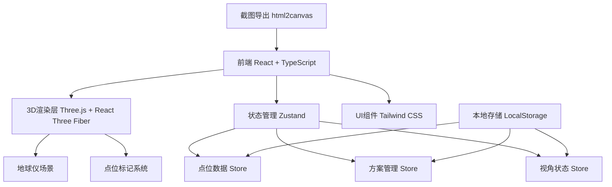
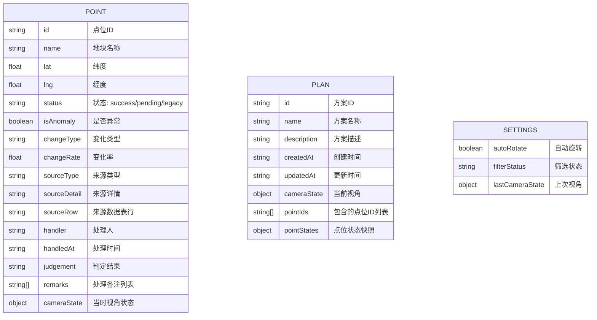

## 1. 架构设计


## 2. 技术描述
- **前端**：React@18 + TypeScript + Vite@5
- **3D引擎**：three@0.160 + @react-three/fiber@8 + @react-three/drei@9
- **状态管理**：zustand@4
- **样式方案**：tailwindcss@3
- **图标库**：lucide-react
- **截图导出**：html2canvas
- **后端**：无（纯前端应用，数据存储于LocalStorage）
- **初始化工具**：vite-init，使用 react-ts 模板

## 3. 路由定义
| 路由 | 用途 |
|------|------|
| / | 主界面，3D地球仪 + 点位管理 |

## 4. 数据模型

### 4.1 数据模型定义


### 4.2 TypeScript 类型定义
```typescript
type PointStatus = 'success' | 'pending' | 'legacy';
type SourceType = 'satellite' | 'inspection' | 'manual' | 'legacy';

interface CameraState {
  lat: number;
  lng: number;
  altitude: number;
  rotation: [number, number, number];
}

interface RemarkItem {
  id: string;
  content: string;
  author: string;
  timestamp: string;
}

interface Point {
  id: string;
  name: string;
  lat: number;
  lng: number;
  status: PointStatus;
  isAnomaly: boolean;
  changeType: string;
  changeRate: number;
  sourceType: SourceType;
  sourceDetail: string;
  sourceRow: string;
  handler: string;
  handledAt: string;
  judgement: string;
  remarks: RemarkItem[];
  cameraState: CameraState;
}

interface Plan {
  id: string;
  name: string;
  description: string;
  createdAt: string;
  updatedAt: string;
  cameraState: CameraState;
  pointIds: string[];
  pointStates: Record<string, { status: PointStatus; isAnomaly: boolean }>;
}

interface AppSettings {
  autoRotate: boolean;
  filterStatus: PointStatus | 'all';
  lastCameraState: CameraState | null;
}
```

## 5. 项目结构
```
src/
├── components/
│   ├── Globe/
│   │   ├── Earth.tsx          # 地球模型
│   │   ├── Atmosphere.tsx     # 大气层效果
│   │   ├── PointMarker.tsx    # 点位标记
│   │   └── Stars.tsx          # 星空背景
│   ├── Sidebar/
│   │   ├── PointList.tsx      # 点位列表
│   │   ├── FilterTabs.tsx     # 状态筛选
│   │   └── PlanManager.tsx    # 方案管理
│   ├── TopBar/
│   │   ├── ActionBar.tsx      # 操作按钮栏
│   │   └── PlanInput.tsx      # 方案名称输入
│   ├── DetailPanel/
│   │   ├── PointDetail.tsx    # 点位详情
│   │   ├── SourceRow.tsx      # 来源行展示
│   │   └── JudgementTimeline.tsx # 判定时间线
│   └── common/
│       ├── StatusBadge.tsx    # 状态标签
│       └── Modal.tsx          # 通用弹窗
├── store/
│   ├── usePointStore.ts       # 点位状态管理
│   ├── usePlanStore.ts        # 方案状态管理
│   └── useSettingsStore.ts    # 设置状态管理
├── hooks/
│   ├── useGlobeControls.ts    # 地球仪控制
│   ├── useLocalStorage.ts     # 本地存储
│   └── useScreenshot.ts       # 截图导出
├── data/
│   └── sampleData.ts          # 样例数据
├── types/
│   └── index.ts               # 类型定义
├── utils/
│   ├── coordinate.ts          # 坐标转换
│   └── export.ts              # 导出工具
├── App.tsx
├── main.tsx
└── index.css
```

## 6. 核心技术实现要点

### 6.1 3D地球仪
- 使用 `@react-three/drei` 的 `Globe` 组件或自定义球体 + 卫星纹理贴图
- 经纬度转3D坐标算法：`x = R * cos(lat) * cos(lng)`，`y = R * sin(lat)`，`z = R * cos(lat) * sin(lng)`
- 相机控制使用 `OrbitControls`，禁用平移，限制极角范围避免翻转
- 点击点位后使用 `lerp` 平滑过渡相机位置

### 6.2 点位高亮与动画
- 异常点位使用 `useFrame` 实现脉冲缩放动画
- 不同状态点位使用不同颜色和材质
- Hover时显示tooltip，点击时弹出详情面板

### 6.3 本地存储持久化
- 所有Store变化自动同步到LocalStorage
- 页面加载时从LocalStorage恢复状态
- 使用 `useLocalStorage` hook 封装读写操作

### 6.4 截图导出
- 使用 `html2canvas` 捕获整个页面
- 自动叠加当前方案名称、点位信息、判定原因等水印
- 导出文件名包含时间戳和方案名称

### 6.5 方案保存与加载
- 保存时序列化当前相机状态和所有点位状态
- 加载时恢复相机视角并平滑过渡
- 支持方案重命名和删除
