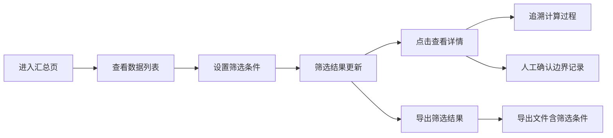

## 1. 产品概述

城市雨水管网容量估算系统，解决数据处理中单位混乱、计算过程不透明、异常数据丢失等问题。面向产品同事小岑及相关业务人员，提供可追溯、可复查、可导出的估算工具。

- 核心价值：保留完整计算链路，确保数据可追溯，支持异常样本复查
- 目标用户：产品经理、数据分析人员、业务审核人员

## 2. 核心功能

### 2.1 用户角色

| 角色 | 注册方式 | 核心权限 |
|------|----------|----------|
| 业务用户 | 无需注册 | 数据查看、筛选、导出、计算过程追溯 |

### 2.2 功能模块

1. **数据汇总页**：数据列表、筛选条件、状态统计、导出功能
2. **详情追溯页**：计算过程展示、参数版本、异常标记、人工确认
3. **样例数据模块**：内置多种测试场景（空值、重复、单位混用、异常数据）

### 2.3 页面详情

| 页面名称 | 模块名称 | 功能描述 |
|-----------|-------------|---------------------|
| 数据汇总页 | 筛选面板 | 按状态、时间、区域筛选，筛选条件与导出口径一致 |
| 数据汇总页 | 数据表格 | 展示估算记录，保留原始备注，标记状态（顺利/待确认/旧口径/异常） |
| 数据汇总页 | 统计卡片 | 各类状态数据统计，含无法计算记录的原因统计 |
| 数据汇总页 | 导出功能 | 导出CSV/Excel，包含完整计算过程和筛选条件 |
| 详情追溯页 | 计算过程 | 分步展示计算逻辑、参数版本号、单位换算过程 |
| 详情追溯页 | 异常标记 | 标记空值、重复、单位混用、异常值，保留原因说明 |
| 详情追溯页 | 人工确认 | 支持对边界记录进行人工确认或驳回 |

## 3. 核心流程

用户进入系统后，首先在汇总页查看所有雨水管网估算记录，可通过筛选条件快速定位目标数据。点击单条记录可查看完整计算过程，包括参数版本、单位换算步骤、异常检测结果。对于边界记录可进行人工确认操作，确认后状态更新。导出功能会将当前筛选条件和结果一并导出，确保口径一致。

## 4. 用户界面设计

### 4.1 设计风格

- 主色调：深蓝 (#1e3a5f) 代表专业可信，辅助色：橙 (#e67e22) 代表预警提示
- 按钮风格：圆角 4px，轻微阴影，hover 状态有颜色过渡
- 字体：标题使用 Playfair Display 体现专业感，正文使用 Lato 保证可读性
- 布局风格：卡片式布局，顶部导航 + 侧边筛选 + 主内容区
- 图标风格：线性图标，统一 24px 尺寸，颜色与状态对应

### 4.2 页面设计概述

| 页面名称 | 模块名称 | UI 元素 |
|-----------|-------------|-------------|
| 数据汇总页 | 顶部标题区 | 系统名称、当前日期、导出按钮、深色/浅色切换 |
| 数据汇总页 | 统计卡片区 | 4 张状态统计卡片，含数字和趋势图标 |
| 数据汇总页 | 筛选面板 | 下拉选择器、日期范围、状态多选、重置按钮 |
| 数据汇总页 | 数据表格 | 斑马纹、状态标签色、悬停高亮、行点击进入详情 |
| 详情追溯页 | 头部信息 | 记录编号、状态标签、返回按钮 |
| 详情追溯页 | 计算步骤区 | 时间线样式展示每一步计算，参数版本用角标标记 |
| 详情追溯页 | 异常信息区 | 红色边框卡片，列出异常类型和原因说明 |
| 详情追溯页 | 操作区 | 确认通过、标记需复核、取消按钮 |

### 4.3 响应性

- 桌面端优先设计，主内容区最小宽度 1200px
- 平板端自适应，筛选面板可折叠
- 移动端简化展示，表格改为卡片列表

### 4.4 动效设计

- 页面加载：统计数字从 0 滚动到目标值
- 状态变化：标签颜色有过渡动画
- 详情展开：计算步骤时间线依次出现，有轻微延迟
- 筛选应用：表格内容淡出淡入，提示筛选生效
