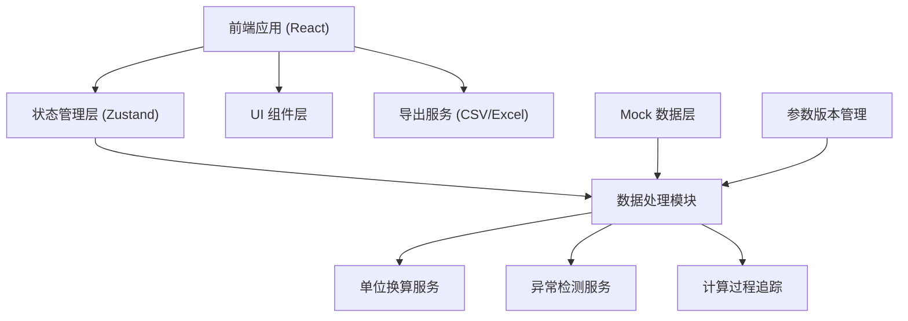
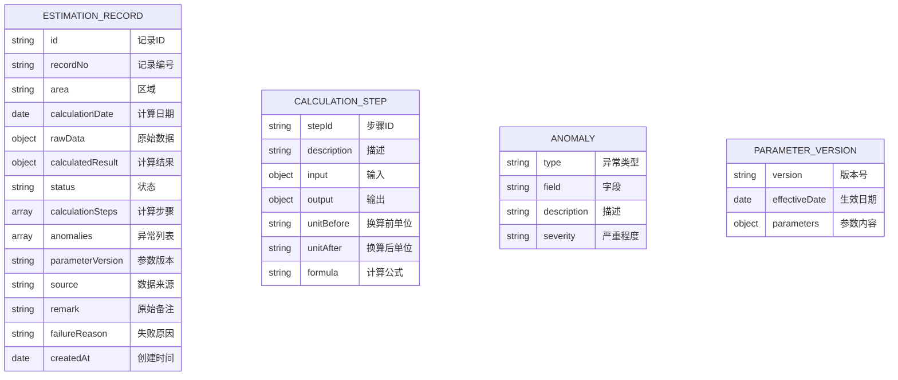

## 1. 架构设计



## 2. 技术描述

- 前端：React@18 + TypeScript + Vite
- 状态管理：Zustand
- 样式：TailwindCSS@3
- 图标：Lucide React
- 数据导出：xlsx (SheetJS)
- 初始化工具：Vite 初始化

## 3. 路由定义

| 路由 | 用途 |
|-------|---------|
| / | 数据汇总页 |
| /detail/:id | 详情追溯页 |

## 4. 数据模型

### 4.1 数据模型定义



### 4.2 TypeScript 类型定义

```typescript
type RecordStatus = 'success' | 'pending' | 'legacy' | 'error';
type AnomalyType = 'empty_value' | 'duplicate' | 'unit_mismatch' | 'outlier' | 'boundary';
type AnomalySeverity = 'high' | 'medium' | 'low';

interface CalculationStep {
  stepId: string;
  description: string;
  input: Record<string, any>;
  output: Record<string, any>;
  unitBefore?: string;
  unitAfter?: string;
  formula: string;
}

interface Anomaly {
  type: AnomalyType;
  field: string;
  description: string;
  severity: AnomalySeverity;
}

interface EstimationRecord {
  id: string;
  recordNo: string;
  area: string;
  calculationDate: string;
  rawData: {
    pipeLength?: number;
    pipeDiameter?: number;
    pipeDiameterUnit?: string;
    rainfallIntensity?: number;
    rainfallUnit?: string;
    runoffCoefficient?: number;
  };
  calculatedResult?: {
    capacity: number;
    unit: string;
  };
  status: RecordStatus;
  calculationSteps: CalculationStep[];
  anomalies: Anomaly[];
  parameterVersion: string;
  source: 'system' | 'manual' | 'legacy';
  remark: string;
  failureReason?: string;
  createdAt: string;
}
```

## 5. 核心服务模块

### 5.1 单位换算服务

- 支持的单位类型：
  - 长度：m, cm, mm, km
  - 流量：m³/s, L/s, m³/h
  - 雨量：mm/h, mm/min, mm/24h

### 5.2 异常检测服务

检测规则：
- 空值检测：关键字段为空
- 重复检测：相同区域+日期+管径
- 单位混用：单位不统一
- 边界值：结果超出正常范围
- 异常值：数值偏离正常范围过大

### 5.3 计算过程追踪

每一步计算都记录：
- 输入值和输出值
- 使用的公式
- 单位换算过程
- 参数版本号

### 5.4 导出服务

导出内容包含：
- 筛选条件说明
- 数据列表
- 计算过程摘要
- 异常统计
