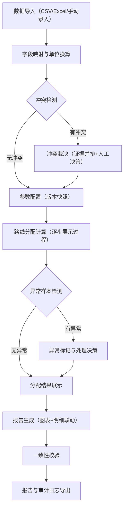

## 1. 产品概述

仓库冷链路线分配系统——面向量化助理的端到端路线分配工具，从历史样本导入、参数校准到路线分配结果输出，全链路可复查、可续接、可审计。解决的核心问题是：公式没错但单位混乱导致结果离谱，计算过程黑盒无法复查，人工调参被默认值覆盖，新旧数据冲突无人拍板。

- 目标用户：量化助理、仓库调度员、业务复查人员
- 核心价值：让冷链路线分配从"凭经验+黑盒"变为"可追溯+可复查+可续接"

## 2. 核心功能

### 2.1 用户角色

| 角色 | 进入方式 | 核心权限 |
|------|----------|----------|
| 量化助理 | 直接使用 | 导入数据、调参、执行分配、导出报告 |
| 复查人员 | 直接使用 | 查看审计日志、比对冲突、查看报告与明细 |

### 2.2 功能模块

1. **数据导入页**：多源异构数据导入（讲义、业务表、截图OCR）、字段映射、单位标注、来源溯源
2. **路线分配页**：参数配置与版本管理、分配计算引擎、计算过程展示、异常样本标记
3. **冲突裁决页**：历史样本与导入数据冲突检测、双方证据并排展示、建议动作、人工裁决记录
4. **报告导出页**：图表生成与导出、图表点击跳转明细、报告与明细一致性校验、审计日志

### 2.3 页面详情

| 页面名称 | 模块名称 | 功能描述 |
|----------|----------|----------|
| 数据导入页 | 数据源录入 | 支持CSV/Excel粘贴、手动录入；每条记录标注来源（讲义/业务表/截图）、录入时间、字段映射状态 |
| 数据导入页 | 字段映射面板 | 将异构字段名统一映射到标准字段；映射规则持久化，新导入自动匹配，可手动修正 |
| 数据导入页 | 单位标注与换算 | 每个数值字段标注原始单位与目标单位，自动换算并记录换算系数版本 |
| 数据导入页 | 数据预览表 | 导入后预览统一化数据，高亮异常值和缺失字段，标记来源追溯链 |
| 路线分配页 | 参数配置面板 | 冷链约束参数（温区范围、最大里程、车辆容量等），支持版本快照，人工调参不覆盖已有版本 |
| 路线分配页 | 分配计算引擎 | 基于参数执行路线分配算法，计算过程逐步展示（输入→中间值→结果），每步标注所用参数版本 |
| 路线分配页 | 异常样本标记 | 自动检测偏离阈值的样本，标记为异常并记录原因，异常样本参与/排除可切换 |
| 路线分配页 | 分配结果表 | 路线-仓库-车辆分配结果，每行可展开查看计算链路 |
| 冲突裁决页 | 冲突检测引擎 | 比对历史样本与新导入数据，检测数值/单位/字段映射冲突 |
| 冲突裁决页 | 证据并排视图 | 左侧历史样本证据、右侧导入数据证据，底部建议动作（采用历史/采用新数据/人工裁决） |
| 冲突裁决页 | 裁决记录 | 每次裁决记录裁决人、时间、选择、理由，不可篡改 |
| 报告导出页 | 图表生成 | 温区分布图、路线效率图、异常分布图等，图表可导出为PNG/SVG |
| 报告导出页 | 图表-明细联动 | 点击图表元素跳转到对应明细行，明细行高亮来源 |
| 报告导出页 | 一致性校验 | 导出前自动校验报告摘要与明细数据一致性，不一致则警告并标注差异点 |
| 报告导出页 | 审计日志导出 | 全流程审计日志（数据来源、参数版本、计算步骤、裁决记录），支持导出 |

## 3. 核心流程

用户从导入历史样本开始，经过字段映射和单位换算统一数据格式，配置参数后执行路线分配计算，过程中发现冲突则进入裁决环节，最终生成可复查的报告。重复运行时参数版本不丢失，补充材料后可续接处理。

## 4. 用户界面设计

### 4.1 设计风格

- 主色调：深青蓝（#0F4C5C）+ 暖琥珀色（#E36414）强调色，传达冷链专业感与温度警示感
- 辅助色：冷灰（#E8E8E8）背景、白色卡片、#1A1A2E深色面板
- 按钮：圆角矩形（8px），主按钮实心填充，次按钮描边，危险按钮琥珀色
- 字体：标题用 Noto Sans SC Bold，正文用 Noto Sans SC Regular，数据用 JetBrains Mono
- 布局：左侧固定导航栏 + 右侧内容区卡片式布局，表格数据密集排列
- 图标风格：线性图标（Lucide），线条2px，与专业工具调性匹配

### 4.2 页面设计概览

| 页面名称 | 模块名称 | UI元素 |
|----------|----------|--------|
| 数据导入页 | 数据源录入 | 拖拽上传区域、来源标签选择器（讲义/业务表/截图）、录入时间自动填充 |
| 数据导入页 | 字段映射面板 | 左侧原始字段列表、右侧标准字段下拉、映射连线可视化、已保存映射规则列表 |
| 数据导入页 | 单位换算区 | 源单位→目标单位下拉、换算系数输入、换算系数版本号标签 |
| 数据导入页 | 数据预览表 | 条纹表格、异常行琥珀色高亮、来源列可点击展开溯源链、缺失字段红色标记 |
| 路线分配页 | 参数配置面板 | 参数卡片分组（温区/里程/容量）、每参数显示当前值与版本号、"保存为新版本"按钮 |
| 路线分配页 | 计算过程面板 | 步骤时间线（输入→中间值→结果）、每步折叠展开、参数版本标签、异常步骤琥珀色标记 |
| 路线分配页 | 分配结果表 | 路线行+展开计算链路、异常标记徽章、参与/排除切换开关 |
| 冲突裁决页 | 证据并排视图 | 左右分栏、中间VS分隔线、底部裁决按钮组、裁决理由输入框 |
| 冲突裁决页 | 裁决历史时间线 | 垂直时间线、每节点显示裁决选择与时间戳 |
| 报告导出页 | 图表区 | 温区分布柱状图、路线效率散点图、异常分布热力图，悬停显示明细入口 |
| 报告导出页 | 一致性校验面板 | 校验进度条、通过/警告状态徽章、差异点列表 |
| 报告导出页 | 审计日志 | 可折叠时间线、按类型筛选（数据/参数/计算/裁决）、导出按钮 |

### 4.3 响应式

桌面优先设计，最小支持1280px宽度。平板端（768-1280px）侧边导航收起为图标模式。移动端暂不支持。

### 4.4 3D场景

不适用
