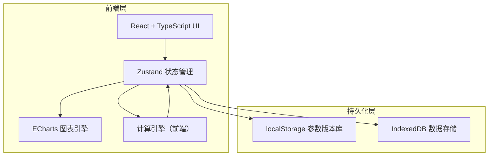
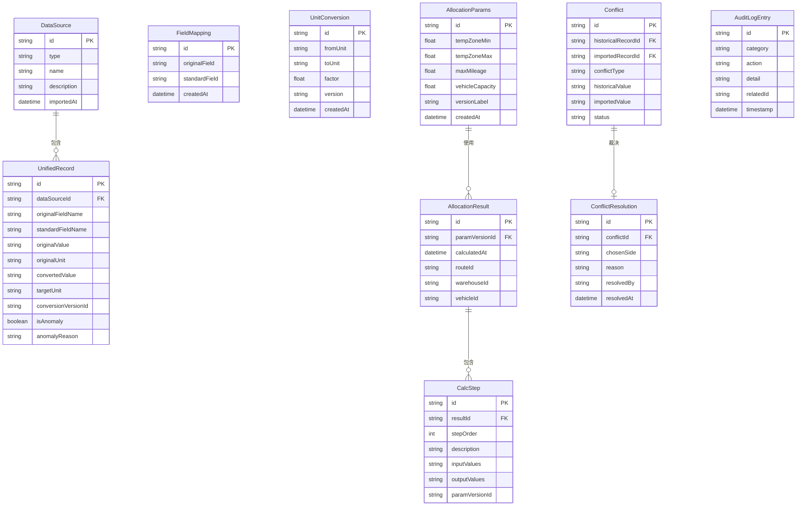

## 1. 架构设计



纯前端架构，所有数据与计算在浏览器本地完成，无需后端服务。使用 localStorage 存储参数版本与配置，IndexedDB 存储大数据量（导入记录、计算过程、审计日志）。

## 2. 技术说明

- 前端：React@18 + TypeScript + Tailwind CSS@3 + Vite
- 初始化工具：vite-init
- 后端：无（纯前端应用）
- 数据库：IndexedDB（通过 Dexie.js 封装）+ localStorage
- 图表：ECharts（图表-明细联动）
- 状态管理：Zustand
- 单位换算：自定义换算引擎，换算系数版本化存储

## 3. 路由定义

| 路由 | 用途 |
|------|------|
| / | 重定向到 /import |
| /import | 数据导入页——多源数据录入、字段映射、单位换算 |
| /allocation | 路线分配页——参数配置、计算引擎、结果展示 |
| /conflict | 冲突裁决页——冲突检测、证据并排、裁决记录 |
| /report | 报告导出页——图表生成、明细联动、审计日志 |

## 4. API 定义

无后端 API。所有数据操作通过 Zustand store + Dexie.js 本地数据库完成。

### 4.1 核心数据操作接口

```typescript
interface DataImportService {
  importFromCSV(raw: string, source: DataSource): Promise<ImportResult>
  importFromExcel(buffer: ArrayBuffer, source: DataSource): Promise<ImportResult>
  saveFieldMapping(mapping: FieldMapping[]): void
  saveUnitConversion(conversion: UnitConversion): void
  getDataPreview(): Promise<UnifiedRecord[]>
}

interface AllocationService {
  getParamVersions(paramKey: string): ParamVersion[]
  saveParamVersion(params: AllocationParams): string
  runAllocation(paramVersionId: string): Promise<AllocationResult>
  getCalculationTrace(resultId: string): CalcStep[]
  toggleAnomalySample(sampleId: string, included: boolean): void
}

interface ConflictService {
  detectConflicts(): Promise<Conflict[]>
  resolveConflict(conflictId: string, resolution: ConflictResolution): void
  getConflictHistory(): ConflictResolution[]
}

interface ReportService {
  generateCharts(resultId: string): ChartConfig[]
  drillDownToDetail(chartElementId: string): DetailRow[]
  validateConsistency(resultId: string): ConsistencyReport
  exportAuditLog(): AuditLogEntry[]
}
```

## 5. 服务端架构图

不适用（纯前端应用）

## 6. 数据模型

### 6.1 数据模型定义



### 6.2 数据定义语言

使用 Dexie.js 定义 IndexedDB schema：

```typescript
const db = new Dexie('ColdChainDB')
db.version(1).stores({
  dataSources: '++id, type, importedAt',
  unifiedRecords: '++id, dataSourceId, standardFieldName, isAnomaly',
  fieldMappings: '++id, originalField, standardField',
  unitConversions: '++id, fromUnit, toUnit, version',
  allocationParams: '++id, versionLabel, createdAt',
  allocationResults: '++id, paramVersionId, calculatedAt',
  calcSteps: '++id, resultId, stepOrder',
  conflicts: '++id, conflictType, status',
  conflictResolutions: '++id, conflictId, resolvedAt',
  auditLog: '++id, category, timestamp'
})
```
