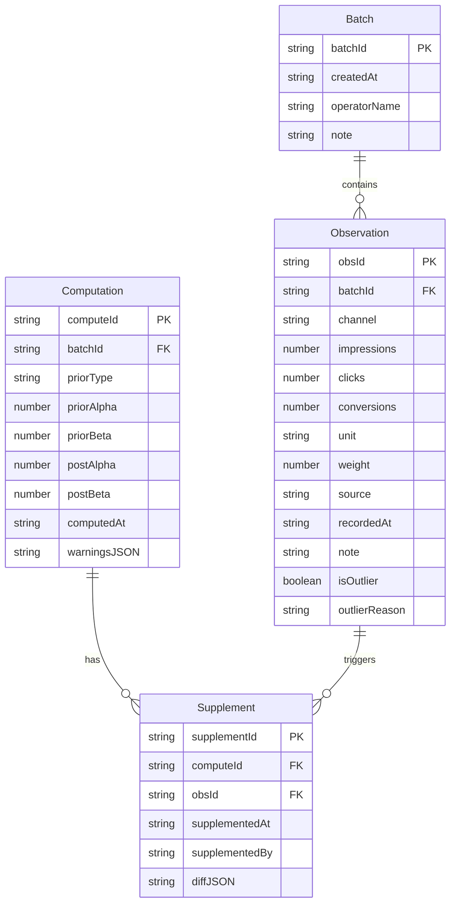

## 1. 架构设计

纯前端单页应用，所有计算在浏览器端完成，无需后端服务。数据通过 localStorage 持久化，支持导出/导入 JSON 备份。

```mermaid
graph TD
    "UI层[React组件]" --> "状态层[Zustand Store]"
    "状态层" --> "计算层[贝叶斯引擎]"
    "计算层" --> "校验层[单位/权重/边界]"
    "校验层" --> "状态层"
    "状态层" --> "持久层[localStorage]"
    "UI层" --> "图表层[Chart.js]"
```

## 2. 技术说明

- **前端**：React@18 + TypeScript + Tailwind CSS@3 + Vite
- **初始化工具**：vite-init（react-ts 模板）
- **状态管理**：Zustand
- **图表**：Chart.js + react-chartjs-2
- **数学计算**：自行实现贝叶斯共轭更新（无外部依赖）
- **后端**：无（纯前端）
- **数据库**：localStorage + JSON 导出/导入

## 3. 路由定义

| 路由 | 用途 |
|------|------|
| / | 数据录入页——参数表、历史记录、备注、越界标注 |
| /compute | 贝叶斯计算页——公式展示、计算引擎、校验提醒 |
| /report | 复盘报告页——图表、明细联动、差异对比、导出 |

## 4. API 定义

无后端 API。核心计算函数接口如下：

```typescript
interface PriorParams {
  type: 'beta' | 'normal'
  alpha: number
  beta: number
  mu?: number
  sigma2?: number
}

interface Observation {
  impressions: number
  clicks: number
  conversions: number
  channel: string
  unit: 'CPM' | 'CPC' | 'CPA'
  weight: number
  source: string
  recordedAt: string
  note: string
}

interface PosteriorResult {
  params: PriorParams
  priorSnapshot: PriorParams
  observations: Observation[]
  warnings: Warning[]
  computedAt: string
  batchId: string
}

interface Warning {
  type: 'unit_mismatch' | 'weight_not_closed' | 'boundary_exceeded' | 'outlier_detected'
  field: string
  message: string
  detail: string
  severity: 'info' | 'warn' | 'error'
}

interface SupplementDiff {
  before: PosteriorResult
  after: PosteriorResult
  changedFields: { field: string; before: number; after: number; delta: number; reason: string }[]
  supplementedAt: string
  supplementedBy: string
}

function bayesianUpdate(prior: PriorParams, obs: Observation[]): PosteriorResult
function supplementNote(result: PosteriorResult, note: Observation): SupplementDiff
function checkUnits(obs: Observation[]): Warning[]
function checkWeights(obs: Observation[]): Warning[]
function checkBoundaries(result: PosteriorResult): Warning[]
```

## 5. 无后端架构

不适用

## 6. 数据模型

### 6.1 数据模型定义



### 6.2 数据定义

所有数据存储在 localStorage 中，键名为 `bayesian_tool_*`，值为 JSON 序列化后的对象。导出时将所有键合并为一个 JSON 文件。
