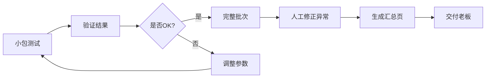

# 3D网格孔洞面积估算工具

> 可追溯、可解释、保护人工操作的数据处理管道

## ✨ 核心特性

1. **🔒 参数不被覆盖**：默认参数在代码中，用户参数在JSON文件，人工调整永远优先
2. **📝 老板备注不被洗掉**：汇总页用HTML标记分隔人工区和自动区，老板写的备注永远保留
3. **🧠 结果可解释**：每个结果都有判断依据、置信度、建议，不只是吐数字
4. **⏱️ 增量处理**：支持先跑小包验证，再补数据接着处理，补录差异讲清楚
5. **🔍 完整溯源**：每条结果带原始来源和处理时间，别人接手不用再问小岑
6. **⚠️ 异常清单**：越界样本自动标出，给出具体异常原因和处理建议

---

## 🚀 快速开始

### 0. 环境准备

Python 3.7+，无需额外依赖（标准库即可）。

### 1. 先跑小包验证（推荐）

产品同事小岑每次会先跑一小包材料验证参数：

```bash
python run.py estimate \
  -i data/samples/small_batch_test.json \
  -o output/results_test.json \
  -r output/report_test.md
```

查看结果：
- `output/results_test.json` - 详细结果数据
- `output/report_test.md` - 老板看的汇总页（已含人工备注区）

### 2. 确认没问题后跑完整批次

加上人工修正和备注一起处理：

```bash
python run.py estimate \
  -i data/samples/batch_may_week4.json \
  -o output/results_full.json \
  -r output/report_full.md \
  --incremental \
  --previous output/results_test.json \
  --previous-report output/report_test.md \
  --override H-003:45.2:扫描故障，已与工程确认 \
  --add-note H-007:需等下周一补充5个同类型样本后再判 \
  --operator 小岑 \
  --csv output/results_full.csv \
  --json output/results_full_detailed.json \
  --anomaly output/anomalies.md
```

### 3. 查看异常清单

```bash
# 直接看生成的异常清单
cat output/anomalies.md

# 或用命令行查看特定样本的详细解释
python run.py explain -i output/results_full.json --sample H-003
```

### 4. 查看参数调整情况

```bash
# 查看所有参数（带人工调整标记）
python run.py param list

# 查看与默认值的差异
python run.py param diff

# 查看参数修改历史
python run.py param history --key hole_area_estimation.normal_distribution_mean
```

---

## 📋 输入格式

### 样本数据文件 (JSON)

```json
{
  "batch_id": "批次编号",
  "scanned_at": "2026-05-27T09:00:00",
  "operator": "扫描组-老王",
  "scanner_model": "Scan3D-Pro-X200",
  "samples": [
    {
      "sample_id": "H-001",
      "vertices": [[0,0,0], [5,0,0], ...],
      "faces": [[0,1,4], [1,5,4], ...],
      "quality_score": 0.92,
      "material_type": "aluminum_alloy"
    }
  ]
}
```

### 支持的样本数据类型（按精度排序）

| 类型 | 字段 | 说明 | 精度 |
|------|------|------|------|
| 3D网格 | `vertices` + `faces` | 顶点坐标和三角面索引 | ⭐⭐⭐⭐⭐ 最高 |
| 轮廓点 | `contour_points` | 孔洞轮廓的二维点集 | ⭐⭐⭐⭐ 高 |
| 测量直径 | `measured_diameter` | 近似圆形的直径 | ⭐⭐⭐ 中 |
| 包围盒 | `bounding_box` | `{width, height, depth}` | ⭐⭐ 低 |
| 无几何数据 | 仅元数据 | 用统计模型估算 | ⭐ 最低 |

### 参数文件 (data/parameters.json)

**注意：只存你改过的参数！** 没改的用代码默认值。

```json
{
  "hole_area_estimation": {
    "normal_distribution_mean": 28.5,
    "outlier_z_score_threshold": 2.5
  },
  "_meta": {
    "last_edited_by": "小岑",
    "note": "5月根据质量部反馈调整"
  }
}
```

### 人工备注文件 (data/manual_notes.md)

老板和产品同事的备注，会自动合并到汇总页顶部：

```markdown
**老板备注**：
> 1. 样本H-003明显越界，人工修正为45.2mm²
> 2. 异常率偏高，需排查设备

**产品同事小岑备注**：
- H-003已过研发复核
- 扫描设备已安排校准
```

---

## 📖 怎么看异常清单

### 打开 `output/anomalies.md`

每个异常样本包含：

| 字段 | 说明 |
|------|------|
| 🔴 **异常原因** | 为什么判定为异常（Z-score超阈值、低于业务阈值、数据质量低等） |
| 💡 **建议行动** | 具体该怎么做（重新扫描、人工复核、调整阈值等） |
| 📊 **统计上下文** | Z分数、百分位等统计数据，辅助判断 |
| 🔗 **溯源信息** | 来源文件、处理时间、使用的参数，方便追查 |

### 异常原因类型速查

| 原因类型 | 说明 | 建议 |
|----------|------|------|
| **Z分数超标** | 与样本均值偏差过大 | 检查是否真实异常，或调整 `outlier_z_score_threshold` |
| **IQR超界** | 四分位距法判定为离群点 | 同上，或调整 `iqr_multiplier` |
| **超业务阈值** | 小于 `min_hole_area` 或大于 `max_hole_area` | 确认业务阈值是否合理 |
| **数据质量低** | `quality_score` < 0.3 | 建议重新扫描 |
| **样本量不足** | 样本数 < `boundary_sample_threshold` | 补充更多样本，或人工确认 |
| **无法估算** | 缺少必要几何数据 | 检查原始数据是否完整 |

### 优先级说明

- **🔴 高优先级**：异常样本 + 置信度低 → 立即人工复核
- **🟡 中优先级**：统计近似或边界样本 → 建议复核
- **🟢 正常**：结果可靠 → 无需处理

---

## 🔧 参数说明

### 核心估算参数

| 参数名 | 默认值 | 说明 |
|--------|--------|------|
| `hole_area_estimation.min_hole_area` | 0.5 | 最小业务阈值 (mm²) |
| `hole_area_estimation.max_hole_area` | 100.0 | 最大业务阈值 (mm²) |
| `hole_area_estimation.normal_distribution_mean` | 25.0 | 统计估算均值 |
| `hole_area_estimation.normal_distribution_std` | 10.0 | 统计估算标准差 |
| `hole_area_estimation.boundary_sample_threshold` | 5 | 边界样本判定阈值 |
| `hole_area_estimation.outlier_z_score_threshold` | 3.0 | Z分数异常阈值 |
| `hole_area_estimation.confidence_level` | 0.95 | 置信区间置信度 |

### 异常检测参数

| 参数名 | 默认值 | 说明 |
|--------|--------|------|
| `anomaly_detection.iqr_multiplier` | 1.5 | IQR法乘数 (1.5=温和, 3.0=极端) |
| `anomaly_detection.flag_boundary_samples` | true | 是否标记边界样本 |

### 调整参数示例

```bash
# 收紧异常检测阈值
python run.py param set \
  --key hole_area_estimation.outlier_z_score_threshold \
  --value 2.5 \
  --operator 小岑 \
  --note "质量部要求减少漏判"

# 查看修改历史
python run.py param history --key hole_area_estimation.outlier_z_score_threshold

# 恢复默认值
python run.py param reset \
  --key hole_area_estimation.outlier_z_score_threshold
```

---

## 📊 输出文件说明

### 1. `output/report_*.md` - 老板汇总页

**结构：**
- 顶部：**人工备注区**（永远不被覆盖，老板和小岑可以随便写）
- 中部：**自动生成区**（每次运行更新）
  - 执行摘要（总数、异常数、面积范围）
  - 详细结果表（点击展开看单样本解释）
  - 异常清单
  - 参数与审计信息

### 2. `output/results_*.json` - 详细结果数据

含每个样本的：
- 原始数据、估算值、置信区间
- 异常状态、异常原因
- 人工修正值（如有）
- 元数据（来源、处理时间、使用参数）

### 3. `output/results_*.csv` - 简化CSV

适合导入Excel或其他系统，列包括：
`样本ID, 最终面积, 估算面积, 人工修正, 结果类型, 置信度, 是否异常, 异常原因, 处理时间, 来源`

### 4. `output/anomalies.md` - 异常清单

仅包含异常样本的详细分析，方便快速处理。

### 5. `output/diff_report.json` - 增量差异报告

增量模式下生成，包含：
- 新增、移除、修改、未变的样本数
- 每个修改样本的具体变化
- 参数变更情况

---

## 🔄 典型工作流

### 场景1：正常批次处理



### 场景2：交接前补材料

1. 之前已经跑过一批，结果在 `output/results_prev.json`
2. 新到了一批样本 `data/samples/new_batch.json`
3. **增量处理，保留之前的人工修正**：

```bash
python run.py estimate \
  -i data/samples/new_batch.json \
  -o output/results_merged.json \
  -r output/report_merged.md \
  --incremental \
  --previous output/results_prev.json \
  --previous-report output/report_prev.md
```

### 场景3：临时补一条备注

跑完后发现H-007需要补充说明，不用重新跑，直接加备注：

```bash
# 可以在命令行追加备注，然后重新生成报告
# 或者直接编辑 report.md 的人工备注区（推荐）
```

> 💡 **技巧**：直接打开 `output/report_*.md`，在顶部"人工备注区"随便写，下次运行不会被覆盖！

---

## 📝 前一次处理记录速查

每次处理后，以下信息都有完整记录：

### 1. 参数修改历史 → `data/history.json`

```bash
python run.py param history
```

### 2. 样本处理时间和来源 → `output/results_*.json`

每个样本都有：
```json
{
  "source": "batch_may_week4.json",
  "processed_at": "2026-05-30T15:30:00",
  "metadata": {
    "retained_manual_override": true,
    "previous_processed_at": "2026-05-29T10:15:00"
  }
}
```

### 3. 谁、什么时候、为什么改了参数

`data/history.json` 每条记录：
```json
{
  "timestamp": "2026-05-28T14:30:00",
  "key_path": "hole_area_estimation.normal_distribution_mean",
  "old_value": 25.0,
  "new_value": 28.5,
  "operator": "小岑",
  "note": "根据5月上半月样本统计调整"
}
```

### 4. 谁、什么时候、为什么改了样本值

`output/results_*.json` 中：
```json
{
  "sample_id": "H-003",
  "manual_override": 45.2,
  "manual_note": "扫描故障，已与工程确认",
  "manual_operator": "小岑",
  "metadata": {
    "last_manual_update": "2026-05-30T15:35:00"
  }
}
```

---

## 🛠️ 常见问题

### Q: 我改了 `parameters.json`，为什么有些参数没变？
A: 程序只会读 JSON 里有的参数，没写的用代码默认值。**只存你改过的！**

### Q: 我在汇总页写的备注会不会被覆盖？
A: 不会！报告分两部分：
- `<!-- MANUAL_NOTES_START/END -->` 之间是你的，永远保留
- `<!-- AUTO_GENERATED_START/END -->` 之间是自动生成的，每次更新

### Q: 重复运行会覆盖人工修正吗？
A: 用 `--incremental` 参数！会自动加载之前的结果，**人工修正值不会被算法覆盖**。

### Q: 怎么知道小岑上次为什么这么判？
A: 两个办法：
1. `python run.py explain -i output/results_*.json --sample 样本ID`
2. 看 `output/report_*.md` 里的单样本详细解释（点击展开）

### Q: 边界样本是什么意思？
A: 样本量 < `boundary_sample_threshold`（默认5）时，统计结果不可靠，需要人工复核。

---

## 📁 目录结构

```
.
├── run.py                     # 入口脚本
├── README.md                  # 本文件
├── src/                       # 源代码
│   ├── config.py             # 参数管理（核心：不覆盖人工调整）
│   ├── estimator.py          # 面积估算核心逻辑
│   ├── anomaly.py            # 异常检测
│   ├── explainer.py          # 可解释性（为什么这么判）
│   ├── incremental.py        # 增量处理+差异报告
│   ├── report.py             # 老板汇总页生成
│   └── cli.py                # 命令行入口
├── data/                      # 输入数据
│   ├── parameters.json       # 用户参数（只存改过的）
│   ├── history.json          # 参数修改历史
│   ├── manual_notes.md       # 人工备注（老板写的）
│   └── samples/              # 样本数据
│       ├── batch_may_week4.json    # 完整批次（12个样本）
│       └── small_batch_test.json   # 小包测试（3个样本）
└── output/                    # 输出目录（运行后生成）
    ├── results_*.json        # 详细结果
    ├── report_*.md           # 老板汇总页
    ├── results_*.csv         # CSV导出
    ├── anomalies.md          # 异常清单
    └── diff_report.json      # 增量差异报告
```

---

## 📞 联系

有问题找产品同事小岑，或查看参数修改历史和样本备注。

> 设计原则：**让人接手时不用再问"这条为什么这么判"**
