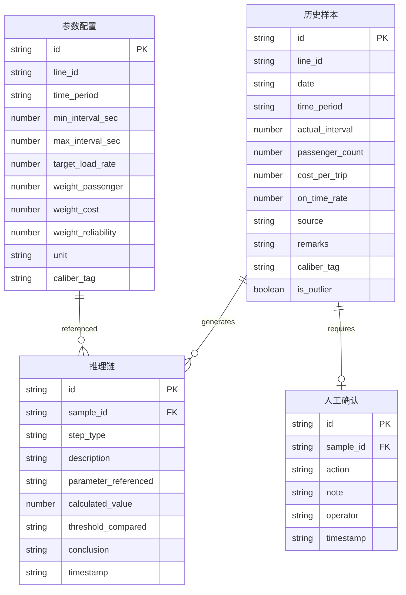

## 1. 架构设计

```mermaid
flowchart TD
    "前端 React" --> "状态管理 Zustand"
    "状态管理 Zustand" --> "数据清洗校验引擎"
    "状态管理 Zustand" --> "优化判断引擎"
    "数据清洗校验引擎" --> "推理链生成器"
    "优化判断引擎" --> "推理链生成器"
    "推理链生成器" --> "导出模块"
    "推理链生成器" --> "UI渲染"
    "导出模块" --> "CSV报告"
    "导出模块" --> "CSV明细"
```

纯前端架构，所有数据与计算逻辑在浏览器内完成，无需后端服务。数据以 TypeScript 类型约束的 JSON 形式内嵌于前端，后续补材料时只需扩展数据文件。

## 2. 技术说明

- 前端：React@18 + TypeScript + Tailwind CSS@3 + Vite
- 初始化工具：vite-init (react-ts 模板)
- 状态管理：Zustand
- 后端：无
- 数据库：无（使用前端 mock 数据，预留结构便于后续接入API）
- 图标：lucide-react
- 导出：前端生成 CSV（报告与明细同源数据）
- 字体：Google Fonts - Noto Sans SC + JetBrains Mono

## 3. 路由定义

| 路由 | 用途 |
|------|------|
| / | 数据总览页：样本表格 + 质量仪表盘 + 筛选栏 |
| /optimize | 优化判断页：推理链面板 + 人工确认 + 历史口径 + 导出 |

## 4. API定义

无后端API，数据从前端 mock 模块加载。

## 5. 服务端架构图

不适用

## 6. 数据模型

### 6.1 数据模型定义



### 6.2 数据定义

核心类型（TypeScript 接口）：

- **ParamConfig**：线路参数配置，含线路ID、时段、最小/最大间隔(秒)、目标载客率、三个权重(客流/成本/准点)、单位、口径标签
- **HistoricalSample**：历史运行样本，含线路ID、日期、时段、实际间隔、客流量、单趟成本、准点率、来源、备注、口径标签、是否越界
- **ReasoningStep**：推理链单步，含步骤类型、描述、引用参数、计算值、比对阈值、结论
- **ReasoningChain**：完整推理链，关联样本ID、步骤列表、最终建议、建议原因
- **ManualReview**：人工确认记录，含动作(通过/驳回/待定)、备注、操作人、时间戳
- **QualityIssue**：数据质量问题，含类型(空值/重复/越界/单位不一致/权重未闭合)、涉及的样本ID、可读提醒文案
