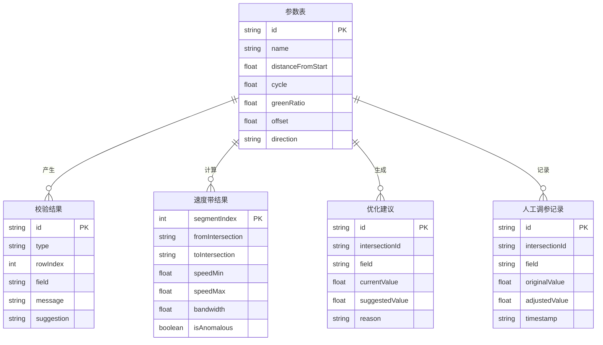

## 1. 架构设计

```mermaid
flowchart TB
    subgraph "前端层"
        "A[参数导入页]" --> "B[计算与结果页]"
        "B" --> "C[调参与重算页]"
    end
    subgraph "计算引擎层"
        "D[数据解析与校验模块]"
        "E[绿波速度带计算模块]"
        "F[优化建议模块]"
        "G[时距图绘制模块]"
    end
    subgraph "数据层"
        "H[Zustand 状态管理]"
        "I[LocalStorage 持久化]"
    end
    "A" --> "D"
    "D" --> "H"
    "H" --> "E"
    "E" --> "F"
    "E" --> "G"
    "H" --> "I"
```

纯前端架构，无后端服务。所有计算在浏览器内完成，状态通过 Zustand 管理，调参历史通过 LocalStorage 持久化。

## 2. 技术说明

- 前端：React@18 + TypeScript + Tailwind CSS@3 + Vite
- 初始化工具：vite-init
- 状态管理：Zustand（含 persist 中间件）
- 数据可视化：Canvas API 手绘时距图
- 图标：lucide-react
- 后端：无
- 数据库：无（LocalStorage + 内存）

## 3. 路由定义

| 路由 | 用途 |
|------|------|
| / | 参数导入页：粘贴/上传参数表，预览校验 |
| /calculate | 计算与结果页：速度带计算、优化建议、时距图、异常记录 |
| /adjust | 调参与重算页：微调参数、筛选、导出 |

## 4. API 定义

无后端 API。核心计算函数接口如下：

```typescript
interface IntersectionData {
  id: string
  name: string
  distanceFromStart: number
  cycle: number
  greenRatio: number
  offset: number
  direction: "上行" | "下行"
}

interface SpeedBandResult {
  segmentIndex: number
  fromIntersection: string
  toIntersection: string
  distance: number
  speedMin: number
  speedMax: number
  bandwidth: number
  isAnomalous: boolean
  anomalyReason?: string
}

interface OptimizationSuggestion {
  intersectionId: string
  field: "offset" | "greenRatio"
  currentValue: number
  suggestedValue: number
  reason: string
  impactOnBandwidth: number
}

interface ValidationResult {
  type: "empty" | "duplicate" | "unit_mismatch" | "conflict" | "boundary"
  rowIndex: number
  field: string
  message: string
  paramTableValue?: string
  importedValue?: string
  suggestion: string
}
```

## 5. 服务端架构

不适用

## 6. 数据模型

### 6.1 数据模型定义



### 6.2 数据定义语言

无数据库，使用 TypeScript 接口定义。样例数据硬编码在前端，结构如下：

```typescript
const SAMPLE_SMOOTH: IntersectionData[] = [
  { id: "I001", name: "长安路与建国路", distanceFromStart: 0, cycle: 120, greenRatio: 0.55, offset: 0, direction: "上行" },
  { id: "I002", name: "长安路与和平路", distanceFromStart: 450, cycle: 120, greenRatio: 0.50, offset: 30, direction: "上行" },
  { id: "I003", name: "长安路与中山路", distanceFromStart: 980, cycle: 120, greenRatio: 0.48, offset: 55, direction: "上行" },
  { id: "I004", name: "长安路与解放路", distanceFromStart: 1520, cycle: 120, greenRatio: 0.52, offset: 80, direction: "上行" },
  { id: "I005", name: "长安路与人民路", distanceFromStart: 2100, cycle: 120, greenRatio: 0.50, offset: 105, direction: "上行" },
]

const SAMPLE_REWORK: (Partial<IntersectionData> & { rawDistance?: string; rawSpeed?: string })[] = [
  { id: "I001", name: "光明路与朝阳路", distanceFromStart: 0, cycle: 100, greenRatio: 0.50, offset: 0, direction: "上行" },
  { id: "I002", name: "光明路与安定路", distanceFromStart: 380, cycle: 100, greenRatio: 0.45, offset: 25, direction: "上行" },
  { id: "I002", name: "光明路与安定路(旧)", distanceFromStart: 400, cycle: 100, greenRatio: 0.48, offset: 28, direction: "上行" },
  { id: "I004", name: "", distanceFromStart: NaN, cycle: 100, greenRatio: NaN, offset: NaN, direction: "上行" },
  { id: "I005", name: "光明路与幸福路", distanceFromStart: 1100, cycle: 100, greenRatio: 0.42, offset: 50, direction: "上行", rawDistance: "1.1km" },
  { id: "I006", name: "光明路与建设路", distanceFromStart: 1500, cycle: 100, greenRatio: 0.00, offset: 60, direction: "上行" },
  { id: "I007", name: "光明路与创新路", distanceFromStart: 1950, cycle: 100, greenRatio: 0.47, offset: 72, direction: "上行" },
  { id: "I008", name: "光明路与科技路", distanceFromStart: 2400, cycle: 100, greenRatio: 0.44, offset: 85, direction: "上行", rawSpeed: "60km/h" },
]
```

### 6.3 核心算法说明

**绿波速度带计算原理：**

1. 对相邻路口 i 和 i+1，距离 d，偏移差 Δφ = offset[i+1] - offset[i]
2. 上行绿波速度 v = d / Δφ（当 Δφ > 0）
3. 速度带范围：考虑绿灯持续时间 g_i = cycle × greenRatio_i
   - 带宽 B = min(g_i) 沿途取最小值（瓶颈路口决定带宽）
   - 速度下限 v_min = d / (Δφ + B)，速度上限 v_max = d / (Δφ - B)（需 Δφ > B）
4. 全段综合速度带：取所有相邻段速度带的交集

**优化建议逻辑：**

- 遍历每个路口的偏移量，尝试 ±5s 步长调整
- 计算调整后的带宽增量
- 若带宽增加 > 10%，给出建议并说明：调整哪个路口的偏移量、从多少到多少、带宽增加多少秒、为什么这个路口是瓶颈
