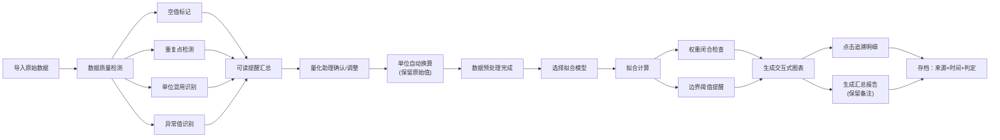

## 1. 产品概述

材料疲劳寿命拟合分析系统，解决量化助理在处理材料疲劳试验数据时遇到的单位混用、数据异常、可追溯性差等问题。面向量化助理、工程技术人员和管理层，提供自动化数据清洗、智能拟合分析、交互式可视化和可追溯报告。

通过自动化单位换算、异常检测、判定留痕，减少人工校对工作量，确保分析结果透明可查，新接手人员无需反复询问历史判定依据。

## 2. 核心功能

### 2.1 用户角色

| 角色 | 操作方式 | 核心权限 |
|------|-----------|----------|
| 量化助理 | 直接使用 | 数据上传、预处理操作、人工确认、报告导出 |
| 工程技术人员 | 直接使用 | 查看拟合结果、追溯明细、历史判定 |
| 管理层 | 查看报告 | 查看汇总报告、追溯来源 |

### 2.2 功能模块

1. **数据导入与预览模块：原始数据导入、自动识别、预览、单位检测
2. **智能预处理模块：单位换算、重复检测、空值处理、异常识别
3. **拟合分析模块：多模型拟合、权重闭合、边界阈值提醒
4. **交互式可视化模块：散点拟合图、点击追溯、判定历史
5. **报告生成模块：面向非技术人员报告、可追溯链接、备注保留
6. **历史记录模块：原始来源存档、处理时间戳、判定依据留痕

### 2.3 页面详情

| 页面名称 | 模块名称 | 功能描述 |
|---------|----------|----------|
| 首页/数据导入页 | 数据上传区 | 拖拽上传Excel/CSV，自动识别列名和单位，预览原始数据 |
| 首页/数据导入页 | 数据质量检查 | 标记空值、重复点、单位混用、异常值，显示可读提醒 |
| 预处理配置页 | 单位换算引擎 | 自动识别应力单位(MPa/ksi/kgf/mm²)、寿命单位(次/小时/周)，一键换算统一单位 |
| 预处理配置页 | 数据清洗规则 | 空值处理策略、重复点合并策略、异常值标记与保留 |
| 拟合分析页 | 拟合模型选择 | 支持S-N曲线幂函数、指数函数、Basquin模型拟合 |
| 拟合分析页 | 权重与边界 | 权重闭合计算、边界阈值提醒、置信区间显示 |
| 拟合分析页 | 交互式图表 | 散点图+拟合曲线，点击数据点弹出明细和判定历史 |
| 报告预览页 | 汇总报告 | 面向管理层的汇总视图，保留原始备注，支持追溯链接 |
| 报告预览页 | 明细追溯 | 从图表点、汇总行跳转至原始数据和处理记录 |
| 历史记录页 | 历史存档 | 按批次查看历史分析、原始来源、处理时间、判定人员 |

## 3. 核心流程

用户导入原始试验数据 → 系统自动检测数据质量问题（空值、重复、单位混用、异常）并给出可读提醒 → 量化助理确认或调整预处理规则 → 系统自动单位换算、保留所有原始信息和备注 → 选择拟合模型进行寿命拟合 → 系统计算权重闭合、检查边界阈值并给出提醒 → 生成交互式拟合图表，每个数据点可追溯 → 生成包含汇总和明细的报告，所有例外情况明面上展示 → 报告和原始数据一并存档，保留来源和处理时间。

## 4. 用户界面设计

### 4.1 设计风格

- **主色调**：工程蓝(#1e3a5f)作为主色，搭配警示橙(#ff7043)用于异常提醒，成功绿(#43a047)用于正常数据，中性灰(#546e7a)用于文本
- **按钮风格**：直角微圆角(2px)，强调工业严谨感，主按钮深色填充，次级按钮描边
- **字体**：标题使用思源宋体（工程专业感），正文使用思源黑体，数字使用等宽字体JetBrains Mono
- **布局风格**：左右分栏，左侧数据列表，右侧图表和详情，卡片式分区，清晰的边框分割线
- **图标风格**：线性图标，保持工程文档风格，异常状态使用明显的颜色标记

### 4.2 页面设计概览

| 页面名称 | 模块名称 | UI元素 |
|---------|----------|---------|
| 数据导入页 | 上传区 | 虚线边框拖拽区，工程蓝图风格，上传后显示数据表格 |
| 数据导入页 | 质量提醒区 | 醒目警示卡片，每条提醒包含：类型、位置、原始值、建议处理方式 |
| 预处理配置页 | 单位换算 | 下拉选择目标单位，显示换算公式，原始值与换算值并列展示 |
| 预处理配置页 | 清洗规则 | 开关+说明文字，每条规则可单独启用/禁用 |
| 拟合分析页 | 模型选择 | 卡片式模型选择，显示模型公式和适用场景 |
| 拟合分析页 | 交互式图表 | 大尺寸散点图，不同状态点用不同颜色，悬停显示基本信息，点击弹出详情面板 |
| 拟合分析页 | 权重与边界 | 状态标签：正常/警告/异常，鼠标悬停显示详细说明 |
| 报告预览页 | 汇总视图 | 表格形式，异常行标红，每行有追溯链接图标 |
| 报告预览页 | 明细面板 | 右侧抽屉式面板，展示原始数据、处理过程、判定依据、时间戳 |
| 历史记录页 | 历史列表 | 时间线布局，显示批次、材料、处理时间、操作人员 |

### 4.3 响应式设计

桌面端优先设计，适配1920px为主。移动端适配时图表自适应宽度，左右分栏改为上下布局。触控优化：增加点击区域，重要按钮最小44x44px。

### 4.4 三种样例记录设计

**顺利记录（正常数据）：
- 数据完整、单位统一、无重复、拟合结果正常
- 标记：绿色"正常"标签
- 追溯信息：显示完整处理流程

**需要人工确认的记录（异常数据）：
- 包含空值或单位混用或异常值
- 标记：橙色"待确认"标签，系统给出建议，需要人工点击确认
- 追溯信息：显示系统建议+人工确认记录+确认人+确认时间

**从汇总页补来的旧口径记录：
- 标记为"历史数据"，来源标注为"老板汇总页_2024Q3"
- 保留原始备注："2024年Q3批次，按旧标准判定"
- 追溯信息：显示来源文件、导入时间、备注原文

### 4.5 例外情况明面上展示设计

所有单位换算、权重闭合、边界阈值提醒都采用"边框高亮+工具提示+可展开详情"的方式：
- 单位换算：数据旁边显示"→"图标，悬停显示换算公式和原始值
- 权重闭合：右上角状态徽章，绿色正常，橙色警告，红色异常
- 边界阈值：超出边界的数据点用红色边框，图例中单独说明

## 5. 核心数据字段设计

### 5.1 原始数据字段

| 字段名 | 类型 | 说明 |
|--------|------|------|
| id | string | 唯一标识 |
| material | string | 材料牌号 |
| stress | number | 应力值 |
| stress_unit | string | 应力原始单位 |
| life | number | 疲劳寿命 |
| life_unit | string | 寿命原始单位 |
| source | string | 数据来源 |
| remark | string | 原始备注 |
| test_date | string | 试验日期 |
| imported_at | datetime | 导入时间 |

### 5.2 处理记录字段

| 字段名 | 类型 | 说明 |
|--------|------|------|
| data_id | string | 关联原始数据ID |
| process_type | string | 处理类型（单位换算/空值填充/重复合并） |
| original_value | string | 原始值 |
| processed_value | string | 处理后值 |
| reason | string | 处理原因 |
| operator | string | 操作人员（系统/人工） |
| operated_at | datetime | 处理时间 |

### 5.3 判定记录字段

| 字段名 | 类型 | 说明 |
|--------|------|------|
| data_id | string | 关联原始数据ID |
| status | string | 判定状态（正常/待确认/已确认/历史数据） |
| judgment | string | 判定结论 |
| judge | string | 判定人 |
| judged_at | datetime | 判定时间 |
| evidence | string | 判定依据 |

