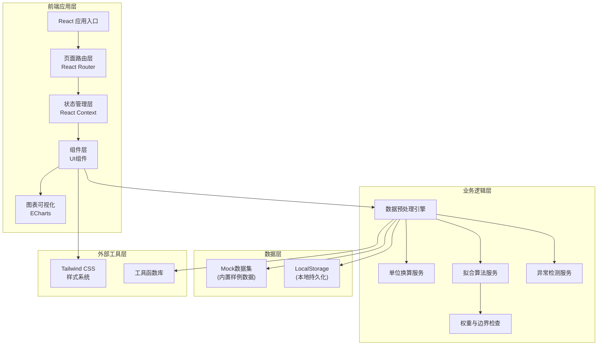

## 1. 架构设计



## 2. 技术栈说明

- **前端框架**：React@18 + TypeScript
- **构建工具**：Vite@5
- **样式系统**：Tailwind CSS@3
- **图表可视化**：ECharts@5
- **路由管理**：React Router@6
- **状态管理**：React Context + useReducer
- **日期处理**：date-fns
- **数学计算**：自定义最小二乘拟合
- **数据持久化**：LocalStorage（本地存档历史记录）

## 3. 目录结构

```
src/
├── components/           # 组件目录
│   ├── common/       # 通用组件
│   │   ├── DataTable.tsx
│   │   ├── StatusBadge.tsx
│   │   ├── TracePanel.tsx
│   │   └── AlertCard.tsx
│   ├── layout/       # 布局组件
│   │   ├── Header.tsx
│   │   └── Sidebar.tsx
│   └── modules/    # 业务模块组件
│       ├── DataUpload.tsx
│       ├── QualityCheck.tsx
│       ├── UnitConversion.tsx
│       ├── FittingChart.tsx
│       ├── ModelSelector.tsx
│       └── ReportSummary.tsx
│       └── HistoryList.tsx
├── pages/           # 页面组件
│   ├── DataImportPage.tsx
│   ├── PreprocessPage.tsx
│   ├── FittingPage.tsx
│   ├── ReportPage.tsx
│   └── HistoryPage.tsx
├── services/        # 业务逻辑服务
│   ├── dataPreprocess.ts
│   ├── unitConversion.ts
│   ├── fittingAlgorithm.ts
│   ├── anomalyDetection.ts
│   └── weightBoundary.ts
├── data/           # 数据与Mock
│   └── mockData.ts
├── types/          # TypeScript类型定义
│   └── index.ts
├── utils/          # 工具函数
│   ├── format.ts
│   └── storage.ts
├── context/        # 状态管理
│   └── DataContext.tsx
├── App.tsx
├── main.tsx
└── index.css
```

## 4. 路由定义

| 路由 | 页面 | 说明 |
|------|------|------|
| / | DataImportPage | 数据导入页，默认首页 |
| /preprocess | PreprocessPage | 预处理配置页 |
| /fitting | FittingPage | 拟合分析页 |
| /report | ReportPage | 报告预览页 |
| /history | HistoryPage | 历史记录页 |

## 5. 核心类型定义

```typescript
// 原始试验数据
interface RawData {
  id: string;
  material: string;
  stress: number | null;
  stressUnit: string;
  life: number | null;
  lifeUnit: string;
  source: string;
  remark: string;
  testDate: string;
  importedAt: string;
}

// 处理后数据
interface ProcessedData extends RawData {
  stressConverted: number | null;
  lifeConverted: number | null;
  targetStressUnit: string;
  targetLifeUnit: string;
  isDuplicate: boolean;
  isNull: boolean;
  isAnomaly: boolean;
  anomalyReason: string;
  status: 'normal' | 'pending' | 'confirmed' | 'historical';
  processHistory: ProcessRecord[];
  judgment: JudgmentRecord[];
}

// 处理记录
interface ProcessRecord {
  id: string;
  dataId: string;
  processType: 'unit_conversion' | 'null_fill' | 'duplicate_merge' | 'anomaly_mark';
  originalValue: string;
  processedValue: string;
  reason: string;
  operator: 'system' | 'user';
  operatedAt: string;
}

// 判定记录
interface JudgmentRecord {
  id: string;
  dataId: string;
  status: 'normal' | 'pending' | 'confirmed' | 'historical';
  judgment: string;
  judge: string;
  judgedAt: string;
  evidence: string;
}

// 拟合结果
interface FittingResult {
  model: 'power' | 'exponential' | 'basquin';
  formula: string;
  parameters: {
    a: number;
    b: number;
    r2: number;
  };
  weightClosure: number;
  boundaryCheck: {
    minStress: number;
    maxStress: number;
    outOfBounds: string[];
  };
  points: FittingPoint[];
}

interface FittingPoint {
  stress: number;
  life: number;
  predictedLife: number;
  residual: number;
  dataId: string;
}

// 质量检查结果
interface QualityIssue {
  type: 'null' | 'duplicate' | 'unit_mismatch' | 'anomaly';
  dataId: string;
  rowIndex: number;
  field: string;
  originalValue: string;
  description: string;
  suggestion: string;
}
```

## 6. 核心算法模块设计

### 6.1 单位换算模块

应力单位换算系数：
- MPa ⟷ ksi: 1 MPa = 0.145038 ksi
- MPa ⟷ kgf/mm²: 1 MPa = 0.101972 kgf/mm²
- ksi ⟷ kgf/mm²: 1 ksi = 0.70307 kgf/mm²

寿命单位换算系数：
- 次 ⟷ 小时: 假设频率f Hz，1小时 = 3600*f 次
- 次 ⟷ 周: 1周 = 7*24*3600*f 次

### 6.2 拟合算法模块

**幂函数模型（Power Law）**：
σ^m * N = C
对数线性化：log(N) = log(C) - m * log(σ)

**指数函数模型**：
N = A * exp(B * σ)
对数线性化：ln(N) = ln(A) + B * σ

**Basquin模型**：
σ_a = σ'_f * (2N_f)^b

最小二乘法求解参数，计算R²决定系数。

### 6.3 异常检测模块

- **IQR法**：四分位距法检测离群点
- **残差分析**：拟合后残差过大标记
- **物理边界检查**：应力/寿命超出合理物理范围

### 6.4 权重闭合检查

权重闭合度 = Σ(权重_i * 残差_i²) / Σ残差_i²
阈值：> 0.85 正常，0.7-0.85 警告，< 0.7 异常

### 6.5 边界阈值提醒

应力边界：最小应力 > 0.1σ_s（屈服强度），最大应力 < 0.9σ_b（抗拉强度）
寿命边界：最小寿命 > 1e3 次，最大寿命 < 1e7 次

## 7. Mock 数据结构

内置15条样例数据，包含：
- 8条正常数据
- 2条空值数据
- 2条重复数据
- 2条单位混用数据
- 1条看起来正常但结果很怪的数据（残差异常）

三种典型记录：
1. 顺利记录：id = 'REC-001，材料40CrNiMoA，数据完整单位统一
2. 待确认记录：id = 'REC-007，应力单位为ksi需要换算，id='REC-008'寿命为空需要填充
3. 历史数据：id='REC-015，来源标注为"老板汇总页_2024Q3"，备注保留原文

## 8. 可追溯性设计

- 每条数据唯一ID，所有操作记录processHistory数组
- 判定记录judgment数组，记录每次状态变更
- 报告中每条汇总行链接至详细面板
- 图表每个数据点点击弹出溯源面板
- LocalStorage持久化所有处理历史

## 9. 交互设计

- 数据点点击 → 右侧抽屉面板显示：原始数据 → 处理过程时间线 → 判定记录 → 拟合残差
- 状态徽章悬停 → 显示详细说明
- 单位换算标记 → 悬停显示换算公式和原始值
- 异常提醒卡片 → 可展开查看建议处理方式

