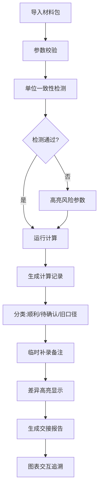

## 1. 产品概述

图神经网络社区解释交接管理系统，专为调度主管周姐及业务团队设计，解决"图神经网络社区解释"算法在交接过程中计算不透明、结果难追溯、人工核对效率低的核心痛点。系统通过可视化计算流程、参数版本管理、异常样本追踪，让每一步判断都有迹可循，大幅降低交接时的沟通成本。

## 2. 核心功能

### 2.1 用户角色
| 角色 | 注册方式 | 核心权限 |
|------|----------|----------|
| 调度主管 | 系统分配 | 全流程管理、参数配置、报告导出、备注补录 |
| 业务同事 | 系统分配 | 查看计算结果、处理建议、历史记录 |
| 算法工程师 | 系统分配 | 算法参数调优、异常分析 |

### 2.2 功能模块
1. **仪表盘首页**: 计算概览、异常统计、快速操作入口
2. **参数管理**: 参数版本对比、历史参数回溯、单位校验
3. **计算流程**: 分步计算展示、中间结果查看、公式校验
4. **样本管理**: 正常样本、异常样本、人工确认样本、旧口径补录
5. **图表分析**: 可交互图表、点击追溯明细、多维度对比
6. **交接报告**: 自动生成报告、备注差异说明、导出分享

### 2.3 页面详情
| 页面名称 | 模块名称 | 功能描述 |
|---------|----------|----------|
| 仪表盘 | 数据概览 | 今日计算批次、异常数量、待处理事项统计 |
| 仪表盘 | 快捷操作 | 一键导入材料、运行计算、导出报告 |
| 参数管理 | 参数列表 | 参数版本树、版本对比、单位标注 |
| 参数管理 | 单位校验 | 自动检测单位不一致、高亮风险参数 |
| 计算流程 | 分步展示 | 每步计算公式、输入输出、参与判断依据 |
| 计算流程 | 异常追踪 | 算不出的记录保留原因、不自动过滤 |
| 样本管理 | 三类型记录 | 顺利记录、待人工确认、旧口径补录 |
| 样本管理 | 备注补录 | 临时添加备注、差异高亮显示 |
| 图表分析 | 交互图表 | 折线图/柱状图、点击点查看明细数据 |
| 图表分析 | 复盘追溯 | 从图表点跳转到对应计算记录 |
| 交接报告 | 报告生成 | 非技术人员友好、业务化语言建议 |
| 交接报告 | 导出分享 | PDF/Excel导出、在线分享链接 |

## 3. 核心流程

### 3.1 主业务流程
调度主管周姐导入参数表、历史记录、人工备注和越界样本 → 系统自动运行计算并校验单位一致性 → 生成三类结果记录（顺利/待确认/旧口径）→ 周姐临时补录备注 → 系统高亮显示补录差异 → 生成可交互交接报告 → 业务同事点击图表追溯明细 → 新接手人员快速理解历史判断

## 4. 用户界面设计

### 4.1 设计风格
- **主色调**: 深蓝(#1e3a5f) - 专业、可靠，符合调度管理场景
- **辅助色**: 橙红(#e94e1b) - 异常告警、高对比度
- **成功色**: 墨绿(#2d8a5e) - 正常记录、通过校验
- **警告色**: 琥珀(#f5a623) - 待确认、需要关注
- **按钮风格**: 微立体圆角按钮，hover时有轻微上浮效果
- **字体**: 标题使用 Noto Serif SC（稳重专业），正文使用 PingFang SC（清晰易读）
- **布局风格**: 卡片式布局，左侧导航+右侧内容区，信息层级分明
- **图标风格**: 线性图标，统一2px线宽，配色与主题一致

### 4.2 页面设计概览
| 页面名称 | 模块名称 | UI元素 |
|---------|----------|--------|
| 仪表盘 | 数据概览 | 大数字卡片、渐变背景、趋势箭头、微动效 |
| 参数管理 | 参数对比 | 左右分栏、差异高亮、版本时间线、折叠展开 |
| 计算流程 | 分步展示 | 垂直时间线、代码块样式公式、输入输出表格 |
| 样本管理 | 记录列表 | 三色标签区分类型、状态徽章、展开详情 |
| 图表分析 | 交互图表 | ECharts增强、tooltip显示明细、点击跳转 |
| 交接报告 | 报告预览 | 模拟打印样式、业务化语言、可折叠详情 |

### 4.3 响应式
- 桌面端优先设计（1280px以上）
- 平板端（768-1280px）: 导航折叠为图标栏，卡片自适应排列
- 移动端（768px以下）: 底部导航，单列布局，简化交互

### 4.4 动效设计
- 页面加载: 顶部进度条 + 内容渐入
- 卡片hover: 轻微上浮(translateY(-4px)) + 阴影加深
- 数据更新: 数字滚动动画、高亮闪烁提示
- 状态变化: 平滑过渡颜色、图标旋转提示
