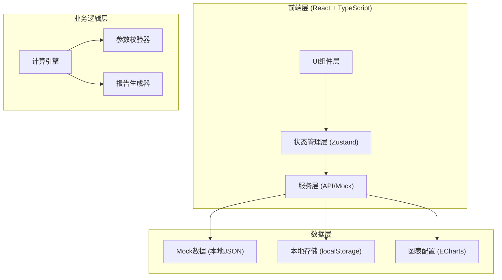
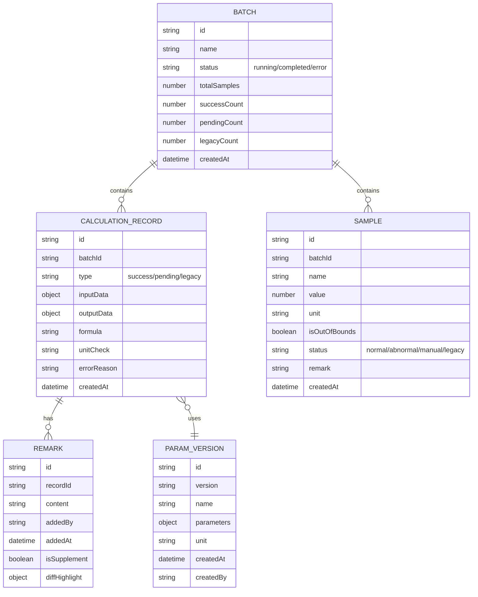

## 1. 架构设计



## 2. 技术描述

- **前端框架**: React@18 + TypeScript
- **构建工具**: Vite@5
- **样式方案**: Tailwind CSS@3 + SCSS
- **状态管理**: Zustand (轻量级，适合中小型应用)
- **图表库**: ECharts@5 (功能强大，交互丰富)
- **路由**: React Router@6
- **UI组件**: 自定义组件 + lucide-react 图标库
- **后端**: 无，使用Mock数据模拟
- **数据持久化**: localStorage 存储用户操作和备注

## 3. 路由定义

| 路由 | 页面 | 用途 |
|------|------|------|
| / | 仪表盘 | 数据概览、快捷操作 |
| /params | 参数管理 | 参数版本管理、单位校验 |
| /calculation | 计算流程 | 分步计算展示、异常追踪 |
| /samples | 样本管理 | 三类型记录管理、备注补录 |
| /charts | 图表分析 | 可交互图表、追溯明细 |
| /report | 交接报告 | 报告预览、导出 |

## 4. 数据模型

### 4.1 核心数据结构



### 4.2 TypeScript 类型定义

```typescript
// 参数版本
interface ParamVersion {
  id: string;
  version: string;
  name: string;
  parameters: Record<string, ParamItem>;
  createdAt: string;
  createdBy: string;
}

interface ParamItem {
  value: number;
  unit: string;
  description: string;
}

// 计算记录
type RecordType = 'success' | 'pending' | 'legacy';

interface CalculationRecord {
  id: string;
  batchId: string;
  type: RecordType;
  inputData: Record<string, number>;
  outputData: Record<string, number>;
  formula: string;
  unitCheck: { passed: boolean; issues: string[] };
  errorReason?: string;
  steps: CalculationStep[];
  createdAt: string;
}

interface CalculationStep {
  step: number;
  name: string;
  formula: string;
  input: Record<string, number>;
  output: number;
  unit: string;
  remark?: string;
}

// 样本
type SampleStatus = 'normal' | 'abnormal' | 'manual' | 'legacy';

interface Sample {
  id: string;
  batchId: string;
  name: string;
  value: number;
  unit: string;
  isOutOfBounds: boolean;
  status: SampleStatus;
  remark?: string;
  createdAt: string;
}

// 备注
interface Remark {
  id: string;
  recordId: string;
  content: string;
  addedBy: string;
  addedAt: string;
  isSupplement: boolean;
  diffHighlight?: string[];
}

// 批次
interface Batch {
  id: string;
  name: string;
  status: 'running' | 'completed' | 'error';
  totalSamples: number;
  successCount: number;
  pendingCount: number;
  legacyCount: number;
  createdAt: string;
}
```

## 5. 核心模块设计

### 5.1 计算引擎模块
- **位置**: `src/engine/CalculationEngine.ts`
- **功能**: 执行图神经网络社区解释算法的模拟计算
- **特点**: 
  - 分步计算，每步保留输入输出
  - 单位一致性校验
  - 异常捕获和原因记录
  - 不自动过滤失败记录

### 5.2 参数校验模块
- **位置**: `src/engine/UnitValidator.ts`
- **功能**: 参数单位一致性检测
- **校验规则**:
  - 同一维度参数单位必须一致
  - 计算公式中单位转换必须明确标注
  - 输出结果单位与预期不符时告警

### 5.3 报告生成模块
- **位置**: `src/services/ReportGenerator.ts`
- **功能**: 生成业务友好的交接报告
- **特点**:
  - 将技术术语转换为业务语言
  - 处理建议使用"请检查..."、"建议..."等提醒语气
  - 高亮显示补录备注的差异
  - 包含图表和明细的跳转链接

### 5.4 状态管理
- **位置**: `src/store/`
- **结构**:
  - `batchStore.ts` - 批次管理
  - `paramStore.ts` - 参数版本管理
  - `calculationStore.ts` - 计算记录管理
  - `sampleStore.ts` - 样本管理

## 6. Mock数据设计

### 6.1 预置样例数据
1. **一条顺利记录**: SAMPLE-001，社区划分符合预期，参数单位一致
2. **一条需人工确认**: SAMPLE-002，结果处于边界值，需要周姐核对
3. **一条旧口径补录**: SAMPLE-003，从复盘图表导入，使用历史口径
4. **明显越界样本**: SAMPLE-004~006，数值超出正常范围

### 6.2 参数版本
- V1.0: 2024年1月基线版本
- V1.1: 2024年3月单位校准版本
- V2.0: 2024年6月算法升级版本

## 7. 目录结构

```
src/
├── components/          # UI组件
│   ├── layout/         # 布局组件
│   ├── charts/         # 图表组件
│   ├── params/         # 参数相关组件
│   ├── calculation/    # 计算流程组件
│   ├── samples/        # 样本管理组件
│   └── report/         # 报告组件
├── pages/              # 页面组件
├── store/              # 状态管理
├── engine/             # 计算引擎
├── services/           # 服务层
├── types/              # TypeScript类型
├── data/               # Mock数据
├── utils/              # 工具函数
├── App.tsx
└── main.tsx
```
