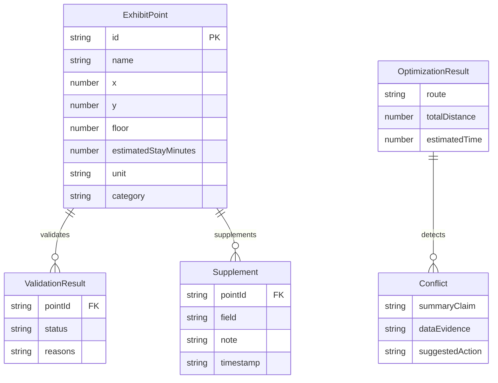

## 1. 架构设计

```mermaid
flowchart TB
    subgraph "前端层"
        "React 18 + TypeScript"
        "Tailwind CSS"
        "Zustand 状态管理"
        "Recharts 图表库"
    end
    subgraph "数据层"
        "Mock 数据引擎"
        "校验引擎"
        "优化计算引擎"
        "补录与差异引擎"
    end
    subgraph "存储层"
        "localStorage 持久化"
    end
    "前端层" --> "数据层"
    "数据层" --> "存储层"
```

纯前端方案，所有计算在浏览器完成，数据通过 localStorage 持久化，无需后端服务。

## 2. 技术说明

- **前端**：React@18 + TypeScript + Tailwind CSS@3 + Vite
- **状态管理**：Zustand
- **图表**：Recharts（支持点击事件下钻）
- **初始化工具**：vite-init
- **后端**：无（纯前端）
- **数据库**：无（使用 localStorage + 内存状态）
- **路由**：react-router-dom v6

## 3. 路由定义

| 路由 | 用途 |
|------|------|
| `/` | 重定向到 /import |
| `/import` | 数据导入与校验页 |
| `/optimize` | 路线优化与诊断页 |
| `/summary` | 汇总与追溯页 |

## 4. API 定义

无后端 API，所有数据通过 Zustand store 在前端流转。

### 4.1 核心 TypeScript 类型

```typescript
interface ExhibitPoint {
  id: string
  name: string
  x: number | null
  y: number | null
  floor: number
  estimatedStayMinutes: number | null
  unit: 'm' | 'ft'
  category: string
}

interface ValidationResult {
  pointId: string
  status: 'valid' | 'warning' | 'uncalculable'
  reasons: string[]
}

interface OptimizationStep {
  step: number
  title: string
  description: string
  data: Record<string, unknown>
}

interface OptimizationResult {
  route: string[]
  totalDistance: number
  totalDistanceUnit: string
  estimatedTime: number
  reasoning: OptimizationStep[]
  excludedPoints: { pointId: string; reason: string }[]
  predictions: { suggestion: string; reasoning: string; confidence: number }[]
}

interface Supplement {
  pointId: string
  field: string
  oldValue: unknown
  newValue: unknown
  note: string
  timestamp: string
}

interface Conflict {
  summaryClaim: string
  dataEvidence: string
  suggestedAction: string
}
```

## 5. 服务架构图

不适用（纯前端项目）

## 6. 数据模型

### 6.1 数据模型定义



### 6.2 样例数据定义

样例数据包含以下典型脏数据场景：

| 序号 | 展点名称 | 问题类型 | 说明 |
|------|----------|----------|------|
| 1 | 入口大厅 | 正常 | 基准点 |
| 2 | 古代展厅 | 正常 | 正常数据 |
| 3 | 现代展厅 | 空值 | x/y 坐标为空 |
| 4 | 科技体验区 | 重复点 | 与序号5坐标完全相同 |
| 5 | 科技体验区B | 重复点 | 与序号4坐标完全相同 |
| 6 | 临时展厅 | 单位混用 | 坐标单位为 ft，其余为 m |
| 7 | 休息区 | 正常 | 正常数据 |
| 8 | 特展区 | 异常但正常样貌 | 停留时间 999 分钟，看起来有值但结果很怪 |
| 9 | 出口 | 正常 | 终点 |
