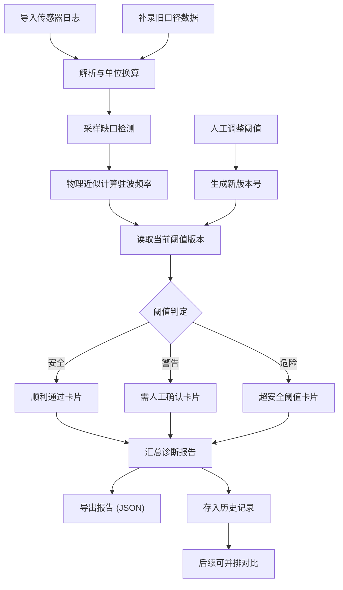

## 1. 产品概述

舞台低频驻波诊断工具，面向训练教练老唐等现场调音人员，将传感器日志中的低频声压数据自动对齐、单位换算、物理近似计算，并给出驻波频率/声压级阈值判定与诊断报告。目标是减少翻旧记录、避免每次从传感器日志重新找证据。

- 解决传感器日志中采样缺口、单位混写、超阈值记录的自动诊断问题
- 让历史参数版本可追踪，重跑结果可并排比较，换人也能看懂前一次判定依据

## 2. 核心功能

### 2.1 用户角色

| 角色 | 使用方式 | 核心权限 |
|------|----------|----------|
| 训练教练（老唐） | 直接操作 | 导入数据、调整阈值、查看报告、导出结果 |
| 接手人员 | 查看历史 | 回溯历史参数与判定依据、继续补录 |

### 2.2 功能模块

1. **诊断看板页**：传感器数据导入与解析、采样缺口检测、单位自动换算、物理近似计算、驻波频率/声压级阈值判定、诊断结果总览
2. **阈值管理页**：阈值版本记录、人工修改后自动生成新版本号、历史阈值并排对比
3. **报告与历史页**：诊断报告生成与导出、历史运行记录并排比较、从传感器日志补录旧口径数据

### 2.3 页面详情

| 页面名称 | 模块名称 | 功能描述 |
|----------|----------|----------|
| 诊断看板页 | 数据导入区 | 支持粘贴/上传传感器日志文本，自动识别分隔符、列头、单位混写（Pa/dB/m/s 等） |
| 诊断看板页 | 采样缺口检测 | 标记采样时间戳缺失区间，在时序图上以虚线/阴影提示 |
| 诊断看板页 | 单位换算引擎 | 自动将 dB SPL→Pa、Pa→dB SPL、m/s→加速度等，换算过程透明可查 |
| 诊断看板页 | 物理近似计算 | 根据房间尺寸估算驻波频率（f = nc/2L），显示各阶模态频率 |
| 诊断看板页 | 阈值判定区 | 将计算结果与当前阈值版本对比，标记安全/警告/危险三级 |
| 诊断看板页 | 诊断结果卡片 | 逐条显示诊断结论，区分"顺利通过"/"需人工确认"/"超安全阈值" |
| 阈值管理页 | 阈值版本列表 | 显示所有历史阈值版本，标注版本号、修改时间、修改人、修改原因 |
| 阈值管理页 | 阈值编辑器 | 修改各频段阈值，保存后自动递增版本号 |
| 阈值管理页 | 版本对比 | 选择两个版本并排展示差异 |
| 报告与历史页 | 诊断报告 | 汇总当前批次诊断结果，含阈值版本、计算参数、逐条判定，可导出 JSON |
| 报告与历史页 | 历史运行列表 | 按时间排列所有历史运行批次，显示使用的阈值版本号 |
| 报告与历史页 | 并排对比 | 选择两次运行结果并排展示参数与判定差异 |
| 报告与历史页 | 补录入口 | 从传感器日志补入旧口径数据，标记数据来源为"补录" |

## 3. 核心流程

用户导入传感器日志 → 系统自动解析与单位换算 → 检测采样缺口 → 物理近似计算驻波频率 → 与当前阈值版本对比 → 输出诊断结果（顺利/确认/超限）→ 生成报告。人工调整阈值后版本递增，后续计算自动使用新版阈值。补录旧数据时标记来源，重跑可并排对比。

## 4. 用户界面设计

### 4.1 设计风格

- **主色调**：深墨蓝 (#0A1628) 为底，辅以琥珀橙 (#F59E0B) 作为警告色、赤红 (#EF4444) 作为危险色、青绿 (#10B981) 作为安全色
- **按钮风格**：圆角微凸（rounded-lg），主操作用实色填充，次要操作用描边
- **字体**：数据区用 JetBrains Mono 等宽字体，正文用 Noto Sans SC
- **布局风格**：左侧导航栏 + 右侧内容区，卡片式模块布局
- **图标风格**：线性描边图标（Lucide 风格），信号波/频谱/仪表盘等声学相关图标

### 4.2 页面设计概览

| 页面名称 | 模块名称 | UI 元素 |
|----------|----------|---------|
| 诊断看板页 | 数据导入区 | 文本域粘贴区 + 文件上传按钮，解析后显示数据表格预览 |
| 诊断看板页 | 采样缺口检测 | 时序折线图（Recharts），缺口区间用阴影条标注 |
| 诊断看板页 | 单位换算引擎 | 换算前后对比表，hover 显示换算公式 |
| 诊断看板页 | 物理近似计算 | 房间尺寸输入框 + 驻波频率表格（各阶模态），公式 f=nc/2L 可展开查看 |
| 诊断看板页 | 阈值判定区 | 三色指示灯（绿/橙/红），当前阈值版本号标签 |
| 诊断看板页 | 诊断结果卡片 | 每条记录一张卡片，卡片左边色条标示等级，内含频率/声压/判定结论 |
| 阈值管理页 | 阈值版本列表 | 时间线样式，每节点显示版本号+修改摘要 |
| 阈值管理页 | 阈值编辑器 | 滑块+数字输入框组合，保存按钮旁显示"将生成 vN"提示 |
| 阈值管理页 | 版本对比 | 左右两栏表格，差异行高亮 |
| 报告与历史页 | 诊断报告 | 结构化报告卡片，"导出 JSON"按钮 |
| 报告与历史页 | 历史运行列表 | 紧凑列表，每行显示时间+阈值版本+判定摘要 |
| 报告与历史页 | 并排对比 | 双栏对照，同频段行对齐，差异处标红 |
| 报告与历史页 | 补录入口 | 与导入区类似的粘贴区，附加"数据来源：补录"标签 |

### 4.3 响应式策略

- 桌面优先设计（教练现场多用笔记本/平板）
- 关键数据表格和图表在 1280px+ 宽度下最优
- 移动端折叠侧栏为汉堡菜单，图表简化为列表视图

### 4.4 样例数据设计

样例数据覆盖三类场景：
1. **顺利记录**：采样完整、单位统一、所有指标在安全范围内
2. **需人工确认记录**：采样有缺口、某频段声压接近警告阈值（边界值）、单位需换算
3. **超安全阈值记录**：某低频段声压级明显超过危险阈值
4. **补录旧口径记录**：从传感器日志补入的历史数据，使用旧版阈值判定

样例中包含：空值字段、重复时间戳、混合单位（Pa 与 dB SPL 混写）、一条边界值记录
