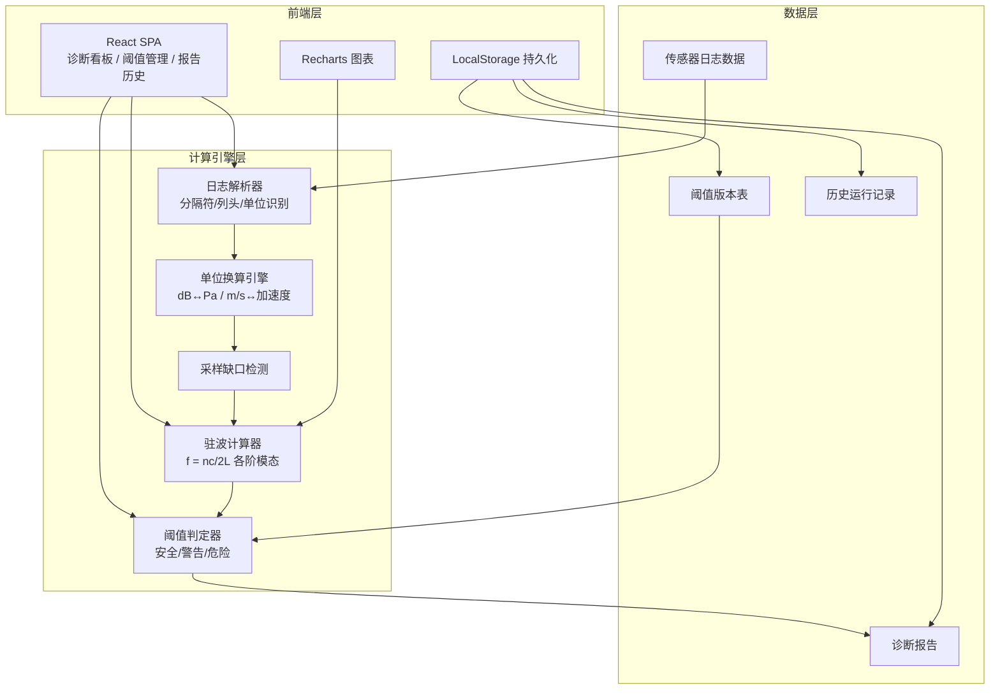
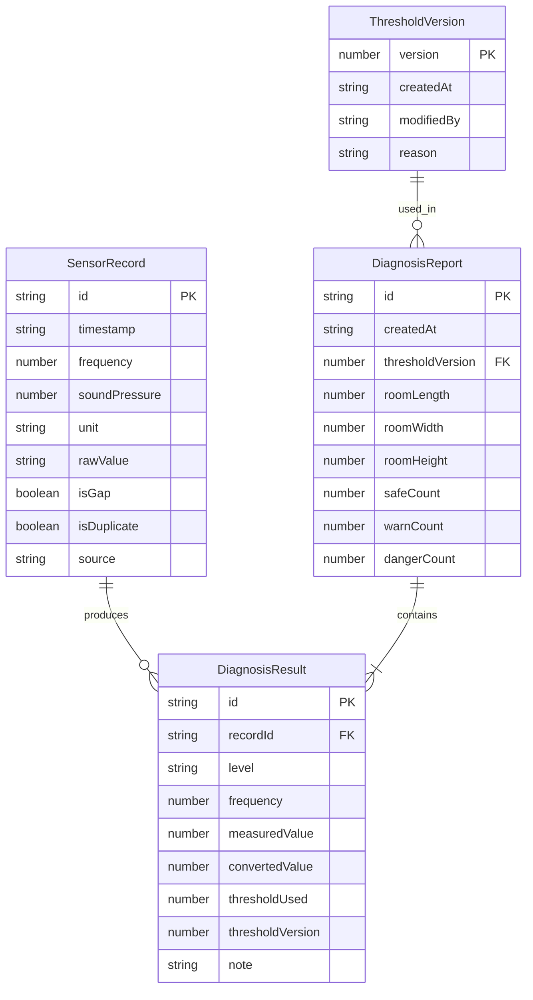

## 1. 架构设计



## 2. 技术说明

- **前端**：React 18 + TypeScript + Tailwind CSS 3 + Vite
- **初始化工具**：Vite (react-ts 模板)
- **后端**：无（纯前端，数据持久化至 LocalStorage）
- **数据库**：LocalStorage（结构化 JSON 存储），无需外部数据库
- **图表**：Recharts（折线图、柱状图）
- **状态管理**：React Context + useReducer（轻量级，无需 Redux）
- **唯一依赖补充**：lucide-react（图标）、uuid（版本号生成）

## 3. 路由定义

| 路由 | 用途 |
|------|------|
| `/` | 诊断看板页 - 数据导入、解析、计算、判定 |
| `/thresholds` | 阈值管理页 - 版本管理、编辑、对比 |
| `/reports` | 报告与历史页 - 报告查看、导出、历史对比、补录 |

## 4. API 定义

无后端 API，所有计算在浏览器端完成。核心函数接口定义如下：

```typescript
interface SensorRecord {
  id: string;
  timestamp: string;
  frequency: number;
  soundPressure: number;
  unit: 'Pa' | 'dB' | 'm/s';
  rawValue: string;
  isGap: boolean;
  isDuplicate: boolean;
  source: 'import' | 'supplement';
}

interface ThresholdVersion {
  version: number;
  createdAt: string;
  modifiedBy: string;
  reason: string;
  bands: ThresholdBand[];
}

interface ThresholdBand {
  frequencyRange: [number, number];
  safeMax: number;
  warnMax: number;
  dangerMax: number;
  unit: 'Pa' | 'dB';
}

interface DiagnosisResult {
  recordId: string;
  level: 'safe' | 'warn' | 'danger';
  frequency: number;
  measuredValue: number;
  convertedValue: number;
  thresholdUsed: number;
  thresholdVersion: number;
  note: string;
}

interface DiagnosisReport {
  id: string;
  createdAt: string;
  thresholdVersion: number;
  roomDimensions: { length: number; width: number; height: number };
  results: DiagnosisResult[];
  gapIntervals: [string, string][];
  summary: { safe: number; warn: number; danger: number };
}
```

## 5. 数据模型

### 5.1 数据模型定义



### 5.2 LocalStorage 键设计

| 键名 | 值类型 | 说明 |
|------|--------|------|
| `swd_thresholds` | ThresholdVersion[] | 所有阈值版本 |
| `swd_reports` | DiagnosisReport[] | 所有诊断报告 |
| `swd_records` | SensorRecord[] | 当前导入的传感器记录 |
| `swd_current_threshold_version` | number | 当前使用的阈值版本号 |
