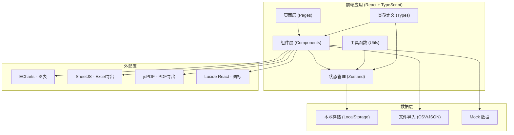

## 1. 架构设计



## 2. 技术描述
- **前端框架**：React@18 + TypeScript + Vite
- **样式方案**：TailwindCSS@3
- **状态管理**：Zustand
- **路由**：React Router DOM@6
- **图表库**：ECharts
- **文件处理**：SheetJS (xlsx)、jsPDF
- **图标库**：Lucide React
- **数据持久化**：LocalStorage
- **初始化工具**：vite-init

## 3. 路由定义
| 路由 | 页面组件 | 用途 |
|------|----------|------|
| / | DashboardPage | 分析仪表板主页 |
| /import | DataImportPage | 数据导入和参数配置 |
| /report | ReportPage | 报告预览和导出 |
| /history | HistoryPage | 历史记录和对比 |

## 4. 数据模型

### 4.1 核心类型定义
```typescript
// 传感器数据点
interface SensorData {
  timestamp: number;      // 时间戳
  velocity: number;       // 速度 (m/s)
  acceleration: number;   // 加速度 (m/s²)
  temperature: number;    // 温度 (°C)
  vibration: number;      // 振动 (mm/s)
  pressure: number;       // 压力 (kPa)
}

// 设备参数
interface DeviceParams {
  id: string;
  name: string;
  mass: number;           // 质量 (kg)
  slopeAngle: number;     // 坡道角度 (°)
  frictionCoeff: number;  // 摩擦系数
  gravity: number;        // 重力加速度 (m/s²)
  normalTempMin: number;  // 正常温度下限
  normalTempMax: number;  // 正常温度上限
  vibrationThreshold: number;  // 振动阈值
  updatedAt: number;
}

// 现场备注
interface FieldNote {
  id: string;
  timestamp: number;
  content: string;
  author: string;
  createdAt: number;
}

// 人工修正
interface ManualCorrection {
  id: string;
  dataPointIndex: number;
  field: keyof SensorData;
  originalValue: number;
  correctedValue: number;
  reason: string;
  author: string;
  createdAt: number;
}

// 能量分析结果
interface EnergyAnalysis {
  id: string;
  batchName: string;
  sensorData: SensorData[];
  deviceParams: DeviceParams;
  fieldNotes: FieldNote[];
  manualCorrections: ManualCorrection[];
  kineticEnergy: EnergyPoint[];
  potentialEnergy: EnergyPoint[];
  totalEnergy: EnergyPoint[];
  energyLoss: EnergyPoint[];
  anomalies: Anomaly[];
  extremeValues: ExtremeValue[];
  summary: AnalysisSummary;
  createdAt: number;
  sourceFiles: string[];
}

// 能量数据点
interface EnergyPoint {
  timestamp: number;
  value: number;
  unit: string;
}

// 异常记录
interface Anomaly {
  id: string;
  timestamp: number;
  dataIndex: number;
  type: 'temperature' | 'vibration' | 'energy' | 'velocity';
  severity: 'warning' | 'critical';
  value: number;
  threshold: number;
  deviation: number;
  reason: string;
  acknowledged: boolean;
}

// 极端值
interface ExtremeValue {
  id: string;
  type: 'max' | 'min';
  field: string;
  value: number;
  timestamp: number;
  dataIndex: number;
  avgValue: number;
  deviationPercent: number;
}

// 分析摘要
interface AnalysisSummary {
  totalSamples: number;
  avgKineticEnergy: number;
  avgPotentialEnergy: number;
  totalEnergyLoss: number;
  maxTemperature: number;
  maxVibration: number;
  anomalyCount: number;
  criticalAnomalyCount: number;
  duration: number;
}
```

## 5. 项目结构

```
src/
├── components/
│   ├── charts/
│   │   ├── EnergyTrendChart.tsx     # 能量趋势图
│   │   ├── SensorDataChart.tsx      # 传感器数据图
│   │   └── AnomalyMarker.tsx        # 异常标记组件
│   ├── common/
│   │   ├── DataTable.tsx            # 通用数据表格
│   │   ├── StatusCard.tsx           # 状态卡片
│   │   └── FileUpload.tsx           # 文件上传
│   ├── import/
│   │   ├── SensorUploader.tsx       # 传感器上传
│   │   ├── DeviceParamsForm.tsx     # 参数表单
│   │   └── NotesEditor.tsx          # 备注编辑器
│   └── report/
│       ├── ReportPreview.tsx        # 报告预览
│       └── ExportPanel.tsx          # 导出面板
├── pages/
│   ├── DashboardPage.tsx            # 分析仪表板
│   ├── DataImportPage.tsx           # 数据导入
│   ├── ReportPage.tsx               # 报告导出
│   └── HistoryPage.tsx              # 历史对比
├── store/
│   └── useAnalysisStore.ts          # 分析状态管理
├── utils/
│   ├── energyCalculator.ts          # 能量计算算法
│   ├── anomalyDetector.ts           # 异常检测
│   ├── csvParser.ts                 # CSV解析
│   ├── exportUtils.ts               # 导出工具
│   └── formatters.ts                # 格式化函数
├── types/
│   └── index.ts                     # 类型定义
├── data/
│   └── mockData.ts                  # 示例数据
├── App.tsx
├── main.tsx
└── index.css
```

## 6. 核心算法说明

### 6.1 能量计算公式
```
动能 (J) = 0.5 × 质量 × 速度²
势能 (J) = 质量 × 重力加速度 × 高度
高度 (m) = 滑行距离 × sin(坡道角度)
总能量 = 动能 + 势能
能量损失 = 前一时刻总能量 - 当前时刻总能量
```

### 6.2 异常检测规则
1. **温度异常**：超出正常温度范围 ±10%
2. **振动异常**：超过振动阈值 1.5 倍为警告，2 倍为严重
3. **能量异常**：能量突变超过前后平均值的 30%
4. **速度异常**：加速度突变超过 2g (19.6 m/s²)

### 6.3 极端值识别
- 计算每个字段的平均值和标准差
- 标记超出 ±2σ 范围的数据点
- 单独记录最大值和最小值及其出现时间
- 计算极端值相对于平均值的偏差百分比
