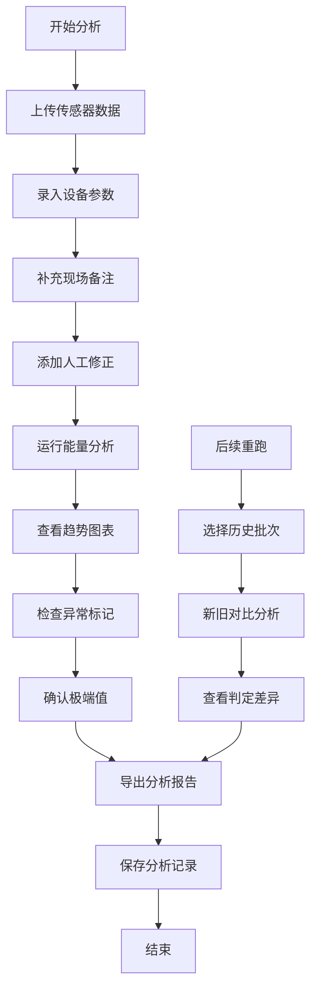

## 1. 产品概述
滑雪坡道能量分析工具是专为设备工程师何工设计的数据分析工具，用于整理实验记录本中的传感器数据、设备参数和现场备注，自动计算能量异常并生成报告。
- 解决问题：替代手工比对数据，减少重复翻查旧记录，保留分析溯源链
- 目标用户：设备工程师、实验室数据分析人员
- 产品价值：提高数据分析效率，确保异常不被遗漏，便于后续人员接手追溯

## 2. 核心功能

### 2.1 用户角色
| 角色 | 注册方式 | 核心权限 |
|------|----------|----------|
| 设备工程师 | 本地应用直接使用 | 数据导入、分析、导出、历史对比 |

### 2.2 功能模块
1. **数据导入页**：传感器记录上传、设备参数录入、现场备注编辑、人工修正添加
2. **分析仪表板**：能量趋势图表、异常值高亮、极端值单独展示
3. **报告导出页**：PDF/Excel导出、分析原因备注、原始来源记录
4. **历史对比页**：多批次数据并排对比、历史参数追溯、判定差异说明

### 2.3 页面详情
| 页面名称 | 模块名称 | 功能描述 |
|---------|----------|----------|
| 数据导入页 | 传感器数据上传 | 支持CSV/JSON格式文件拖拽上传，预览数据 |
| 数据导入页 | 参数配置 | 设备参数表单录入，支持保存为模板 |
| 数据导入页 | 备注编辑 | 现场备注富文本编辑，人工修正记录 |
| 分析仪表板 | 能量趋势图 | 时间序列折线图，多维度数据叠加 |
| 分析仪表板 | 异常检测 | 自动标记偏离阈值的数据点，显示异常原因 |
| 分析仪表板 | 极端值面板 | 单独列出最大/最小值，避免被平均值掩盖 |
| 报告导出页 | 导出配置 | 选择导出格式、包含内容、备注信息 |
| 报告导出页 | 预览生成 | 实时预览导出内容，确认后下载 |
| 历史对比页 | 批次选择 | 选择多批次分析结果进行并排对比 |
| 历史对比页 | 差异高亮 | 自动标记不同批次间的参数和结果差异 |

## 3. 核心流程

设备工程师何工的典型使用流程：
1. 上传传感器记录文件和设备参数
2. 补充现场备注和人工修正条目
3. 运行能量分析算法
4. 查看分析结果和异常标记
5. 确认极端值是否合理
6. 导出带分析原因的报告
7. 后续可查看历史分析记录并与新数据对比

## 4. 用户界面设计

### 4.1 设计风格
- **主色调**：深蓝 #1e3a5f（工业稳重感）+ 橙色 #ff7a45（异常警示）
- **辅助色**：青色 #22d3ee（正常状态）+ 红色 #ef4444（严重异常）
- **按钮风格**：直角矩形，轻微阴影，hover时有颜色加深效果
- **字体**：系统无衬线字体，标题加粗，数据使用等宽字体
- **布局风格**：卡片式布局，顶部导航，左侧参数面板，右侧图表区域
- **图标风格**：线性图标，简洁工业风，使用 lucide-react 图标库

### 4.2 页面设计概述
| 页面名称 | 模块名称 | UI 元素 |
|---------|----------|---------|
| 数据导入页 | 上传区域 | 拖拽区域、文件列表、进度条、预览表格 |
| 数据导入页 | 参数表单 | 分组表单、数值输入框、下拉选择、保存模板按钮 |
| 分析仪表板 | 图表区 | 响应式折线图、tooltip悬浮提示、图例切换 |
| 分析仪表板 | 异常面板 | 红/橙/绿三色状态卡片、异常原因标签 |
| 分析仪表板 | 极端值区 | 突出显示的数值卡片、对比基准线 |
| 报告导出页 | 预览区 | 模拟打印效果、页码导航 |
| 历史对比页 | 对比表格 | 并排多列、差异单元格高亮背景 |

### 4.3 响应式
- Desktop-first 设计，主内容区域最小宽度 1200px
- 平板设备自动调整为上下布局
- 移动端优先保证数据表格可读性，图表可横向滚动
- 触控设备优化按钮尺寸（最小 44px）

### 4.4 交互细节
- 数据上传时显示进度动画
- 异常值悬停显示详细分析日志
- 极端值点击可跳转至对应时间点的图表位置
- 历史对比支持拖动调整时间轴对齐
