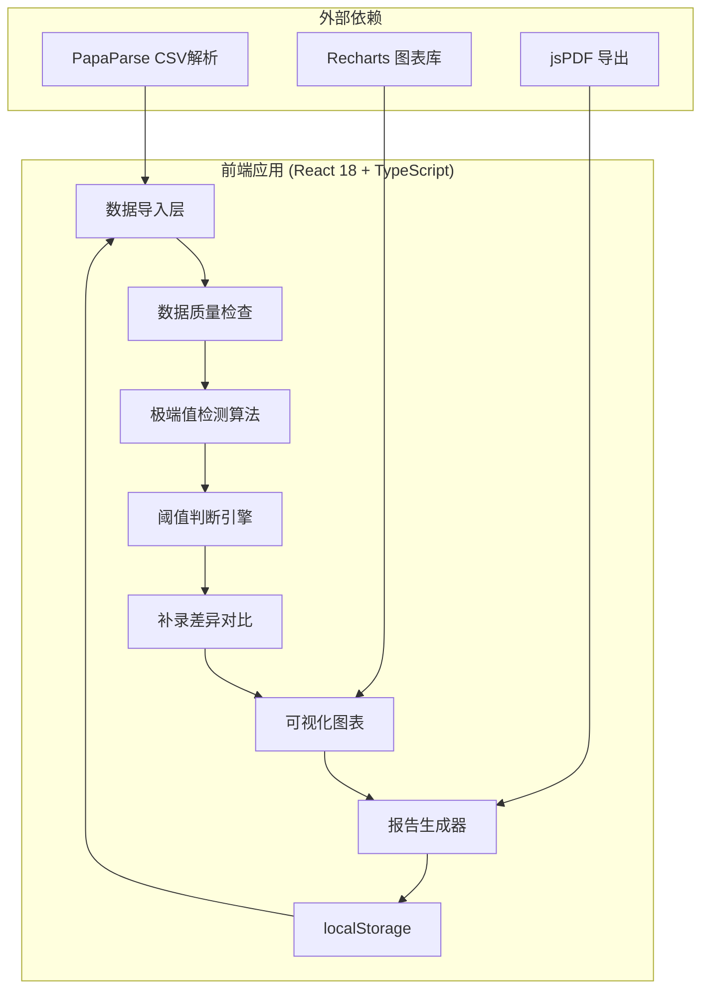

## 1. 架构设计

纯前端单页应用，所有数据处理和计算均在浏览器端完成，无需后端服务。数据存储使用浏览器 localStorage 保存分析历史。



## 2. 技术选型

- **前端框架**：React 18 + TypeScript + Vite 5
- **样式方案**：TailwindCSS 3
- **图表库**：Recharts 2（时间序列图、箱线图、散点图）
- **CSV解析**：PapaParse 5
- **PDF导出**：jspdf + html2canvas
- **路由**：React Router DOM 6
- **状态管理**：React Context + useReducer（轻量级，无需Redux）

## 3. 路由定义

| 路由 | 页面 | 功能 |
|------|------|------|
| `/` | 数据导入页 | 上传实验表、挂载照片、补录工况记录 |
| `/analysis` | 分析仪表盘 | 数据概览、极端值检测、阈值判断过程 |
| `/report` | 报告预览页 | 图表复盘、明细核对、处理建议、导出 |

## 4. 核心数据模型

```typescript
// 电池实验数据记录
interface BatteryRecord {
  id: string;
  timestamp: Date;
  temperature: number | null;      // 温度 (°C)
  voltage: number | null;          // 电压 (V)
  current: number | null;          // 电流 (A)
  internalResistance: number | null; // 内阻 (mΩ)
  dataQuality: {
    isNull: boolean;
    isDuplicate: boolean;
    isBoundary: boolean;
    isExtreme: boolean;
  };
  detectionSteps: DetectionStep[]; // 判断过程留痕
  supplementNote?: SupplementNote; // 补录备注
}

// 判断步骤留痕
interface DetectionStep {
  step: 'raw' | 'qualityCheck' | 'extremeDetection' | 'thresholdCompare' | 'riskRating';
  timestamp: Date;
  value: number;
  threshold: number;
  result: 'normal' | 'warning' | 'danger';
  formula: string; // 计算公式描述
}

// 补录备注
interface SupplementNote {
  id: string;
  content: string;
  author: string;
  timestamp: Date;
  affectedFields: Array<'temperature' | 'voltage' | 'current' | 'internalResistance'>;
  beforeAnalysis: AnalysisResult;
  afterAnalysis: AnalysisResult;
}

// 分析结果
interface AnalysisResult {
  meanTemperature: number;
  meanVoltage: number;
  extremeCount: number;
  riskLevel: 'low' | 'medium' | 'high';
  excludedRecords: string[]; // 被排除的极端值ID列表
}

// 阈值配置
interface ThresholdConfig {
  temperatureDanger: number;   // 温度危险阈值 °C
  temperatureWarning: number;  // 温度警告阈值 °C
  voltageDanger: number;       // 电压危险阈值 V
  voltageWarning: number;      // 电压警告阈值 V
  extremeStdDev: number;       // 极端值标准差倍数
  extremeIQR: number;          // 极端值四分位距倍数
}
```

## 5. 核心算法设计

### 5.1 极端值检测算法（双重检测）

```typescript
// 1. 标准差法 (±3σ)
function detectByStdDev(values: number[], k: number = 3): boolean[] {
  const mean = values.reduce((a, b) => a + b, 0) / values.length;
  const std = Math.sqrt(values.reduce((sum, val) => sum + Math.pow(val - mean, 2), 0) / values.length);
  return values.map(v => Math.abs(v - mean) > k * std);
}

// 2. 四分位距法 (IQR)
function detectByIQR(values: number[], k: number = 1.5): boolean[] {
  const sorted = [...values].sort((a, b) => a - b);
  const q1 = sorted[Math.floor(sorted.length * 0.25)];
  const q3 = sorted[Math.floor(sorted.length * 0.75)];
  const iqr = q3 - q1;
  const lowerBound = q1 - k * iqr;
  const upperBound = q3 + k * iqr;
  return values.map(v => v < lowerBound || v > upperBound);
}

// 双重检测：两种方法都判定为极端值才标记
function detectExtremeValues(values: number[]): boolean[] {
  const stdFlags = detectByStdDev(values, 3);
  const iqrFlags = detectByIQR(values, 1.5);
  return stdFlags.map((flag, i) => flag && iqrFlags[i]);
}
```

### 5.2 平均值计算（排除极端值）

```typescript
function calculateMeanExcludingExtremes(values: number[], extremeFlags: boolean[]): {
  meanWithExtremes: number;
  meanWithoutExtremes: number;
  excludedCount: number;
} {
  const validValues = values.filter((_, i) => !extremeFlags[i]);
  const meanWithExtremes = values.reduce((a, b) => a + b, 0) / values.length;
  const meanWithoutExtremes = validValues.reduce((a, b) => a + b, 0) / validValues.length;
  
  return {
    meanWithExtremes,
    meanWithoutExtremes,
    excludedCount: values.length - validValues.length
  };
}
```

## 6. 目录结构

```
src/
├── types/              # 类型定义
│   └── index.ts
├── config/             # 阈值配置
│   └── thresholds.ts
├── algorithms/         # 核心算法
│   ├── extremeDetection.ts
│   └── thresholdJudgment.ts
├── context/            # 状态管理
│   └── DataContext.tsx
├── components/         # 组件
│   ├── DataImport/     # 数据导入组件
│   ├── Dashboard/      # 分析仪表盘组件
│   ├── Report/         # 报告组件
│   └── common/         # 通用组件
├── hooks/              # 自定义Hooks
│   ├── useAnalysis.ts
│   └── useDataImport.ts
├── utils/              # 工具函数
│   ├── csvParser.ts
│   └── exportPdf.ts
├── mock/               # 测试样例数据
│   └── sampleData.ts
├── pages/              # 页面组件
│   ├── ImportPage.tsx
│   ├── AnalysisPage.tsx
│   └── ReportPage.tsx
└── App.tsx
```

## 7. 测试样例数据

测试数据包含以下场景，确保系统不只是照顾最顺的流程：

1. **空值测试**：3条记录包含温度或电压空值
2. **重复项测试**：2条完全相同的重复记录
3. **边界记录测试**：1条恰好等于阈值的边界记录
4. **极端值测试**：2条极端高温记录（85°C, 92°C），故意拉高平均值
5. **正常数据**：15条正常范围数据

```typescript
// 小样例数据（共23条）
// 极端值：85°C, 92°C（正常值范围 25-45°C）
// 边界值：60°C（恰好等于警告阈值）
// 空值：第7行温度为空，第12行电压为空
// 重复项：第15、16行完全相同
```

