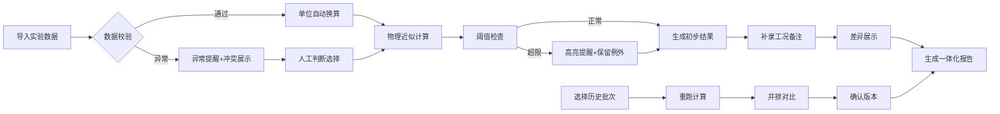

## 1. 产品概述

无人机旋翼噪声预测与分析工具，面向维修工程师，解决传感器数据单位混淆、计算过程不可追溯、异常值被汇总掩盖等痛点。将物理近似计算、单位换算、阈值提醒和报告生成一体化，确保维修师傅老岑无需二次手工核对。

### 目标用户
- 维修工程师（老岑）：负责无人机旋翼噪声检测与分析
- 质量管理人员：审核检测报告与追溯历史记录

### 核心价值
- 消除单位换算错误：自动识别并统一单位，可视化展示换算过程
- 完整追溯判断链：每一步计算和决策都可回溯
- 冲突透明化：数据冲突时展示双方证据而非自动决断
- 历史可对比：重跑数据时并排展示历史参数与新结果
- 报告一致性：汇总报告与明细数据同源，杜绝两套说法

---

## 2. 核心功能

### 2.1 用户角色
| 角色 | 核心权限 |
|------|----------|
| 维修工程师 | 数据导入、计算分析、备注补录、生成报告 |
| 质量管理员 | 查看历史记录、对比分析、导出完整报告 |

### 2.2 功能模块
1. **数据导入看板**：实验表导入、照片说明上传、工况记录补录
2. **计算分析工作台**：物理近似计算、单位换算、方向符号检查、时间间隔校验
3. **阈值与异常监控**：阈值配置、实时提醒、例外高亮、冲突证据展示
4. **历史对比中心**：多批次并排对比、参数差异标注、计算过程追溯
5. **报告生成器**：统一数据源报告、明细附表、决策链附录

### 2.3 页面详情
| 页面名称 | 模块名称 | 功能描述 |
|---------|---------|----------|
| 主工作台 | 数据导入区 | 支持CSV/Excel实验表导入、拖拽上传照片说明、手动录入工况记录 |
| 主工作台 | 单位换算面板 | 自动识别数据单位、一键换算、换算公式可视化展示 |
| 主工作台 | 计算分析区 | 旋翼噪声物理模型计算、实时显示中间过程、参数可调整 |
| 主工作台 | 异常提醒栏 | 方向符号错误、单位不匹配、时间间隔异常等高亮提醒 |
| 主工作台 | 冲突解决区 | 传感器日志与导入数据冲突时，双栏展示证据并给出建议动作 |
| 历史对比页 | 批次选择器 | 选择多批次数据进行并排对比 |
| 历史对比页 | 差异高亮 | 自动标注参数差异、结果差异、备注差异 |
| 历史对比页 | 追溯时间线 | 展示每一批次的完整计算决策链 |
| 报告预览页 | 报告生成 | 汇总报告+明细附表+决策链附录一体化导出 |
| 报告预览页 | 备注补录 | 支持临时添加备注并自动计算补录前后差异 |
| 配置页 | 阈值配置 | 噪声阈值、时间间隔阈值、容差范围等参数配置 |

---

## 3. 核心流程

### 3.1 正常处理流程
维修师傅老岑导入一小包实验数据 → 系统自动校验单位/方向/时间间隔 → 执行物理近似计算 → 生成初步结果 → 老岑补录工况备注 → 系统展示补录差异 → 确认后生成一体化报告

### 3.2 返工处理流程
导入数据后检测到单位/方向冲突 → 系统双栏展示传感器日志与导入数据 → 老岑人工判断选择数据源 → 系统标记决策过程 → 重新计算 → 生成带返工标记的报告

### 3.3 重跑对比流程
选择历史批次 → 一键重跑相同数据 → 并排展示历史参数与新结果 → 差异高亮标注 → 确认是否覆盖或保留双版本

---

## 4. 用户界面设计

### 4.1 设计风格
**工业工程风格 - 专业精密感**
- 主色调：深空蓝 (#1a365d) + 警告橙 (#ff8c42) + 数据绿 (#22c55e) + 错误红 (#ef4444)
- 辅助色：浅灰蓝 (#f1f5f9) 背景、深灰 (#334155) 文本
- 字体：JetBrains Mono (数值显示) + Noto Sans SC (中文说明)
- 按钮风格：直角切边、轻微立体阴影、悬停微抬升效果
- 布局：模块化卡片式、数据网格优先、高密度信息展示
- 图标：线性工业图标、强调数据可视化

**差异化设计点**：
- 计算过程采用"时间线瀑布流"展示，每一步变换清晰可见
- 单位换算采用"双联卡片"设计，左右并排展示换算前后
- 冲突区域采用"对比分割线"设计，中间竖线分隔两侧证据
- 例外数据采用"红边外扩"设计，确保不会被汇总淹没

### 4.2 页面设计概述
| 页面名称 | 模块名称 | UI元素 |
|---------|---------|--------|
| 主工作台 | 数据导入区 | 拖拽上传区、文件预览卡片、工况录入表单 |
| 主工作台 | 单位换算面板 | 双联卡片、换算公式、单位选择器、换算箭头动画 |
| 主工作台 | 计算分析区 | 公式编辑器、中间变量卡片、结果展示区、计算时间线 |
| 主工作台 | 异常提醒栏 | 顶部固定横幅、可展开详情、错误代码说明 |
| 主工作台 | 冲突解决区 | 双栏对比布局、中间竖线分割、证据标签、建议动作按钮 |
| 历史对比页 | 批次选择器 | 时间轴选择、批次卡片、多选模式 |
| 历史对比页 | 差异高亮 | 背景色差异标注、数值变动箭头、差异百分比 |
| 历史对比页 | 追溯时间线 | 垂直时间线、决策节点、备注气泡 |
| 报告预览页 | 报告生成 | 分栏报告预览、页码导航、导出按钮组 |
| 报告预览页 | 备注补录 | 浮动编辑框、差异计算弹窗、确认按钮 |

### 4.3 响应式
- 桌面优先（1280px+）：完整四栏布局，适合维修工位大屏
- 平板（768px-1280px）：两栏自适应，核心功能保留
- 移动端（<768px）：单列流式布局，仅支持数据查看和报告导出
- 触控优化：按钮最小44px，重要操作增加确认步骤

### 4.4 动效设计
- 页面加载：模块渐入+轻微上移，按工作流顺序错峰出现
- 单位换算：箭头旋转+数字滚动动画，换算过程可视化
- 异常出现：警告横幅从顶部滑入，轻微抖动吸引注意
- 差异标注：高亮背景色从中心向外扩散，引导用户视线
- 历史对比：滑动切换动画，旧数据向左淡出、新数据从右滑入
