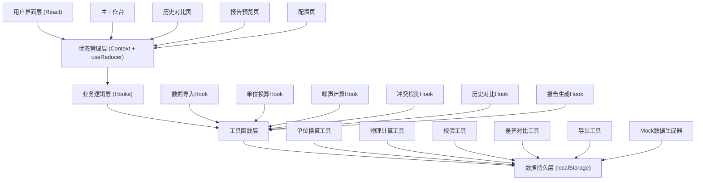

## 1. 架构设计



---

## 2. 技术描述

### 2.1 技术栈选择
- **前端框架**：React@18 + TypeScript
- **构建工具**：Vite@5
- **样式方案**：Tailwind CSS@3 + CSS变量
- **状态管理**：React Context + useReducer（轻量级，避免过度工程化）
- **路由管理**：react-router-dom@6
- **数据持久化**：localStorage（无需后端，本地存储所有批次数据）
- **文件解析**：csv-parse（解析CSV实验表）
- **图标**：Lucide React（线性工业风格图标）
- **日期处理**：date-fns
- **类型安全**：TypeScript 严格模式

### 2.2 设计决策
1. **纯前端方案**：无需后端服务，所有数据本地存储，适合维修车间离线使用场景
2. **Mock数据内置**：内置两套完整样例数据（一次顺利处理 + 一次返工），开箱即用
3. **计算过程可追溯**：每一步计算都生成计算节点，形成完整决策链
4. **时间戳版本控制**：每次修改都带时间戳，支持完整历史回溯
5. **单页应用架构**：快速切换页面，无需刷新

---

## 3. 目录结构

```
src/
├── assets/              # 静态资源
├── components/          # 可复用组件
│   ├── common/         # 通用组件（按钮、卡片、表单等）
│   ├── dataImport/     # 数据导入相关组件
│   ├── calculation/    # 计算分析相关组件
│   ├── unitConvert/    # 单位换算相关组件
│   ├── conflict/       # 冲突解决相关组件
│   ├── history/        # 历史对比相关组件
│   └── report/         # 报告生成相关组件
├── context/            # React Context
│   └── AppContext.tsx  # 全局应用状态
├── hooks/              # 自定义Hooks（业务逻辑层）
│   ├── useDataImport.ts
│   ├── useUnitConvert.ts
│   ├── useNoiseCalculation.ts
│   ├── useConflictDetection.ts
│   ├── useHistoryCompare.ts
│   └── useReportGenerator.ts
├── utils/              # 工具函数层
│   ├── unitConverter.ts
│   ├── physicsCalculator.ts
│   ├── validator.ts
│   ├── diffComparator.ts
│   ├── exporter.ts
│   └── mockData.ts     # Mock数据生成器
├── types/              # TypeScript类型定义
│   └── index.ts
├── pages/              # 页面组件
│   ├── Workbench.tsx
│   ├── HistoryCompare.tsx
│   ├── ReportPreview.tsx
│   └── Settings.tsx
├── App.tsx
├── main.tsx
└── index.css
```

---

## 4. 路由定义

| 路由 | 页面 | 说明 |
|------|------|------|
| `/` | 主工作台 | 数据导入、计算分析、冲突解决 |
| `/history` | 历史对比页 | 批次选择、并排对比、追溯时间线 |
| `/report/:batchId` | 报告预览页 | 报告生成、备注补录、差异展示 |
| `/settings` | 配置页 | 阈值配置、单位预设、系统设置 |

---

## 5. 核心数据模型

### 5.1 TypeScript类型定义

```typescript
// 物理量单位
type Unit = 'dB' | 'dBA' | 'dBm' | 'Hz' | 'kHz' | 'RPM' | 'm/s' | 'm' | 'kg' | 'N' | 'Pa';

// 方向符号
type Direction = 'CW' | 'CCW' | 'UP' | 'DOWN' | 'LEFT' | 'RIGHT';

// 数据点
interface DataPoint {
  id: string;
  timestamp: number;
  value: number;
  unit: Unit;
  direction?: Direction;
  source: 'sensor' | 'import' | 'manual';
  confidence: number;
}

// 传感器日志条目
interface SensorLogEntry {
  id: string;
  timestamp: number;
  parameter: string;
  value: number;
  unit: Unit;
  rawLog: string;
}

// 实验记录表
interface ExperimentRecord {
  id: string;
  batchId: string;
  droneModel: string;
  rotorModel: string;
  testDate: string;
  temperature: number;
  humidity: number;
  atmosphericPressure: number;
  dataPoints: DataPoint[];
  sensorLogs: SensorLogEntry[];
  photoUrls?: string[];
}

// 工况记录
interface OperationCondition {
  id: string;
  batchId: string;
  timestamp: number;
  description: string;
  rotorSpeed?: number;
  flightAltitude?: number;
  payload?: number;
  weatherCondition?: string;
}

// 计算节点（用于追溯）
interface CalculationNode {
  id: string;
  batchId: string;
  timestamp: number;
  step: number;
  operation: string;
  input: Record<string, any>;
  output: Record<string, any>;
  formula?: string;
  operator?: string;
  note?: string;
}

// 单位换算记录
interface UnitConversion {
  id: string;
  fromValue: number;
  fromUnit: Unit;
  toValue: number;
  toUnit: Unit;
  formula: string;
  timestamp: number;
}

// 冲突记录
interface ConflictRecord {
  id: string;
  batchId: string;
  timestamp: number;
  type: 'unit_mismatch' | 'direction_error' | 'timegap_error' | 'value_conflict';
  severity: 'warning' | 'error' | 'critical';
  sensorData: {
    value: number;
    unit: Unit;
    timestamp: number;
    rawLog: string;
  };
  importData: {
    value: number;
    unit: Unit;
    timestamp: number;
    source: string;
  };
  suggestedAction: string;
  resolution?: 'use_sensor' | 'use_import' | 'manual';
  resolvedBy?: string;
  resolvedAt?: number;
}

// 异常记录
interface AnomalyRecord {
  id: string;
  batchId: string;
  type: 'threshold_exceed' | 'outlier' | 'missing_data';
  description: string;
  value: number;
  threshold: number;
  timestamp: number;
  highlighted: boolean;
}

// 阈值配置
interface ThresholdConfig {
  noiseWarning: number;      // dB
  noiseCritical: number;     // dB
  timeGapWarning: number;    // 秒
  timeGapCritical: number;   // 秒
  valueTolerance: number;    // 百分比
  directionMismatch: boolean;
}

// 批次数据
interface Batch {
  id: string;
  name: string;
  status: 'draft' | 'processing' | 'completed' | 'rework';
  createdAt: number;
  updatedAt: number;
  experimentRecord: ExperimentRecord;
  operationConditions: OperationCondition[];
  calculationChain: CalculationNode[];
  unitConversions: UnitConversion[];
  conflicts: ConflictRecord[];
  anomalies: AnomalyRecord[];
  notes: Note[];
  result?: NoisePredictionResult;
}

// 备注
interface Note {
  id: string;
  batchId: string;
  timestamp: number;
  content: string;
  author: string;
  previousResultSnapshot?: NoisePredictionResult;
}

// 噪声预测结果
interface NoisePredictionResult {
  overallNoiseLevel: number;
  unit: Unit;
  dominantFrequency: number;
  harmonicComponents: number[];
  directionalityIndex: number;
  confidenceLevel: number;
  assessment: 'normal' | 'warning' | 'critical';
  recommendations: string[];
}

// 对比差异
interface ComparisonDiff {
  field: string;
  oldValue: any;
  newValue: any;
  diffType: 'added' | 'removed' | 'modified';
  significance: 'low' | 'medium' | 'high';
}
```

### 5.2 核心物理公式

#### 旋翼噪声近似计算公式
1. **厚度噪声** (Thickness Noise):
   $$ f_{tip} = \frac{N \times \Omega}{60} $$
   其中 N 为桨叶数，Ω 为转速(RPM)

2. **载荷噪声** (Loading Noise):
   $$ SPL = 10 \log_{10}\left(\frac{p_{rms}^2}{p_{ref}^2}\right) $$
   其中 p_ref = 20 μPa

3. **宽带噪声** (Broadband Noise):
   $$ SPL_{BB} = K + 50 \log_{10}(M) + 20 \log_{10}(c) $$
   其中 M 为马赫数，c 为弦长，K 为经验常数

4. **A计权修正**:
   $$ L_{A} = L_{p} + A(f) $$
   其中 A(f) 为A计权修正值

---

## 6. 核心算法

### 6.1 单位换算算法
```typescript
// 单位转换矩阵
const conversionMatrix: Record<Unit, Partial<Record<Unit, (value: number) => number>>> = {
  'dB': {
    'dBA': (dB) => dB + 2.5,  // 近似修正
  },
  'dBA': {
    'dB': (dBA) => dBA - 2.5,
  },
  'Hz': {
    'kHz': (hz) => hz / 1000,
  },
  'kHz': {
    'Hz': (khz) => khz * 1000,
  },
  'RPM': {
    'Hz': (rpm) => rpm / 60,
  },
  'm/s': {
    'km/h': (ms) => ms * 3.6,
  },
  // ... 更多转换
};
```

### 6.2 冲突检测算法
1. 遍历传感器日志与导入数据的时间戳
2. 匹配时间窗口内的数据点（±5秒）
3. 比较数值、单位、方向
4. 超出容差范围则生成冲突记录
5. 按严重程度排序展示

### 6.3 差异对比算法
1. 深度递归对比两个批次对象
2. 标记新增、删除、修改字段
3. 根据业务规则计算差异重要性
4. 数值字段计算变化百分比

---

## 7. Mock数据设计

### 7.1 正常处理样例（顺利批次）
- 批次号：BATCH-2026-001
- 无人机型号：DJI-Matrice-300
- 旋翼型号：R-MT300-1760
- 测试条件：25°C，60%湿度，标准大气压
- 数据完整，单位统一，无冲突
- 结果：噪声水平78.5 dB，正常范围

### 7.2 返工处理样例
- 批次号：BATCH-2026-002（标记REWORK）
- 冲突点：传感器日志单位为dBm，导入数据单位为dB
- 数值相近但单位不同，直接使用导致结果完全错误
- 方向符号：传感器记录CCW（逆时针），导入数据记录CW（顺时针）
- 时间间隔：存在15秒数据缺口，超过阈值5秒
- 返工过程：人工确认单位错误，重新换算后计算
- 结果：原始计算65 dB（错误）→ 修正后82 dB（正确，超限警告）

---

## 8. 存储方案

### 8.1 localStorage键定义
| 键名 | 数据类型 | 说明 |
|------|----------|------|
| `noise_prediction_batches` | `Batch[]` | 所有批次数据 |
| `noise_prediction_config` | `ThresholdConfig` | 阈值配置 |
| `noise_prediction_settings` | `object` | 用户偏好设置 |

### 8.2 数据导出格式
- **PDF报告**：包含汇总页、明细附表、决策链附录
- **CSV导出**：原始数据、计算结果、异常记录
- **JSON导出**：完整批次数据，可导入重算
