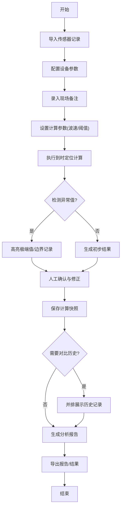

## 1. 产品概述

地震波到时定位计算工具，旨在解决传统依赖设备巡检表进行地震波定位分析的低效问题，将物理近似计算、单位换算、阈值提醒和报告生成为一体化工作流，实现从样例数据到定位结果的完整闭环。

- 核心目标：将"地震波到时定位"从分散的人工操作转变为系统化的计算工具
- 目标用户：地震监测人员、项目助理（如小宋）、数据分析人员
- 核心价值：减少翻查旧记录的时间，保留处理历史，支持后续补充材料继续处理

## 2. 核心功能

### 2.1 用户角色

| 角色 | 核心权限 |
|------|----------|
| 数据分析员 | 导入数据、执行计算、生成报告、查看历史 |
| 项目助理 | 查看报告、导出结果、对比历史记录 |

### 2.2 功能模块

1. **数据导入与管理**：传感器记录导入、设备参数配置、现场备注录入、人工修正
2. **核心计算引擎**：物理近似计算、单位换算、到时差定位算法
3. **阈值提醒系统**：异常值检测、边界条件预警、极端值高亮
4. **报告生成模块**：自动生成分析报告、极端值单独提取、可导出格式
5. **历史记录对比**：保存计算参数、历史结果并排展示、处理追溯

### 2.3 页面详情

| 页面名称 | 模块名称 | 功能描述 |
|-----------|-------------|---------------------|
| 数据导入页 | 数据上传区 | 支持CSV/Excel导入传感器记录、设备参数、现场备注 |
| 数据导入页 | 数据预览区 | 表格展示原始数据，标注空值、重复项、边界记录 |
| 计算工作台 | 参数配置区 | 设置波速、阈值、计算方法等参数 |
| 计算工作台 | 实时计算区 | 显示计算进度、中间结果、极端值提醒 |
| 计算工作台 | 人工确认区 | 标记需要人工确认的记录，录入修正意见 |
| 结果分析页 | 定位结果展示 | 可视化展示震源位置、到时差曲线 |
| 结果分析页 | 极端值分析 | 单独展示极端值记录，支持筛选和导出 |
| 历史记录页 | 历史对比区 | 并排展示多次计算的参数和结果差异 |
| 历史记录页 | 追溯面板 | 查看每次计算的处理逻辑和人工修正痕迹 |
| 报告导出页 | 报告预览区 | 生成包含完整分析过程的报告 |
| 报告导出页 | 导出选项 | 支持PDF/Excel/Word格式导出 |

## 3. 核心流程

用户从数据导入开始，经过参数配置、自动计算、人工确认，最终生成报告，所有计算参数和结果自动保存以便后续对比和追溯。

## 4. 样例数据设计

预置三类测试数据，覆盖从顺利到复杂的各种场景：

| 数据类型 | 说明 | 预期处理方式 |
|---------|------|-------------|
| 顺利记录 | 数据完整、数值正常、无异常 | 自动计算通过 |
| 需要确认记录 | 存在边界值、到时差异常 | 标记黄色预警，等待人工确认 |
| 旧口径记录 | 从设备巡检表补录的历史数据 | 标注来源，使用兼容算法 |

## 5. 用户界面设计

### 5.1 设计风格

**设计理念：科技感与专业感并重的工业风界面**

- **主色调**：深蓝 (#0F172A) - 代表专业与科技
- **辅助色**：青色 (#06B6D4) - 用于交互元素和高亮
- **警示色**：琥珀色 (#F59E0B) - 人工确认提醒；红色 (#EF4444) - 极端值警告
- **中性色**：深灰到白色渐变 - 保证可读性

**字体选择**：
- 标题：JetBrains Mono - 等宽字体增强数据可读性
- 正文：Inter - 现代无衬线字体保证易读性
- 数据展示：JetBrains Mono - 数字对齐清晰

**布局风格**：
- 卡片式布局，明确的功能分区
- 深色主题降低长时间使用的视觉疲劳
- 数据表格使用斑马纹增强可读性
- 极端值使用红色背景+闪烁边框突出显示

### 5.2 页面设计概览

| 页面名称 | 模块名称 | UI 关键元素 |
|-----------|-------------|-------------|
| 数据导入页 | 上传区 | 拖拽上传区域，进度条动画，文件类型图标 |
| 数据导入页 | 数据预览 | 冻结表头的表格，空值灰色占位，重复项黄色标记 |
| 计算工作台 | 参数面板 | 滑块控件，实时单位换算显示，预设参数快捷按钮 |
| 计算工作台 | 异常提醒 | 顶部通知栏，极端值卡片单独列出，计数器徽章 |
| 结果分析页 | 可视化 | SVG波形图，到时差热力图，震源位置标记 |
| 历史记录页 | 对比视图 | 左右分栏布局，差异高亮显示，时间戳追溯 |
| 报告导出页 | 预览区 | 分页预览，目录导航，一键导出按钮组 |

### 5.3 响应式设计

- 桌面端：完整功能布局，多面板协同工作
- 平板端：折叠侧边栏，标签页切换功能模块
- 移动端：简化视图，核心数据展示为主

### 5.4 交互动效

- 页面加载：元素淡入+轻微上移动画
- 数据计算：进度条平滑过渡，结果数字滚动动画
- 异常提醒：脉冲动画吸引注意力
- 卡片悬停：轻微上浮+阴影加深
- 切换动画：页面间使用滑动过渡效果
