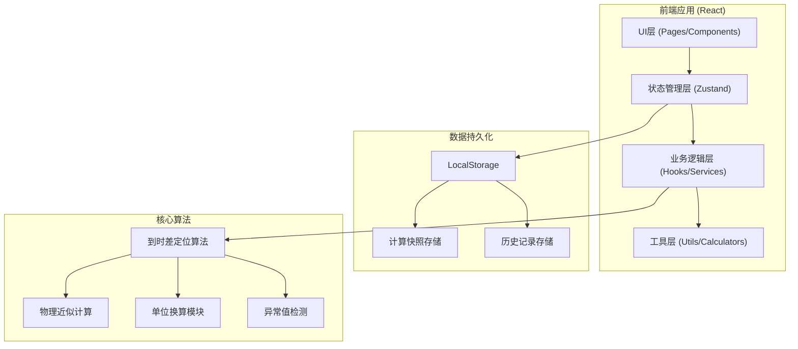

## 1. 架构设计



## 2. 技术选型

- **前端框架**: React@18 + TypeScript
- **构建工具**: Vite@5
- **样式方案**: TailwindCSS@3
- **状态管理**: Zustand (轻量级，适合本项目)
- **图表可视化**: Recharts (React生态，轻量高性能)
- **UI组件**: Headless UI + 自定义组件
- **图标**: Lucide React
- **文件处理**: PapaParse (CSV解析)
- **数据导出**: xlsx (Excel导出), jsPDF (PDF导出)
- **持久化**: LocalStorage (无需后端，前端完整可用)

## 3. 路由定义

| 路由路径 | 页面名称 | 主要功能 |
|-----------|----------|---------|
| / | 首页/仪表盘 | 项目概览、快速开始、最近记录 |
| /import | 数据导入 | 上传数据、预览、数据校验 |
| /workspace | 计算工作台 | 参数配置、实时计算、人工确认 |
| /results | 结果分析 | 定位结果、极端值分析、可视化 |
| /history | 历史记录 | 历史快照、对比分析、追溯 |
| /report | 报告导出 | 报告预览、多格式导出 |

## 4. 数据模型

### 4.1 核心数据结构

```typescript
// 传感器记录
interface SensorRecord {
  id: string;
  sensorId: string;
  stationName: string;
  latitude: number;
  longitude: number;
  elevation: number;
  pWaveArrival: number | null;      // P波到时 (秒)
  sWaveArrival: number | null;      // S波到时 (秒)
  amplitude: number | null;         // 振幅
  quality: 'good' | 'fair' | 'poor';
  source: 'sensor' | 'manual' | 'legacy';  // 数据来源
  notes?: string;
  createdAt: string;
}

// 设备参数
interface DeviceParams {
  deviceId: string;
  deviceName: string;
  sampleRate: number;       // 采样率 (Hz)
  sensitivity: number;      // 灵敏度
  calibrationDate: string;
  lastMaintenance: string;
}

// 计算参数
interface CalculationParams {
  pWaveVelocity: number;    // P波速度 (km/s)
  sWaveVelocity: number;    // S波速度 (km/s)
  velocityRatio: number;    // 波速比 Vp/Vs
  timeThreshold: number;    // 时间差阈值 (秒)
  locationMethod: 'geiger' | 'homogeneous' | 'layered';
  maxIterations: number;
  convergenceThreshold: number;
}

// 定位结果
interface LocationResult {
  id: string;
  earthquakeId: string;
  latitude: number;
  longitude: number;
  depth: number;
  originTime: number;
  magnitude: number;
  uncertainty: {
    horizontal: number;
    vertical: number;
  };
  residuals: Array<{
    sensorId: string;
    residual: number;
  }>;
  quality: 'excellent' | 'good' | 'fair' | 'poor';
  extremeValues: string[];    // 极端值记录ID
  needsReview: string[];      // 需要人工确认的记录ID
}

// 计算快照 (用于历史对比)
interface CalculationSnapshot {
  id: string;
  name: string;
  timestamp: string;
  operator: string;
  params: CalculationParams;
  inputRecords: SensorRecord[];
  result: LocationResult;
  manualCorrections: Array<{
    recordId: string;
    field: string;
    oldValue: any;
    newValue: any;
    reason: string;
  }>;
  notes: string;
}
```

### 4.2 异常检测规则

```typescript
interface AnomalyRules {
  // 到时差异常: S-P 时间超出正常范围
  maxTimeDifference: number;    // 最大允许时差 (秒)
  minTimeDifference: number;    // 最小允许时差
  
  // 振幅异常: 超出均值倍数
  amplitudeOutlierThreshold: number;  // 标准差倍数
  
  // 残差异常: 定位残差过大
  maxResidual: number;         // 最大残差 (秒)
  
  // 边界值检测
  boundaryThreshold: number;   // 接近边界的百分比阈值
}
```

## 5. 核心算法模块

### 5.1 到时差定位算法 (Geiger 方法)

```
输入: 各台站到时、台站坐标、初始震源位置
输出: 震源位置、发震时刻、残差

迭代过程:
1. 根据初始位置计算理论到时
2. 构建偏导数矩阵 (雅可比矩阵)
3. 求解观测到时与理论到时的差值方程组
4. 更新震源位置
5. 检查收敛性，未收敛则重复
```

### 5.2 单位换算模块

支持的单位转换:
- 距离: km ↔ m ↔ miles
- 时间: s ↔ ms ↔ min
- 速度: km/s ↔ m/s ↔ km/h
- 深度: km ↔ m

### 5.3 异常值检测算法

- **极端值识别**: IQR 方法 (四分位距)
- **边界值检测**: 距离数据范围边缘的比例
- **重复项检测**: 基于传感器ID和时间戳
- **空值处理**: 标记并提供填充策略

## 6. 状态管理设计

```typescript
// 全局状态切片
interface AppState {
  // 数据状态
  sensorRecords: SensorRecord[];
  deviceParams: DeviceParams[];
  
  // 计算状态
  currentParams: CalculationParams;
  currentResult: LocationResult | null;
  isCalculating: boolean;
  
  // 历史状态
  snapshots: CalculationSnapshot[];
  selectedSnapshots: string[];  // 用于对比
  
  // UI状态
  activeTab: string;
  notifications: Notification[];
}
```

## 7. 项目目录结构

```
src/
├── components/           # 可复用组件
│   ├── layout/          # 布局组件
│   ├── ui/              # 基础UI组件
│   ├── charts/          # 图表组件
│   └── tables/          # 数据表格
├── pages/               # 页面组件
│   ├── Dashboard.tsx
│   ├── DataImport.tsx
│   ├── Workspace.tsx
│   ├── Results.tsx
│   ├── History.tsx
│   └── Report.tsx
├── hooks/               # 自定义Hooks
│   ├── useCalculation.ts
│   ├── useAnomalyDetection.ts
│   └── useSnapshot.ts
├── store/               # 状态管理
│   └── useAppStore.ts
├── utils/               # 工具函数
│   ├── calculations/    # 核心算法
│   │   ├── location.ts
│   │   ├── unitConversion.ts
│   │   └── anomalyDetection.ts
│   ├── export/          # 导出功能
│   └── formatters.ts
├── types/               # TypeScript类型定义
│   └── index.ts
├── data/                # 示例数据
│   └── sampleData.ts
├── styles/              # 全局样式
└── App.tsx
```

## 8. 性能优化策略

1. **计算性能**: 核心算法使用 Web Workers 避免阻塞UI
2. **大数据处理**: 虚拟滚动渲染大表格
3. **状态优化**: Zustand 选择器避免不必要重渲染
4. **图表优化**: 数据降采样，按需渲染
5. **存储优化**: 增量快照，只存储变更部分

## 9. 测试策略

- **单元测试**: 核心算法模块 (定位计算、单位换算、异常检测)
- **集成测试**: 完整工作流测试
- **边界测试**: 空值、重复项、极端值测试场景
- **E2E测试**: 关键用户流程自动化测试
