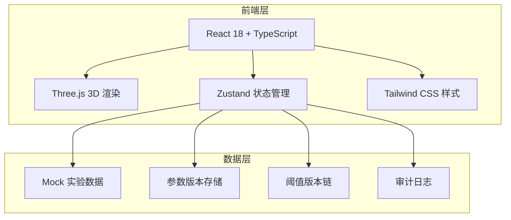

## 1. 架构设计



## 2. 技术说明

- **前端框架**：React@18 + TypeScript + Vite
- **初始化工具**：vite-init（react-ts 模板）
- **3D 渲染**：Three.js + @react-three/fiber + @react-three/drei + @react-three/postprocessing
- **状态管理**：Zustand（参数版本追踪、阈值版本链、审计日志）
- **样式方案**：Tailwind CSS 3
- **后端**：无（纯前端，数据使用 Mock）
- **数据持久化**：localStorage（参数版本、阈值版本、审计日志）

## 3. 路由定义

| 路由 | 用途 |
|------|------|
| `/` | 数据看板页——实验记录导入、数据质量扫描、冲突标记、处理建议 |
| `/analysis` | 热传导分析页——3D 温度场、计算链路、阈值管理 |
| `/comparison` | 历史对比页——并排比较、版本时间线、交接报告 |

## 4. 数据模型

### 4.1 核心数据结构

```typescript
interface ExperimentRecord {
  id: string
  batchId: string
  timestamp: string
  temperature: number | null
  temperatureUnit: "°C" | "°F" | "unknown"
  duration: number | null
  durationUnit: "s" | "min" | "unknown"
  beanCenterTemp: number | null
  beanSurfaceTemp: number | null
  roastingLevel: string
  rawNote: string
  dataQualityFlags: DataQualityFlag[]
  conflictWithNote: boolean
}

interface DataQualityFlag {
  type: "missing_value" | "mixed_unit" | "duplicate" | "threshold_exceeded"
  field: string
  message: string
  suggestedAction: string
  status: "pending" | "confirmed" | "dismissed"
}

interface ThresholdVersion {
  version: number
  maxValue: number
  minValue: number
  unit: string
  changedAt: string
  changedBy: string
  reason: string
}

interface ParameterVersion {
  version: number
  params: Record<string, number>
  changedAt: string
  changedBy: string
  reason: string
}

interface ComputationTrace {
  id: string
  recordId: string
  parameterVersion: number
  thresholdVersion: number
  steps: ComputationStep[]
  result: number
  computedAt: string
}

interface ComputationStep {
  name: string
  input: Record<string, number>
  formula: string
  output: number
  parameterVersionUsed: number
  thresholdVersionUsed: number
}

interface AuditLogEntry {
  id: string
  timestamp: string
  action: string
  target: string
  oldValue: string
  newValue: string
  operator: string
  reason: string
}

interface ComparisonSession {
  id: string
  batchId: string
  runA: ComputationTrace
  runB: ComputationTrace
  createdAt: string
}
```

### 4.2 Mock 数据设计

Mock 数据包含以下刻意设置的数据问题：

1. **空值**：第 7、13 行温度为 null，第 5 行持续时间为 null
2. **单位混写**：第 4 行温度单位为 °F（其余为 °C），第 11 行持续时间单位为 s（其余为 min）
3. **重复项**：第 8、9 行数据完全相同
4. **超限记录**：第 17 行豆心温度 268°C，超过安全阈值 250°C
5. **备注冲突**：第 12 行备注写"温度异常偏低"但数据为 225°C（正常范围）；第 17 行备注写"正常出炉"但数据超限
6. **乱备注**：第 3 行备注"这天设备好像不太对"，第 15 行备注"老岑说这批还行"

## 5. 核心计算逻辑

### 5.1 热传导简化模型

采用一维径向热传导方程的简化版本：

```
∂T/∂t = α * (∂²T/∂r² + (1/r) * ∂T/∂r)
```

其中：
- T：温度（°C）
- t：时间（s）
- r：径向距离（m）
- α：热扩散系数（m²/s），默认值 1.2×10⁻⁷（咖啡豆近似值）

离散化后使用显式有限差分法计算，每一步计算过程记录在 ComputationTrace 中。

### 5.2 阈值检测

- 默认安全阈值：豆心温度 ≤ 250°C
- 超限检测在每次计算后自动执行
- 阈值版本影响判断结果：使用旧版阈值时"超限"的记录，在阈值上调后可能变为"正常"，系统会标注"基于 vN 阈值判定"

## 6. 组件结构

```
src/
├── components/
│   ├── layout/
│   │   ├── Sidebar.tsx
│   │   └── PageContainer.tsx
│   ├── data/
│   │   ├── DataImport.tsx
│   │   ├── DataTable.tsx
│   │   ├── QualityFlag.tsx
│   │   ├── ConflictCard.tsx
│   │   └── SuggestionList.tsx
│   ├── analysis/
│   │   ├── HeatConduction3D.tsx
│   │   ├── ComputationTrace.tsx
│   │   ├── ThresholdPanel.tsx
│   │   └── AlertBanner.tsx
│   └── comparison/
│       ├── SideBySideTable.tsx
│       ├── VersionTimeline.tsx
│       └── HandoverReport.tsx
├── pages/
│   ├── Dashboard.tsx
│   ├── Analysis.tsx
│   └── Comparison.tsx
├── store/
│   ├── useDataStore.ts
│   ├── useThresholdStore.ts
│   ├── useComputationStore.ts
│   └── useAuditStore.ts
├── utils/
│   ├── heatConduction.ts
│   ├── dataQuality.ts
│   └── mockData.ts
└── App.tsx
```
