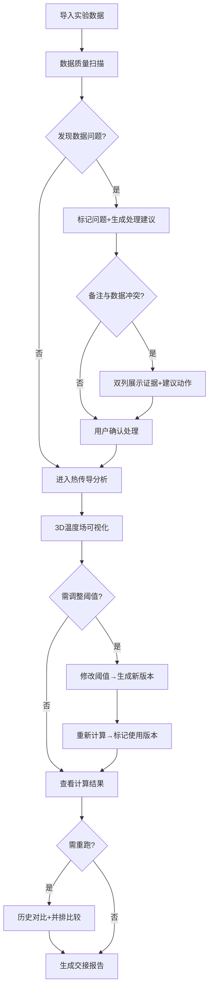

## 1. 产品概述

"咖啡烘焙热传导"分析工具——面向维修师傅与实验员的烘焙热传导数据处理与可视化系统。解决实验记录参数版本混乱、采样缺口、单位混写、阈值超限无人追踪等现实问题，让判断过程可回溯、可交接。

- 核心目标：从原始实验数据导入到热传导计算结果全链路可审计，任何人工干预（改阈值、补参数）都留痕并影响后续计算标记
- 目标用户：维修师傅（如老岑）、实验员、品控同事——非技术背景但需要照着结果做判断的人

## 2. 核心功能

### 2.1 用户角色

| 角色 | 使用方式 | 核心权限 |
|------|----------|----------|
| 维修师傅 | 查看结果、处理建议 | 浏览数据、确认处理动作 |
| 实验员 | 导入数据、调参、重跑 | 数据导入、阈值修改、历史对比 |
| 品控同事 | 审核阈值变更、查看冲突 | 审计日志、冲突裁决 |

### 2.2 功能模块

1. **数据看板页**：实验记录导入、数据质量扫描、原始备注保留
2. **热传导分析页**：3D 温度场可视化、计算过程展示、阈值超限告警
3. **历史对比页**：重跑数据并排比较、参数版本追踪、交接报告导出

### 2.3 页面详情

| 页面名称 | 模块名称 | 功能描述 |
|----------|----------|----------|
| 数据看板页 | 实验记录导入 | 支持 CSV/手动录入，导入后保留原始乱备注，不自动清洗 |
| 数据看板页 | 数据质量扫描 | 自动检测空值、单位混写、重复项，用标签标记但不替用户删改 |
| 数据看板页 | 冲突标记 | 实验记录备注与导入数据冲突时，双列展示证据+建议动作 |
| 数据看板页 | 处理建议 | 针对每类数据问题生成业务同事可照做的提醒，如"第17行温度单位疑似°F，建议确认后手动修正" |
| 热传导分析页 | 3D 温度场 | Three.js 渲染烘焙炉温度梯度动画，可交互旋转/缩放，服务于解释而非炫技 |
| 热传导分析页 | 计算链路 | 从原始参数到最终结果的每一步计算过程可见，标注使用的是哪版参数/阈值 |
| 热传导分析页 | 阈值管理 | 人工修改安全阈值后，后续计算自动标记"基于 v2 阈值"，历史计算仍显示旧版 |
| 热传导分析页 | 超限告警 | 超过安全阈值的记录高亮，附带当前阈值版本和超限幅度 |
| 历史对比页 | 并排比较 | 同一批数据不同次运行的结果左右对比，参数差异高亮 |
| 历史对比页 | 版本时间线 | 参数/阈值变更的时间线视图，每次变更记录操作人、时间、原因 |
| 历史对比页 | 交接报告 | 生成可打印的交接摘要，包含数据问题清单、阈值版本、处理建议汇总 |

## 3. 核心流程

用户从导入实验数据开始，系统扫描数据质量并标记问题，用户逐条确认或保留冲突；进入热传导分析后，3D 可视化辅助理解温度分布，人工调整阈值时自动生成新版本并标记影响范围；重跑数据时可与历史结果并排对比，最终生成交接报告。

## 4. 用户界面设计

### 4.1 设计风格

- **设计方向**：工业实用主义（Industrial Utilitarian）——温暖咖啡色调 + 实验室精密感
- **主色调**：琥珀棕 `#8B5E3C`、深烘焙 `#3E2723`、奶泡白 `#FAF3E0`
- **强调色**：超限告警红 `#D32F2F`、版本标记蓝 `#1565C0`、冲突提示琥珀 `#FF8F00`
- **按钮风格**：圆角微凸，功能性优先，状态切换有明确视觉反馈
- **字体**：标题用 Noto Serif SC（温暖人文感），正文用 Noto Sans SC（清晰可读），数据用 JetBrains Mono（等宽对齐）
- **布局**：左侧固定导航 + 右侧工作区，卡片式模块，间距宽松便于老岑戴老花镜阅读

### 4.2 页面设计概览

| 页面名称 | 模块名称 | UI 元素 |
|----------|----------|----------|
| 数据看板页 | 实验记录导入 | 拖拽上传区、数据预览表格（保留原始备注列）、导入状态指示器 |
| 数据看板页 | 数据质量扫描 | 问题标签行（空值/混写/重复/超限），每行可展开查看详细证据 |
| 数据看板页 | 冲突标记 | 双列对比卡片：左"实验备注说"右"导入数据显示"，底部建议动作按钮 |
| 数据看板页 | 处理建议 | 可勾选的建议清单，完成后变灰划线，像待办事项一样可追踪 |
| 热传导分析页 | 3D 温度场 | Three.js 画布占主区域，底部参数滑块，右侧阈值面板 |
| 热传导分析页 | 计算链路 | 步骤条+每步参数版本标注，鼠标悬停展开计算细节 |
| 热传导分析页 | 阈值管理 | 阈值卡片+版本号，修改后弹出版本备注输入框 |
| 历史对比页 | 并排比较 | 双栏表格，差异单元格高亮，顶部参数版本选择器 |
| 历史对比页 | 版本时间线 | 垂直时间线，节点显示版本号+变更摘要 |
| 历史对比页 | 交接报告 | 报告预览区+导出按钮，自动汇总数据问题与处理状态 |

### 4.3 响应式

桌面优先设计，最小支持 1280px 宽度。平板端隐藏 3D 交互改为静态渲染，移动端仅保留数据看板和交接报告查看。

### 4.4 3D 场景指引

- **环境**：低饱和暖色环境光，模拟烘焙车间氛围，HDRI 使用暖色调室内环境
- **光照**：顶部主光源（暖白）+ 侧面补光（琥珀色），温度梯度用自发光材质表现
- **相机**：45° 俯视透视，支持 OrbitControls 旋转缩放，默认视角展示温度梯度最大差异面
- **交互**：鼠标悬停显示温度值，滚轮缩放，可切换剖面视图
- **动画**：热传导过程渐进动画，温度从外层向内层扩散，播放/暂停/进度条控制
- **后处理**：轻微辉光（Bloom）表现高温区域，不使用过度特效

## 5. 数据问题处理原则

1. **保留原始**：实验记录本中的乱备注（如"这天设备好像不太对"）原样保留，不清洗
2. **标记优先**：对空值、单位混写、重复项用标签标记位置，不做自动修正
3. **冲突透明**：备注与数据矛盾时，双列展示双方证据，提供"按备注修正""按数据保留""暂不处理"三个建议动作
4. **版本可溯**：人工改阈值后自动递增版本号，后续计算明确标注所依赖版本
5. **建议可执行**：处理建议写成"第X行温度疑似°F→建议确认后手动改为°C"而非"单位异常"
