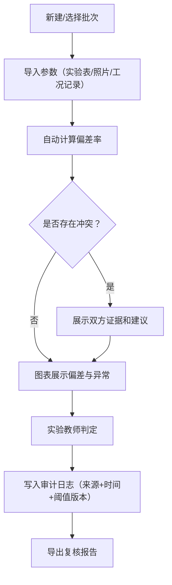

## 1. 产品概述

"小提琴琴弦张力复核"系统是一套面向实验教师（如林老师）的实验参数复核与审计工具，解决实验参数散落在设备巡检表、实验表和工况记录中、阈值改过没人记得哪版、复核结论无法追溯等痛点。
- 核心目标：让"小提琴琴弦张力复核"从翻旧记录的手工流程，变成参数可导入、异常可检测、阈值可版本化、结论可审计的数字化复核流程
- 目标用户：实验室负责参数复核的教师，以及后续接手复盘的其他人员

## 2. 核心功能

### 2.1 用户角色
| 角色 | 使用方式 | 核心权限 |
|------|----------|----------|
| 实验教师 | 直接使用 | 导入参数、调整阈值、执行复核、导出报告 |
| 复审人员 | 查看历史 | 查看历史记录、对比报告、审计日志 |

### 2.2 功能模块
1. **仪表盘页面**：复核总览、最近批次状态、异常告警摘要、阈值版本提示
2. **复核工作台页面**：参数导入与录入、异常检测与图表展示、阈值管理与版本记录、冲突证据展示、复核判定与导出
3. **历史对比页面**：批次历史列表、并排参数对比、审计追踪时间线

### 2.3 页面详情
| 页面名称 | 模块名称 | 功能描述 |
|----------|----------|----------|
| 仪表盘 | 状态总览卡片 | 显示待复核/已通过/异常批次数，阈值版本号 |
| 仪表盘 | 异常告警列表 | 最近异常条目摘要，点击跳转工作台 |
| 仪表盘 | 最近批次 | 最近5次复核批次快速入口 |
| 复核工作台 | 参数导入面板 | 支持从实验表/照片说明/工况记录三个来源录入参数 |
| 复核工作台 | 张力数据表格 | 展示各琴弦（E/A/D/G弦）的测量值、标准值、偏差率 |
| 复核工作台 | 异常检测图表 | 柱状图展示各弦张力偏差，异常值高亮标注，展示判断依据 |
| 复核工作台 | 阈值管理面板 | 当前阈值版本、阈值修改历史、修改原因必填 |
| 复核工作台 | 冲突证据区 | 当设备巡检表数据与导入数据冲突时，展示双方证据和建议动作 |
| 复核工作台 | 复核判定面板 | 判定通过/异常，附原因，记录原始来源和处理时间 |
| 复核工作台 | 导出按钮 | 导出含审计原因的复核报告 |
| 历史对比 | 批次列表 | 按时间排列的历史复核批次 |
| 历史对比 | 并排对比视图 | 选择两个批次，参数与阈值并排展示 |
| 历史对比 | 审计时间线 | 每条判定的完整审计链：谁、何时、用哪版阈值、依据什么来源 |

## 3. 核心流程

### 3.1 复核主流程
1. 实验教师进入复核工作台，选择或新建一个"小提琴琴弦张力复核"批次
2. 从实验表/照片说明/工况记录导入参数数据（支持手动录入，每条数据标注来源）
3. 系统基于当前阈值版本自动计算偏差率，标记异常项
4. 图表展示各弦张力偏差，异常项高亮并标注判断依据
5. 如设备巡检表数据与导入数据冲突，展示双方证据和建议，不自动拍板
6. 实验教师做出判定（通过/异常），填写原因
7. 判定结果附原始来源、处理时间、阈值版本号，写入审计日志
8. 可导出含审计原因的复核报告

### 3.2 阈值修改流程
1. 实验教师在阈值管理面板修改某项阈值
2. 系统要求必填修改原因
3. 保存后生成新阈值版本，旧版本保留
4. 后续复核计算自动使用最新版本，但历史记录锁定使用当时的版本

### 3.3 历史对比流程
1. 进入历史对比页面，选择两个批次
2. 系统并排展示两批次的参数、使用阈值版本、判定结果
3. 审计时间线展示每条判定的完整决策链

## 4. 用户界面设计

### 4.1 设计风格
- **主色调**：深炭灰(#1a1a2e)背景 + 暖铜色(#c47f17)作为强调色（呼应小提琴的木质与铜弦美学）
- **辅助色**：浅灰(#e8e8e8)用于数据区域，淡琥珀(#f5d7a1)用于警告，柔红(#d4443e)用于异常
- **按钮风格**：圆角矩形(8px)，微妙阴影，hover时铜色提亮
- **字体**：数据区域使用 JetBrains Mono 等宽字体，正文使用 Noto Sans SC
- **布局风格**：左侧固定导航 + 右侧内容区，数据密集时使用固定表头滚动表格
- **图标风格**：Lucide 线性图标，与整体简洁工业风统一

### 4.2 页面设计概览
| 页面名称 | 模块名称 | UI元素 |
|----------|----------|--------|
| 仪表盘 | 状态总览卡片 | 3张统计卡片，铜色边框，数字用等宽大字 |
| 仪表盘 | 异常告警列表 | 紧凑列表行，左侧色条标记严重程度 |
| 仪表盘 | 最近批次 | 卡片列表，显示批次号、日期、状态标签 |
| 复核工作台 | 参数导入面板 | 三列tab切换（实验表/照片/工况），表格录入 |
| 复核工作台 | 张力数据表格 | 固定表头表格，偏差列带色条，异常行高亮 |
| 复核工作台 | 异常检测图表 | 柱状图，正常区间绿色带，异常柱体红色高亮 |
| 复核工作台 | 阈值管理面板 | 侧边抽屉，当前值+修改历史时间线 |
| 复核工作台 | 冲突证据区 | 双栏对比布局，左侧导入数据右侧巡检表数据 |
| 复核工作台 | 复核判定面板 | 底部固定栏，通过/异常按钮+原因文本框 |
| 历史对比 | 批次列表 | 左侧列表，可勾选两个批次 |
| 历史对比 | 并排对比视图 | 双栏表格，差异项高亮 |
| 历史对比 | 审计时间线 | 垂直时间线节点，显示人/时间/阈值版本/来源 |

### 4.3 响应式设计
- 桌面优先设计，核心工作区域需要充足横向空间展示数据表格和并排对比
- 平板端表格支持横向滚动，冲突证据区改为上下堆叠
- 移动端仅保留核心查看功能，不支持复杂操作

## 5. 样例数据说明

"小提琴琴弦张力复核"样例包含以下真实场景数据：
- **E弦**：标准张力53.4N，实测54.8N（偏差+2.6%，微超阈值）
- **A弦**：标准张力52.5N，实测52.1N（偏差-0.8%，正常）
- **D弦**：标准张力51.2N，实测48.3N（偏差-5.7%，显著异常）
- **G弦**：标准张力49.8N，实测50.1N（偏差+0.6%，正常）
- 环境工况：温度22.3°C，湿度58%（工况记录标注"空调维修后温控不稳定"）
- 冲突场景：设备巡检表记录D弦张力49.8N（正常），但实验表实测48.3N（异常）
- 阈值版本：v1.0偏差阈值±3%，v1.1调整为±4%（附原因："根据环境工况波动放宽"）
