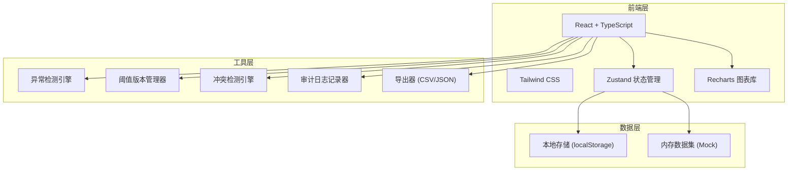
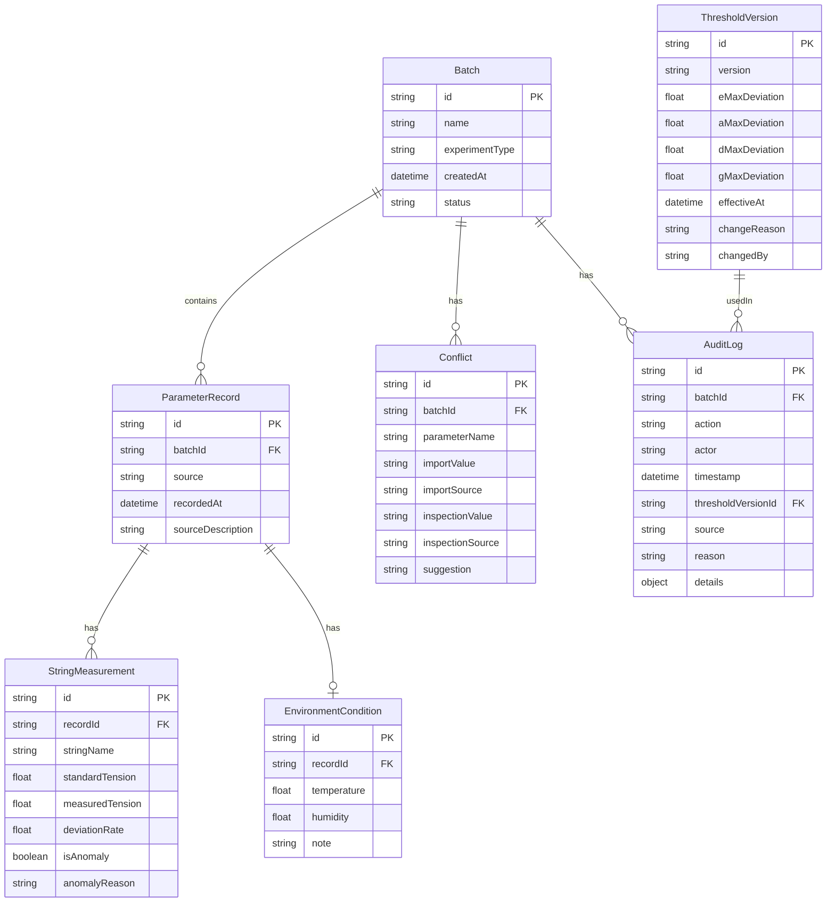

## 1. 架构设计



## 2. 技术说明
- 前端：React@18 + TypeScript + Tailwind CSS@3 + Vite
- 初始化工具：vite-init
- 后端：无（纯前端应用，数据存localStorage）
- 图表：Recharts（柱状图展示张力偏差）
- 状态管理：Zustand
- 数据持久化：localStorage（存储批次数据、阈值版本、审计日志）

## 3. 路由定义
| 路由 | 用途 |
|------|------|
| / | 仪表盘 - 复核总览与快速入口 |
| /review | 复核工作台 - 参数导入、异常检测、阈值管理、判定 |
| /review/:batchId | 指定批次复核详情 |
| /history | 历史对比 - 批次列表与并排对比 |

## 4. 数据模型

### 4.1 数据模型定义



### 4.2 类型定义

```typescript
interface Batch {
  id: string
  name: string
  experimentType: '小提琴琴弦张力复核'
  createdAt: string
  status: 'pending' | 'reviewing' | 'passed' | 'anomaly'
}

interface ParameterRecord {
  id: string
  batchId: string
  source: '实验表' | '照片说明' | '工况记录'
  recordedAt: string
  sourceDescription: string
}

interface StringMeasurement {
  id: string
  recordId: string
  stringName: 'E弦' | 'A弦' | 'D弦' | 'G弦'
  standardTension: number
  measuredTension: number
  deviationRate: number
  isAnomaly: boolean
  anomalyReason: string
}

interface EnvironmentCondition {
  id: string
  recordId: string
  temperature: number
  humidity: number
  note: string
}

interface ThresholdVersion {
  id: string
  version: string
  eMaxDeviation: number
  aMaxDeviation: number
  dMaxDeviation: number
  gMaxDeviation: number
  effectiveAt: string
  changeReason: string
  changedBy: string
}

interface Conflict {
  id: string
  batchId: string
  parameterName: string
  importValue: string
  importSource: string
  inspectionValue: string
  inspectionSource: string
  suggestion: string
}

interface AuditLog {
  id: string
  batchId: string
  action: string
  actor: string
  timestamp: string
  thresholdVersionId: string
  source: string
  reason: string
  details: Record<string, unknown>
}
```

## 5. 核心算法

### 5.1 异常检测
```
偏差率 = (实测张力 - 标准张力) / 标准张力 × 100%
若 |偏差率| > 当前阈值版本对应弦的最大偏差 → 标记为异常
异常原因 = "D弦偏差率-5.7%超出阈值±3%（阈值版本v1.0）"
```

### 5.2 冲突检测
```
对同一参数，比较导入来源值与设备巡检表值
若差值 > 冲突阈值 → 生成冲突记录
冲突建议 = "导入数据实测48.3N与巡检表49.8N差异1.5N，建议复核D弦实际工况"
```

### 5.3 阈值版本化
```
修改阈值时：
1. 创建新ThresholdVersion记录，version = 上一版本+0.1
2. changeReason为必填字段
3. 所有后续计算使用最新版本
4. 历史AuditLog锁定创建时的thresholdVersionId
```
