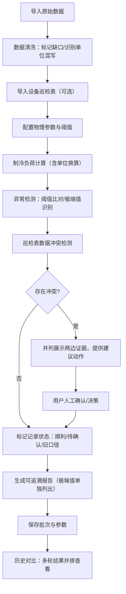

## 1. 产品概述

冰场制冷负荷诊断工具是面向制冷工程技术人员的计算与诊断看板，用于处理冰场制冷系统的巡检数据、计算热负荷、检测异常阈值、生成可追溯的诊断报告。解决现有复盘过程中数据零散、单位混乱、极端值被掩盖、历史对比困难等问题。

- **核心目标**：将物理近似计算、单位自动换算、阈值智能提醒、可追溯报告整合为一体化工作流
- **目标用户**：制冷工程师、项目助理、冰场运维人员
- **产品价值**：让脏数据可被处理、让每条诊断可追溯、让历史决策可复盘

---

## 2. 核心功能

### 2.1 用户角色

| 角色 | 注册方式 | 核心权限 |
|------|----------|----------|
| 工程师 | 本地使用无需注册 | 数据导入、计算诊断、报告生成、历史对比 |
| 项目助理 | 本地使用无需注册 | 数据录入、查看报告、补充巡检表数据 |

### 2.2 功能模块

1. **数据导入看板**：原始数据导入、采样缺口标记、单位混写识别、数据清洗预览
2. **负荷计算中心**：物理参数配置、单位自动换算、制冷负荷计算、计算过程溯源
3. **异常检测面板**：安全阈值配置、极端值高亮、超阈值报警、人工确认标记
4. **巡检表整合**：设备巡检表导入、新旧口径对比、数据冲突识别、证据并列展示
5. **报告生成器**：逐条来源追溯、极端值单独拎出、处理建议生成、报告导出
6. **历史对比**：多轮结果并排、参数变更追踪、决策过程留痕、换人接手可读

### 2.3 页面详情

| 页面名称 | 模块名称 | 功能描述 |
|---------|----------|----------|
| 数据导入页 | 文件上传区 | 支持CSV/Excel导入，拖拽上传，实时预览原始数据 |
| 数据导入页 | 数据清洗区 | 自动标记采样缺口，识别单位混写，提供清洗建议 |
| 负荷计算页 | 参数配置区 | 冰面面积、冰层厚度、环境温湿度、制冷介质等物理参数 |
| 负荷计算页 | 计算引擎区 | 实时计算制冷负荷，显示计算公式、单位换算过程、中间结果 |
| 异常检测页 | 阈值监控区 | 安全阈值配置，超阈值记录高亮，极端值独立卡片展示 |
| 异常检测页 | 人工确认区 | 可疑记录标记，确认/待确认状态，备注留痕 |
| 巡检表页 | 巡检表管理 | 设备巡检表导入，旧口径数据补录，来源标注 |
| 巡检表页 | 冲突处理区 | 数据冲突并列展示，两边证据对比，建议动作不替用户拍板 |
| 报告生成页 | 报告预览区 | 逐条展示诊断结果，每条附数据来源链接，极端值单独章节 |
| 报告生成页 | 报告导出区 | 支持PDF/Markdown导出，包含完整计算过程和追溯信息 |
| 历史对比页 | 多轮对比区 | 选择历史批次，参数与结果并排展示，差异高亮 |
| 历史对比页 | 决策留痕区 | 展示每次判断的依据、决策人、时间戳，支持备注补充 |

---

## 3. 核心流程

**主流程说明**：
1. 用户导入原始数据，系统自动识别采样缺口和单位混写并标记
2. 可选择导入设备巡检表补充旧口径数据
3. 配置物理参数后执行制冷负荷计算，全程记录单位换算过程
4. 系统自动检测超阈值记录和极端值，极端值不参与平均值计算
5. 若巡检表与导入数据冲突，并列展示证据不替用户决策
6. 每条记录标记状态：顺利通过、需人工确认、旧口径补录
7. 生成报告时极端值单独拎出，每条诊断附数据来源追溯
8. 保存完整批次信息，后续可与历史结果并排对比

---

## 4. 用户界面设计

### 4.1 设计风格

**工业实用主义（Industrial Utilitarian）**
- **主色调**：深蓝（#0F2B4A）作为主色，代表专业与可靠；橙红（#D9480F）作为警报色，突出超阈值；浅灰蓝（#E8EEF4）作为背景
- **辅助色**：深灰（#1F2937）用于文字，浅灰（#F3F4F6）用于卡片背景，绿色（#059669）表示正常，黄色（#D97706）表示待确认
- **按钮风格**：方正直角，轻微立体边框，按下有凹陷效果，体现工业感
- **字体**：显示字体使用 JetBrains Mono（等宽，工程感），正文字体使用 Noto Sans SC（清晰易读）
- **布局风格**：模块化卡片布局，网格对齐，数据表格为核心，突出数字和参数
- **图标风格**：线性图标，简洁的工程符号（温度计、雪花、警报、表格）
- **装饰元素**：细边框、网格背景、点阵纹理，模拟工程图纸的感觉

### 4.2 页面设计概述

| 页面名称 | 模块名称 | UI元素 |
|---------|----------|--------|
| 数据导入页 | 文件上传区 | 虚线边框上传区，拖拽高亮，文件列表带状态标签 |
| 数据导入页 | 数据清洗区 | 表格行高亮（黄色=单位混写，灰色=采样缺口），清洗建议气泡 |
| 负荷计算页 | 参数配置区 | 分组表单，输入框带单位下拉，物理公式卡片 |
| 负荷计算页 | 计算引擎区 | 实时计算结果大屏，计算步骤折叠面板，单位换算痕迹 |
| 异常检测页 | 阈值监控区 | 仪表盘式阈值显示，超阈值记录红框高亮，极端值独立卡片置顶 |
| 异常检测页 | 人工确认区 | 状态切换按钮，备注输入框，确认时间戳记录 |
| 巡检表页 | 冲突处理区 | 左右两列对比布局，红色冲突标记，建议动作按钮区 |
| 报告生成页 | 报告预览区 | 分章节布局，来源链接可点击跳转，极端值章节特殊样式 |
| 历史对比页 | 多轮对比区 | 横向并排卡片，差异处背景高亮，参数变更箭头指示 |

### 4.3 响应式

- **桌面优先**：核心功能面向桌面端，利用宽屏展示多列数据对比
- **平板适配**：1024px以下改为上下布局，表格支持横向滚动
- **移动端**：768px以下单列布局，核心计算功能可用，表格转卡片展示

---

### 4.4 样例数据要求

系统预置三条典型样例记录：
1. **顺利记录**：数据完整，单位统一，计算结果在安全阈值内，状态标记为"正常"
2. **人工确认记录**：存在采样缺口或单位异常，或计算结果接近阈值，状态标记为"待确认"
3. **旧口径记录**：从设备巡检表补录，使用旧计算口径，状态标记为"旧口径"，并标注来源

同时预置一条明显超过安全阈值的极端值记录，确保在报告中被单独拎出展示。
